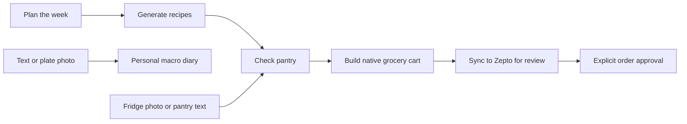

# Kitch

Kitch is an AI household kitchen companion for shared meal planning, pantry-aware recipe and grocery preparation, delivery-cart review, and individual nutrition logging.


The product is built around a simple distinction: meal plans, pantry stock, recipes, and grocery carts are shared household state, while nutrition logs remain personal to the active household member. The current prototype household is configured as Archit, Anubhav, and Naman while full auth-backed household registration is deferred.

## What Is Kitch

Kitch helps a household answer the everyday kitchen questions that usually live across chat threads, memory, notes apps, and grocery carts:

- What should we cook this week?
- What is already in the fridge or pantry?
- What ingredients do we need for a recipe or planned meal?
- What should be added to a delivery cart?
- What did I personally eat today, and how many macros did that add?

The app combines conversational control with structured, reviewable state. Users can ask for a weekly plan, swap a meal, scan a fridge photo, log a plate, generate groceries, or prepare a Zepto cart through natural language. The saved plan, pantry, recipe artifacts, native cart rows, and macro diary are persisted in Supabase so the UI can render what actually changed.

## What Can Kitch Do

Kitch supports the full household food loop: plan meals, understand what is already stocked, turn recipes into groceries, prepare a Zepto cart for review, and keep personal macro logs separate.



In practice, users can ask Kitch to:

- Plan or change household meals.
- Generate recipes and pantry-aware grocery requirements.
- Review and sync selected grocery rows to Zepto.
- Log personal food intake from text or photos.

## How Kitch Works

### Overall System Design

Kitch is split into five main runtime layers:

1. **Next.js frontend** renders the dashboard, Recipes page, Groceries page, floating chat, member switching, and explicit approval controls.
2. **FastAPI backend gateway** exposes browser-facing APIs, prepares ADK turns, handles image uploads, hydrates UI state, and guards provider/order workflows.
3. **Google ADK 2.0 runtime** runs the multi-agent graph behind the backend.
4. **Supabase PostgreSQL** stores deterministic product records such as meal plans, pantry stock, recipe artifacts, native cart rows, profiles, and macro diary logs.
5. **Provider adapters** translate Kitch's native grocery cart into external provider carts. Zepto MCP is the current live provider integration.

The browser does not call the model, ADK, Supabase admin APIs, or Zepto MCP directly. It talks to FastAPI, and FastAPI owns secrets, context preparation, tool execution, provider review snapshots, and order safety boundaries.

### Agent Topology

Kitch uses a Google ADK 2.0 hub-and-spoke topology:

```mermaid
flowchart TD
    User[Household Member] --> API[FastAPI Gateway]
    API --> Runner[ADK Runner]
    Runner --> Coordinator[kitch_coordinator]

    subgraph AgentTeam[ADK Agent Team]
        Chef[chef_planner]
        Vision[vision_scanner]
        RecipeGrocery[recipe_grocery_planner]
    end

    Coordinator --> Chef
    Coordinator --> Vision
    Coordinator --> RecipeGrocery

    subgraph ToolLayer[Python Tool Layer]
        GetWeekly[get_weekly_schedule_tool]
        SaveWeekly[save_weekly_plan_tool]
        UpdateMeal[update_single_meal_in_schedule]
        AddPantry[add_to_pantry_tool]
        LogMacros[log_macros_tool]
        GetPantry[get_pantry_stock_tool]
        GetMacro[get_macro_diary_tool]
        GetCart[get_grocery_cart_tool]
        ClearCart[clear_planned_grocery_cart_tool]
        SaveRecipePlan[save_recipe_grocery_plan_tool]
        GetRecipePlan[get_recipe_grocery_plan_tool]
        ListRecipePlans[list_recipe_grocery_plans_tool]
        SetFoodPreference[set_household_food_preference_tool]
        SearchFoodPreferences[search_household_food_preferences_tool]
        GetDatetime[get_current_datetime]
    end

    Chef --> GetWeekly
    Chef --> SaveWeekly
    Chef --> UpdateMeal
    Chef --> GetDatetime

    Vision --> AddPantry
    Vision --> LogMacros
    Vision --> GetPantry
    Vision --> GetMacro
    Vision --> GetDatetime

    RecipeGrocery --> GetWeekly
    RecipeGrocery --> GetCart
    RecipeGrocery --> ClearCart
    RecipeGrocery --> SaveRecipePlan
    RecipeGrocery --> GetRecipePlan
    RecipeGrocery --> ListRecipePlans
    RecipeGrocery --> SetFoodPreference
    RecipeGrocery --> SearchFoodPreferences
    RecipeGrocery --> GetPantry
    RecipeGrocery --> AddPantry
    RecipeGrocery --> GetDatetime

    GetWeekly --> Supabase[(Supabase)]
    SaveWeekly --> Supabase
    UpdateMeal --> Supabase
    AddPantry --> Supabase
    LogMacros --> Supabase
    GetPantry --> Supabase
    GetMacro --> Supabase
    GetCart --> Supabase
    ClearCart --> Supabase
    SaveRecipePlan --> Supabase
    GetRecipePlan --> Supabase
    ListRecipePlans --> Supabase
    SetFoodPreference --> Memory[ADK Memory]
    SearchFoodPreferences --> Memory
    GetDatetime --> RuntimeContext[Runtime datetime context]

    API --> ProviderAdapters[Backend Provider Adapters]
    ProviderAdapters --> Zepto[Zepto MCP]
```



Provider sync is intentionally outside the `recipe_grocery_planner`. The agent owns native recipe+grocery planning. The backend owns provider cart sync and order approval boundaries.

### Zepto MCP Integration

Kitch owns a provider-agnostic native grocery cart. Zepto is a translation target, not the source of truth.

The Zepto flow is:

1. The user reviews native Kitch grocery rows in the Groceries page.
2. The user selects eligible rows to move to Zepto.
3. FastAPI excludes unselected and pantry-covered rows.
4. Backend code applies household brand preferences to provider search terms where possible.
5. `ZeptoProviderAdapter` uses Zepto MCP to search products, replace/update the Zepto cart, and read the resulting provider cart.
6. FastAPI saves a Zepto review snapshot with matched items, unavailable items, checkout context, snapshot hash, and confirmation token.
7. The frontend displays the actual provider cart for review.
8. A real order can only be placed after explicit frontend approval using the saved review snapshot.

Chat text can plan groceries and prepare cart state, but it must not place a real order by itself.

## Local Deployment

### Prerequisites

- Python 3.12 or newer.
- Node.js and npm.
- A Supabase project.
- A Gemini API key for local development, or Vertex AI credentials for cloud deployment.
- Optional: Zepto MCP authentication if you want live Zepto cart sync.

### 1. Install Backend Dependencies

```bash
cd backend
python3.12 -m venv venv
source venv/bin/activate
pip install -r requirements.txt
```

### 2. Configure Supabase

1. Create a Supabase project.
2. Open the Supabase SQL editor.
3. For a new project, run `backend/database/supabase_schema.sql`. For every
   deployment, apply all unapplied files in `backend/database/migrations/` in
   filename order before starting FastAPI. Versioned migrations are the
   deployment source of truth.
4. Ensure the prototype household profile IDs exist, or update the configured IDs in `backend/app/household_config.py` and `frontend/src/app/householdConfig.js`.

The default prototype IDs are:

| Member | UUID |
| --- | --- |
| Archit | `00000000-0000-0000-0000-000000000000` |
| Anubhav | `11111111-1111-1111-1111-111111111111` |
| Naman | `22222222-2222-2222-2222-222222222222` |

All six structured-data tables use Row Level Security with browser roles denied.
FastAPI must use a backend-only Supabase secret key (preferred) or the temporary
legacy service-role key. If you create real auth users through Supabase Auth,
copy their UUIDs into the household config files instead of using the prototype
UUIDs above. Never expose either elevated key to the frontend.

FastAPI fails startup unless durable storage is ready: the elevated credential,
all required tables and columns, and the configured household profile must be
available. Database failures are returned as a safe HTTP 503; the UI retains
the last confirmed state and does not present a successful save.

### 3. Create Backend Environment File

Create `backend/.env`:

```bash
SUPABASE_URL=...
SUPABASE_SECRET_KEY=sb_secret_...
# Temporary legacy alternative:
# SUPABASE_SERVICE_ROLE_KEY=...

# Gemini setup
KITCH_LLM_MODEL=gemini-3.6-flash
GOOGLE_GENAI_USE_VERTEXAI=FALSE
GOOGLE_API_KEY=...

# Optional Zepto MCP setup
ZEPTO_MCP_ENABLED=false
```

`backend/.env` is loaded by FastAPI and the ADK runtime. Keep this file gitignored.

### 4. Configure Gemini Authentication

Local Google AI Studio mode:

```bash
KITCH_LLM_MODEL=gemini-3.6-flash
GOOGLE_GENAI_USE_VERTEXAI=FALSE
GOOGLE_API_KEY=...
```

Vertex AI mode:

```bash
KITCH_LLM_MODEL=gemini-3.6-flash
GOOGLE_GENAI_USE_VERTEXAI=TRUE
GOOGLE_CLOUD_PROJECT=...
GOOGLE_CLOUD_LOCATION=global
```

Vertex AI uses the deployment service account through Application Default Credentials, so do not set an API key in that mode. Kitch always uses ADK's native Gemini adapter; there is no alternate LLM-provider fallback.

### 5. Configure ADK Tracing (Optional)

Kitch runs ADK programmatically behind FastAPI, so tracing is configured with OpenTelemetry environment variables before the ADK runner is created.

For a local trace viewer, start Jaeger with OTLP HTTP enabled:

```bash
docker run --rm --name kitch-jaeger \
  -p 16686:16686 \
  -p 4318:4318 \
  jaegertracing/all-in-one:latest
```

Then add this to `backend/.env`:

```bash
KITCH_ADK_TRACING_ENABLED=true
OTEL_EXPORTER_OTLP_TRACES_ENDPOINT=http://127.0.0.1:4318/v1/traces
OTEL_SERVICE_NAME=kitch-backend
OTEL_RESOURCE_ATTRIBUTES=service.namespace=kitch,deployment.environment=local
```

To also send the same ADK traces to LangSmith, add:

```bash
LANGSMITH_API_KEY=...
LANGSMITH_PROJECT=kitch-local
```

Jaeger and LangSmith can run together: Jaeger uses the standard OTEL endpoint above, while LangSmith is added as a second exporter by Kitch's telemetry bootstrap.

Restart the backend, run a chat turn, then open:

```text
http://127.0.0.1:16686
```

ADK emits spans for agent invocation, model calls, workflow execution, and tool execution. You can point `OTEL_EXPORTER_OTLP_TRACES_ENDPOINT` at any OTLP-compatible collector, use `OTEL_EXPORTER_OTLP_ENDPOINT` if you want one endpoint for multiple telemetry signals, and set `LANGSMITH_API_KEY` when you want LangSmith export in parallel.

### 6. Configure Zepto MCP (Optional)

Leave Zepto disabled for basic local development:

```bash
ZEPTO_MCP_ENABLED=false
```

To enable Zepto MCP, configure one of the supported auth paths:

```bash
ZEPTO_MCP_ENABLED=true
ZEPTO_MCP_URL=https://mcp.zepto.co.in/mcp
ZEPTO_MCP_ACCESS_TOKEN=...
```

Alternate token/header variables supported by the adapter:

```bash
ZEPTO_MCP_BEARER_TOKEN=...
ZEPTO_ACCESS_TOKEN=...
ZEPTO_MCP_HEADERS='{"Header-Name":"value"}'
```

For local browser OAuth bridge mode, omit the token and allow the adapter to use:

```bash
npx -y mcp-remote https://mcp.zepto.co.in/mcp
```

Advanced transport variables:

```bash
ZEPTO_MCP_TRANSPORT=...
ZEPTO_MCP_REMOTE_COMMAND=npx
ZEPTO_MCP_REMOTE_ARGS='["-y","mcp-remote","https://mcp.zepto.co.in/mcp"]'
```

### 7. Run the Backend

From `backend/`:

```bash
venv/bin/python -m uvicorn app.main:app --host 127.0.0.1 --port 8000
```

Health check:

```bash
curl http://127.0.0.1:8000/api/health
```

### 8. Install Frontend Dependencies

```bash
cd frontend
npm install
```

### 9. Configure Frontend Environment

Create `frontend/.env.local`:

```bash
NEXT_PUBLIC_API_BASE_URL=http://127.0.0.1:8000
```

If this variable is omitted, the frontend falls back to `http://localhost:8000`.

### 10. Run the Frontend

From `frontend/`:

```bash
npm run dev -- --hostname 127.0.0.1 --port 3000
```

Open:

```text
http://127.0.0.1:3000
```

## Environment Variables Reference

### Backend Required

| Variable | Purpose |
| --- | --- |
| `SUPABASE_URL` | Supabase project URL. |
| `SUPABASE_SECRET_KEY` | Preferred `sb_secret_...` credential for the trusted FastAPI backend. |
| `SUPABASE_SERVICE_ROLE_KEY` | Temporary support for a legacy `service_role` JWT. Do not set it together with `SUPABASE_SECRET_KEY`. |

`SUPABASE_KEY`, publishable keys, legacy anon JWTs, malformed keys, and
redacted placeholders are rejected during backend startup.

### Backend Gemini Model

| Variable | Purpose |
| --- | --- |
| `KITCH_LLM_MODEL` | Gemini model ID. Defaults to `gemini-3.6-flash`; non-Gemini IDs are rejected. |
| `GOOGLE_API_KEY` | Google AI Studio key for local Gemini API-key mode. `GEMINI_API_KEY` is also accepted by Google's SDK. |
| `GOOGLE_GENAI_USE_VERTEXAI` | `FALSE` for AI Studio API-key mode, `TRUE` for Vertex AI mode. |
| `GOOGLE_CLOUD_PROJECT` | Required for Vertex AI mode. |
| `GOOGLE_CLOUD_LOCATION` | Required for Vertex AI mode. |

### ADK Tracing / OpenTelemetry (Optional)

| Variable | Purpose |
| --- | --- |
| `KITCH_ADK_TRACING_ENABLED` | Set to `true` to request ADK OpenTelemetry setup even before an endpoint is present. Set to `false` to force-disable it. |
| `KITCH_ADK_TRACING_REQUIRED` | Set to `true` if backend startup should fail when tracing cannot be configured. Defaults to best-effort. |
| `OTEL_EXPORTER_OTLP_TRACES_ENDPOINT` | OTLP HTTP traces endpoint, such as `http://127.0.0.1:4318/v1/traces`. |
| `OTEL_EXPORTER_OTLP_ENDPOINT` | General OTLP endpoint if traces, metrics, and logs share one collector. |
| `OTEL_SERVICE_NAME` | Service name shown in trace backends. Defaults to `kitch-backend` when tracing is enabled. |
| `OTEL_RESOURCE_ATTRIBUTES` | Comma-separated resource attributes. Defaults to `service.namespace=kitch,deployment.environment=local` when tracing is enabled. |
| `LANGSMITH_API_KEY` | Optional LangSmith API key. When set, Kitch exports ADK traces to LangSmith in addition to the standard OTEL endpoint. |
| `LANGSMITH_PROJECT` | Optional LangSmith project name. Defaults to LangSmith's project behavior if omitted. |
| `LANGSMITH_OTEL_TRACES_ENDPOINT` | Optional LangSmith OTEL traces endpoint override. Defaults to `https://api.smith.langchain.com/otel/v1/traces`. |
| `KITCH_LANGSMITH_TRACING_ENABLED` | Optional explicit LangSmith tracing toggle. Set to `false` to disable LangSmith export even if a key is present. |

### Zepto MCP (Optional)

| Variable | Purpose |
| --- | --- |
| `ZEPTO_MCP_ENABLED` | Set to `false` to disable Zepto MCP calls. |
| `ZEPTO_MCP_URL` | Zepto MCP endpoint. Defaults to `https://mcp.zepto.co.in/mcp`. |
| `ZEPTO_MCP_ACCESS_TOKEN` | Bearer token for Zepto MCP. |
| `ZEPTO_MCP_BEARER_TOKEN` | Alternate bearer token variable. |
| `ZEPTO_ACCESS_TOKEN` | Alternate token variable. |
| `ZEPTO_MCP_HEADERS` | Optional JSON object of extra MCP headers. |
| `ZEPTO_MCP_TRANSPORT` | Optional transport override. |
| `ZEPTO_MCP_REMOTE_COMMAND` | Local OAuth bridge command. Defaults to `npx`. |
| `ZEPTO_MCP_REMOTE_ARGS` | Optional custom `mcp-remote` argument list. |

### Frontend

| Variable | Purpose |
| --- | --- |
| `NEXT_PUBLIC_API_BASE_URL` | Browser-visible FastAPI base URL. Defaults to `http://localhost:8000`. |

## Project Structure

```text
backend/
  app/
    agent/              ADK agent graph, prompts, tools, sessions, memory
    providers/          Zepto MCP provider adapter
    main.py             FastAPI gateway and browser-facing routes
    supabase_client.py  Supabase data access layer
  database/
    supabase_schema.sql Supabase schema

frontend/
  src/app/              Next.js app, dashboard, recipes, groceries, chat UI

docs/
  vision_and_requirements.md
  ux_user_flows.md
  current_architecture.md
  current_ai_agent_architecture.md
  current_technology_stack.md
  test_scenarios.md
  production_test_results.md
```

## Key Product Boundaries

- Meal planning is shared household state.
- Pantry, recipes, recipe-grocery artifacts, and native grocery cart rows are shared household state.
- Macro diary entries are individual to the active member.
- Recipe-only requests save recipe artifacts but do not update the cart.
- Grocery/cart/buy/order requests save recipe artifacts and update agent-planned native cart rows.
- Manual cart rows are preserved across agent grocery replanning.
- Pantry-covered rows remain visible but are excluded from provider sync.
- Provider prices and fees should only come from provider responses.
- Chat cannot place real orders.
- Zepto order placement requires a saved review snapshot, confirmation token, and explicit frontend approval.

## Current Limitations

- Multi-household registration and auth-backed membership are deferred.
- ADK sessions and preference memory are explicitly ephemeral process-local
  services, so backend restarts clear them until the Vertex AI migration.
- Supabase persists product-critical records.
- A recipe artifact and replacement of agent-generated cart rows are saved in
  one transaction; either both are confirmed or neither is changed.
- Blinkit live cart insertion is not implemented.
- Pantry quantity reconciliation across arbitrary units is intentionally limited.
- Zepto MCP auth and catalog behavior depend on the external provider.
- Known orchestration issue: compound requests that span multiple specialist agents may currently be routed to only one sub-agent.

## More Documentation

Start with these files for deeper context:

- `docs/vision_and_requirements.md`
- `docs/current_architecture.md`
- `docs/current_ai_agent_architecture.md`
- `docs/current_technology_stack.md`
- `docs/ux_user_flows.md`
- `docs/known_issues.md`
