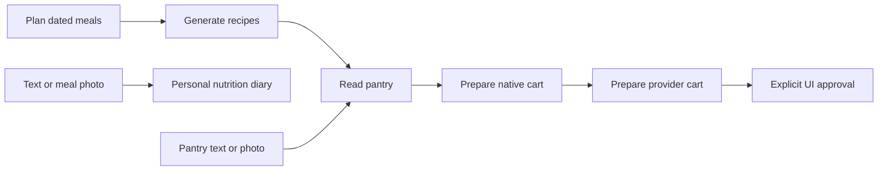

# Kitch

Kitch is an AI household kitchen companion for shared meal planning,
pantry-aware recipes and groceries, delivery-cart review, and individual
nutrition logging.


Meal plans, pantry stock, recipes, and grocery carts are shared household
state. Nutrition logs remain personal to the active household member. The
current prototype household is configured as Archit, Anubhav, and Naman while
auth-backed household registration is deferred.

## What Kitch does

- Plans and edits meals for exact calendar dates and ranges.
- Generates recipes and durable recipe artifacts.
- Reads, edits, replaces, and visually reviews household pantry stock.
- Builds a provider-neutral native grocery cart from recipes, chat, or manual
  UI changes.
- Prepares Zepto or Swiggy Instamart carts for review without allowing chat to
  place an order.
- Logs and corrects personal nutrition entries from text or meal photos.
- Remembers selected natural-language household kitchen context persistently
  through Vertex AI Memory Bank.


```mermaid
flowchart LR
    Plan[Plan dated meals] --> Recipe[Generate recipes]
    Recipe --> Pantry[Read pantry]
    Pantry --> Cart[Prepare native cart]
    Cart --> Provider[Prepare provider cart]
    Provider --> Approval[Explicit UI approval]

    Intake[Text or meal photo] --> Diary[Personal nutrition diary]
    Fridge[Pantry text or photo] --> Pantry
```

## Runtime overview

1. The Next.js frontend renders confirmed product state and collects explicit
   user actions.
2. FastAPI exposes the browser API, invokes the Gemini/Google ADK runtime,
   accesses Supabase, and guards provider operations.
3. Supabase stores structured product state behind backend-only RLS.
4. ADK chat sessions are process-local; selected household context is stored in
   Vertex AI Memory Bank when `vertex_express` is configured.
5. A provider-neutral checkout service prepares and revalidates external carts;
   final ordering remains an explicit UI-only action.

The browser never calls Gemini, ADK, elevated Supabase APIs, or provider MCP
servers directly.

Detailed component flows are in `docs/system_architecture.md`. Agent names,
routing, tools, memory access, commerce authority, and rejected topology
alternatives are maintained only in `docs/ai_agent_topology.md`.

## Local quick start

Prerequisites:

- Python 3.12+
- Node.js and npm
- A Supabase project
- A Gemini API key, or Vertex AI credentials

### 1. Install the backend

```bash
cd backend
python3.12 -m venv venv
source venv/bin/activate
pip install -r requirements.txt
```

### 2. Prepare Supabase

For a new project, run `backend/database/supabase_schema.sql`. For an existing
project, apply every unapplied migration in `backend/database/migrations/` in
filename order. Migrations must be applied before the backend starts.

Ensure the prototype household profiles exist, or update their IDs in:

- `backend/app/household_config.py`
- `frontend/src/app/householdConfig.js`

### 3. Configure and start the backend

Copy `backend/.env.example` to `backend/.env.local` (or `backend/.env`), then
set the Supabase and Gemini credentials. Persistent household memory also needs
a dedicated Vertex AI Express Mode key and Memory Bank ID. The full variable
reference—including Memory Bank setup, provider OAuth, and telemetry—is in
`docs/runtime_stack_and_configuration.md`.

```bash
cd backend
venv/bin/python -m uvicorn app.main:app --host 127.0.0.1 --port 8000
```

Health checks:

```bash
curl http://127.0.0.1:8000/api/health/live
curl http://127.0.0.1:8000/api/health/ready
```

### 4. Configure and start the frontend

```bash
cd frontend
npm install
```

Create `frontend/.env.local`:

```bash
NEXT_PUBLIC_API_BASE_URL=http://127.0.0.1:8000
```

```bash
npm run dev -- --hostname 127.0.0.1 --port 3000
```

Open `http://127.0.0.1:3000`.

Zepto and Swiggy Instamart are optional for core local development. Their
configuration, OAuth requirements, production gates, and safe test boundaries
are documented in `docs/runtime_stack_and_configuration.md`.

## Project structure

```text
backend/
  app/
    agent/              ADK agents, prompts, tools, sessions, and memory
    providers/          Provider contracts, MCP/OAuth clients, and adapters
    grocery_checkout.py Synchronization, review, revalidation, and ordering service
    main.py             FastAPI gateway and browser-facing routes
    supabase_client.py  Supabase data-access layer
  database/
    supabase_schema.sql Bootstrap schema
    migrations/         Versioned deployment migrations

frontend/
  src/app/              Next.js UI

docs/                   Product, architecture, runtime, UX, and issue references
test/                   Functional blueprint, fixtures, and automated tests
```

## Product and safety boundaries

- Recipe-only requests save recipes without silently changing the native cart.
- Standalone chat requests may add, update, or remove native-cart items without
  fabricating a recipe.
- Pantry edits do not implicitly rewrite grocery purchase intent; cart
  reconciliation is explicit.
- Provider carts are reversible projections of native intent, not Kitch's
  source of truth.
- Chat may explicitly prepare a provider cart but cannot select payment or
  place an order.
- Every external order requires a durable reviewed draft, current provider
  state, payment returned by that provider, and explicit UI approval.
- Persistence failures fail loudly; the UI keeps the last confirmed state.

## Documentation map

- `docs/vision_and_requirements.md` — product direction and requirements.
- `docs/ux_user_flows.md` — user journeys and interaction behavior.
- `docs/system_architecture.md` — end-to-end components, APIs, persistence, and
  provider checkout flow.
- `docs/ai_agent_topology.md` — Gemini/ADK topology, agent ownership, tools,
  memory, routing, and authority.
- `docs/runtime_stack_and_configuration.md` — dependencies, local startup,
  environment variables, migrations, telemetry, and deployment.
- `docs/known_issues_and_optimisations.md` — current defects, operational
  blockers, and deferred engineering work.
- `test/functional_testing_blueprint.md` — functional scenarios and expected
  outcomes.
- `docs/test_artifacts/` — immutable historical test evidence.
