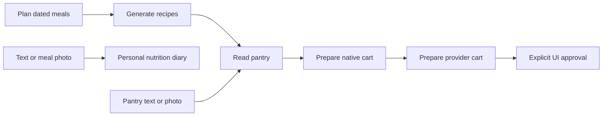

# Kitch

Kitch is an AI household kitchen companion for shared meal planning,
pantry-aware recipes and groceries, delivery-cart review, and individual
nutrition logging.


Meal plans, pantry stock, recipes, and grocery carts are shared household
state. Nutrition logs remain personal to the active household member. An empty
local installation asks for household-member names once and starts without
seeded kitchen activity.

## What Kitch does

- Plans and edits meals for exact calendar dates and ranges.
- Generates recipes and durable recipe artifacts.
- Reads, edits, replaces, and visually reviews household pantry stock.
- Builds a provider-neutral native grocery cart from recipes, chat, or manual
  UI changes.
- Prepares Zepto or Swiggy Instamart carts for review without allowing chat to
  place an order.
- Logs and corrects personal nutrition entries from text or meal photos.
- Remembers selected natural-language household kitchen context through the
  configured ADK memory backend.


```mermaid
flowchart LR
    Plan[Plan dated meals] --> Recipe[Generate recipes]
    Recipe --> Pantry[Read pantry]
    Pantry --> Cart[Prepare native cart]
    Cart --> Provider[Prepare provider cart]
    Provider --> Approval[Explicit UI approval]

    Intake[Text or meal photo] --> Diary[Personal nutrition diary]
    Fridge[Pantry text or photo] --> Pantry
```

## Runtime overview

1. The Next.js frontend renders confirmed product state and collects explicit
   user actions.
2. FastAPI exposes the browser API, invokes the Gemini/Google ADK runtime,
   verifies hosted Google sessions, accesses the selected persistence backend,
   and guards provider operations.
3. SQLite stores local structured state; Supabase stores hosted structured state
   behind backend-only RLS.
4. ADK chat sessions are process-local. Household memory is process-local with
   `in_memory` and persistent with Vertex AI Memory Bank when `vertex` is configured.
5. A provider-neutral checkout service prepares and revalidates external carts;
   final ordering remains an explicit UI-only action.

The browser never calls Gemini, ADK, elevated Supabase APIs, or provider MCP
servers directly.

Hosted Kitch uses one Google account as the owner of one household. Other
household members are editable profiles—not separate login accounts—so their
stable IDs and personal nutrition history survive renames. Local SQLite mode
remains login-free.

Detailed component flows are in `docs/system_architecture.md`. Agent names,
routing, tools, memory access, commerce authority, and rejected topology
alternatives are maintained only in `docs/ai_agent_topology.md`.

## Local quick start

Prerequisites:

- Python 3.12+
- Node.js and npm
- A Gemini API key

### 1. Configure local Kitch

```bash
cp backend/.env.local.example backend/.env.local
```

Replace `GOOGLE_API_KEY` in `backend/.env.local`.

### 2. Install and start

```bash
python3.12 scripts/kitch.py setup
python3.12 scripts/kitch.py start
```

On Windows use `py -3.12`. Open `http://localhost:3000`, enter the household
member names, and begin with an empty kitchen. SQLite is created automatically
under `.kitch/`; local agent memory resets whenever the backend restarts.

Swiggy Instamart uses its real OAuth and MCP services. Click Connect in the
Groceries UI and authenticate on Swiggy with the normal phone/OTP flow. See
[`docs/local_setup.md`](docs/local_setup.md) for troubleshooting and optional
manual commands.

## Project structure

```text
backend/
  app/
    agent/              ADK agents, prompts, tools, sessions, and memory
    providers/          Provider contracts, MCP/OAuth clients, and adapters
    grocery_checkout.py Synchronization, review, revalidation, and ordering service
    main.py             FastAPI gateway and browser-facing routes
    storage.py          Backend-neutral persistence facade
    sqlite_supabase.py  Local SQLite adapter
  database/
    supabase_schema.sql Bootstrap schema
    migrations/         Versioned deployment migrations

frontend/
  src/app/              Next.js UI

docs/                   Product, architecture, runtime, UX, and issue references
test/                   Functional blueprint, fixtures, and automated tests
```

## Product and safety boundaries

- Recipe-only requests save recipes without silently changing the native cart.
- Standalone chat requests may add, update, or remove native-cart items without
  fabricating a recipe.
- Pantry edits do not implicitly rewrite grocery purchase intent; cart
  reconciliation is explicit.
- Provider carts are reversible projections of native intent, not Kitch's
  source of truth.
- Chat may explicitly prepare a provider cart but cannot select payment or
  place an order.
- Every external order requires a durable reviewed draft, current provider
  state, payment returned by that provider, and explicit UI approval.
- Persistence failures fail loudly; the UI keeps the last confirmed state.

## Documentation map

- `docs/vision_and_requirements.md` — product direction and requirements.
- `docs/ux_user_flows.md` — user journeys and interaction behavior.
- `docs/system_architecture.md` — end-to-end components, APIs, persistence, and
  provider checkout flow.
- `docs/ai_agent_topology.md` — Gemini/ADK topology, agent ownership, tools,
  memory, routing, and authority.
- `docs/runtime_stack_and_configuration.md` — dependencies, local startup,
  environment variables, migrations, telemetry, and deployment.
- `docs/local_setup.md` — terminal-based SQLite and in-memory setup.
- `docs/supabase_setup.md` — hosted structured-persistence setup.
- `docs/vertex_memory_setup.md` — persistent Memory Bank setup.
- `docs/vercel_wif_setup.md` — keyless Vercel-to-Google authentication.
- `docs/security_and_privacy.md` — hosted identity, household isolation,
  security controls, provider credentials, telemetry, and retention.
- `docs/swiggy_setup.md` — localhost OAuth and hosted Swiggy onboarding.
- `docs/known_issues_and_optimisations.md` — current defects, operational
  blockers, and deferred engineering work.
- `test/functional_testing_blueprint.md` — functional scenarios and expected
  outcomes.
- `docs/test_artifacts/` — immutable historical test evidence.
