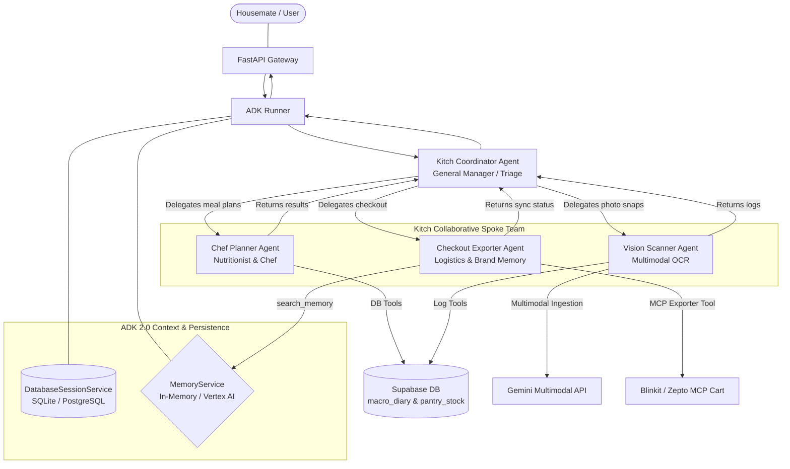

# Kitch: ADK 2.0 Multi-Agent Topology Specification

This document presents the detailed architectural design and specifications for **Kitch's** collaborative multi-agent team. By leveraging Google Agent Development Kit (ADK) 2.0 native sub-agent routing, we isolate distinct operational domains while maintaining a shared household memory.

---

## 1. Multi-Agent Topology Diagram

Below is the clean, universally compatible architectural flowchart showing the relationship between the central Coordinator and the three specialized Spoke agents:

---

## 2. Detailed Agent Specifications

### A. Kitch Coordinator Agent (`kitch_coordinator`)
*   **Role**: The primary conversational orchestrator and general manager.
*   **Sub-Agents Registered**: `chef_planner`, `vision_scanner`, `checkout_exporter`.
*   **Tools**: None (delegates all computational and database tasks to specialized Spokes).
*   **Memory Scope**: Ephemeral short-term scratchpad and general chat thread continuity.
*   **Instruction Focus**:
    *   Acts as the empathetic, welcoming face of Kitch.
    *   Extracts active user settings from the session context (identifying which housemate is logged in).
    *   Triages conversational inputs. If the user asks about meal planning, uploads a plate photo, or requests checkout, the Coordinator immediately hands over active execution to the matching Spoke agent.

---

### B. Chef Planner Agent (`chef_planner`)
*   **Role**: The household nutritionist and personal chef.
*   **Sub-Agents**: None.
*   **Tools**:
    1.  `get_recipes(diet_preference: str)`: Queries the internal recipe library for diet-aligned recipes (vegan, keto, balanced).
    2.  `scale_ingredients(recipe_id: str, household_size: int)`: Multiplies base recipe measurements to match the household size (default: 3 people).
    3.  `get_weekly_schedule_tool()`: Queries Supabase's `meal_plans` table to retrieve what is currently scheduled.
    4.  `save_weekly_plan_tool(weekly_plan: dict)`: Inserts/upserts a structured 7-day meal plan array into the Supabase database.
    5.  `update_single_meal_in_schedule(day: str, meal_category: str, new_recipe_id: str)`: Conversationally swaps a single meal slot on Thursday, Tuesday, etc., and upserts it in the database in real-time.
*   **Memory & Database Scope**: Collaborative household database tables (`meal_plans`, `pantry_stock` subtraction).
*   **Instruction Focus**:
    *   Focuses exclusively on recipe design, portion scaling, dietary restrictions, and meal schedule mutations.
    *   Ensures that every meal swap request is translated into a clean database write.

---

### C. Vision Scanner Agent (`vision_scanner`)
*   **Role**: The multimodal vision interpretation engine.
*   **Sub-Agents**: None.
*   **Tools**:
    1.  `add_to_pantry_tool(user_name: str, ingredient_name: str, amount: float, unit: str)`: Appends segmented fridge items directly into Supabase's pantry stock.
    2.  `log_macros_tool(user_name: str, meal_name: str, calories: int, protein: int, carbs: int, fat: int, fiber: int)`: Inserts estimated plate calories and macros into the individual housemate's macro diary.
*   **Memory & Database Scope**: Ingests multimodal image bytes; writes to shared pantry or isolated individual macro tables.
*   **Instruction Focus**:
    *   Triggered when image payloads are submitted (plate snapshots or fridge interior scans).
    *   Natively interprets visual contents, estimates volume sizes, and immediately executes DB logging tools to synchronize database state with visual evidence.

---

### D. Checkout Exporter Agent (`checkout_exporter`)
*   **Role**: The household logistics and smart brand-mapping coordinator.
*   **Sub-Agents**: None.
*   **Tools**:
    1.  `export_to_delivery(items: list[dict], provider: str)`: Filters unstocked required items, checks brand memory rules, and pushes payloads to the Blinkit/Zepto MCP cart.
    2.  `get_brand_preferences()`: Native tool to query the shared `MemoryService` (using `user_id="shared_household"`) for household brand choices (e.g. Baker's Dozen bread).
    3.  `set_brand_preference(ingredient: str, branded_sku: str)`: Native tool to write a brand choice permanently to the shared household `MemoryService` when discussed.
*   **Memory & Database Scope**: Queries the unified household `MemoryService` and communicates with the Stdio/SSE MCP delivery server tools.
*   **Instruction Focus**:
    *   Compiles required intermediate grocery lists (subtracting stock from plans).
    *   Applies semantic mappings to replace generic items with branded preferences.
    *   Enforces secure Human-in-the-Loop confirmations before order placement.
