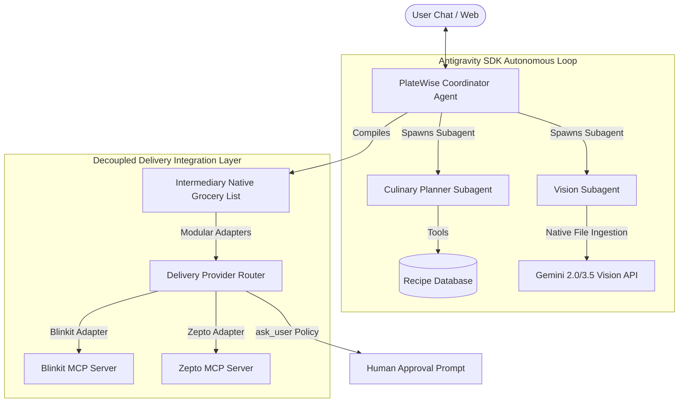

# AI Layer Architectural Proposal: PlateWise AI (Pure Antigravity SDK)

> [!NOTE]
> This document outlines the revised **AI Layer Architecture** for PlateWise AI. Following strict project requirements, we have **rejected all LangChain, LangGraph, and wrapper dependencies**. We rely exclusively on the **Google Antigravity SDK** (`google-antigravity`) as our singular agentic harness, implementing autonomous conversational loops, native subagent delegation, and decoupled grocery-to-merchant delivery adapters.

---

## 1. Core Framework & Harness: Google Antigravity SDK

The Google Antigravity SDK is our exclusive agentic harness. It abstracts the core cognitive loop (Planning $\rightarrow$ Tool Selection $\rightarrow$ Execution $\rightarrow$ Observation) while keeping the agent decoupled from the runtime environment.



---

## 2. Dynamic Native Subagents & Context Quarantine

To prevent context bloat, the **PlateWise Coordinator Agent** natively spawns and manages specialized subagents. Subagents run in isolated context windows—their intermediate tool calls and dense raw logs are quarantined. They return only clean, structured results back to the Coordinator.

### A. PlateWise Coordinator Agent (Parent Manager)
*   **Role**: Primary conversational orchestrator and general manager.
*   **Instruction**: Triage user requests, direct household parameters (household size, diet profiles), manage overall state, compile the **Intermediary Native Grocery List**, and spawn subagents.

### B. Culinary Planner Subagent
*   **Role**: Nutritionist and chef.
*   **Trigger**: Spawned when users request weekly plans, meal swaps, or portion scaling.
*   **Tools**: `get_recipes()`, `scale_ingredients(household_size)`, `apply_substitution()`.

### C. Vision Subagent
*   **Role**: Multimodal computer vision analyst.
*   **Trigger**: Spawned when image payloads are submitted (plate snaps or fridge interior shelf uploads).
*   **Multimodal Input**: Natively ingests raw image bytes utilizing Antigravity's native file ingestion, forwarding them to Gemini to estimate portions or count pantry items.
*   **Response Format**: Returns structured JSON formats (e.g. `MacroLog` or `FridgeScanResult` arrays).

---

## 3. Platform-Agnostic Intermediary Grocery List

To prevent our grocery core from being tightly coupled to a single merchant (such as Blinkit):
1.  **Intermediary Native List**: Required items (planned requirements minus pantry stock) are compiled and stored in our local database as a provider-agnostic required shopping list.
2.  **Delivery Provider Router (Provider Pattern)**: The Coordinator interfaces with a pluggable `DeliveryRouter` module.
3.  **Modular Exporters**: When the user requests checkout, the backend instantiates the matching delivery adapter (e.g. `BlinkitAdapter`, `ZeptoAdapter`) which maps the native required ingredients to the specific merchant catalog format, then triggers the respective MCP tools.

---

## 4. Native Human-in-the-Loop & Safety Policies

Safety and trust are managed natively through **Antigravity's declarative Safety Policies** and **Decide Lifecycle Hooks** rather than deterministic graph state routing.

### A. Declarative "Deny-by-Default" Security Policy
All tool calls operate on a strict security sandbox. Sensitive tools (like order placements or external file writes) are blocked by default or forced to await user confirmation:

```python
from google.antigravity import Policies

# Establish strict governance policies
pantry_policy = Policies(
    allow=["get_recipes", "add_pantry_item"],
    deny=["shell_execute", "network_post"],
    ask_user=["export_to_delivery"]  # declarative human approval trigger on checkout
)
```

### B. The `Decide` Lifecycle Hook
For dynamic tool-execution validation, the Antigravity SDK provides blocking **Decide Hooks**. This hook inspects tool payloads in transit before they hit external servers. If a tool call targets `export_to_delivery`, the SDK pauses the agentic run, displays the JSON payload to the user, and awaits UI confirmation.

---

## 5. Pure Python Antigravity SDK Blueprint

Below is the complete technical code architecture using pure `google-antigravity` SDK primitives:

```python
import asyncio
from google.antigravity import Agent, Subagent, Tools, Policies, Decide, LocalAgentConfig
from pydantic import BaseModel, Field

# --- 1. Define Structured Output Schemas ---
class MacroLog(BaseModel):
    recipe_name: str = Field(description="Identified food item")
    calories: int = Field(description="Estimated energy intake")
    protein_g: int = Field(description="Grams of protein")
    carbs_g: int = Field(description="Grams of carbs")
    fat_g: int = Field(description="Grams of fats")

class PantryItem(BaseModel):
    name: str = Field(description="Ingredient name")
    amount: float = Field(description="Available quantity")
    unit: str = Field(description="Measurement unit")

# --- 2. Define Custom Tools ---
def get_recipes(diet_type: str) -> list[dict]:
    """Retrieve recipes from local DB matching dietary profile."""
    # Local recipe lookups...
    pass

def export_to_delivery(items: list[dict], provider: str = "blinkit") -> str:
    """
    Decoupled checkout tool: Maps native grocery list items
    to the selected merchant cart via the modular DeliveryRouter.
    """
    # Router routes to pluggable adapters (BlinkitAdapter, ZeptoAdapter)
    # and communicates with the respective local MCP server...
    return f"Successfully added {len(items)} items to {provider} cart."

# --- 3. Establish Declarative Safety Policies & Hooks ---
safety_policy = Policies(
    allow=["get_recipes", "scale_ingredients"],
    ask_user=["export_to_delivery"] # Declarative HITL safety policy on checkout
)

@Decide(tools=["export_to_delivery"])
def verify_checkout_payload(tool_call):
    """
    Decide lifecycle hook: Runs before the delivery exporter executes.
    Inspects parameters in transit and verifies merchant availability.
    """
    args = tool_call.arguments
    provider = args.get("provider", "blinkit")
    if provider not in ["blinkit", "zepto"]:
        raise ValueError(f"Unsupported delivery provider: {provider}!")
    return True

# --- 4. Assemble the Agent & Subagent Network ---
async def initialize_platewise_agent():
    config = LocalAgentConfig(
        model="google:gemini-3.5-flash",
        policies=safety_policy
    )
    
    async with Agent(config, name="platewise_coordinator") as coordinator:
        planner_sub = Subagent(
            name="culinary_planner",
            instruction="Focus on recipes, dietary restrictions, and ingredients.",
            tools=[get_recipes]
        )
        
        vision_sub = Subagent(
            name="multimodal_vision",
            instruction="Ingest photos. Extract plate macro metrics or fridge stock details.",
            tools=[]
        )
        
        coordinator.register_subagents([planner_sub, vision_sub])
        
        # Example: Requesting cart checkout for a specific provider
        checkout_response = await coordinator.chat("Export our finalized shopping list to Zepto.")
        print(await checkout_response.text())

if __name__ == "__main__":
    asyncio.run(initialize_platewise_agent())
```
