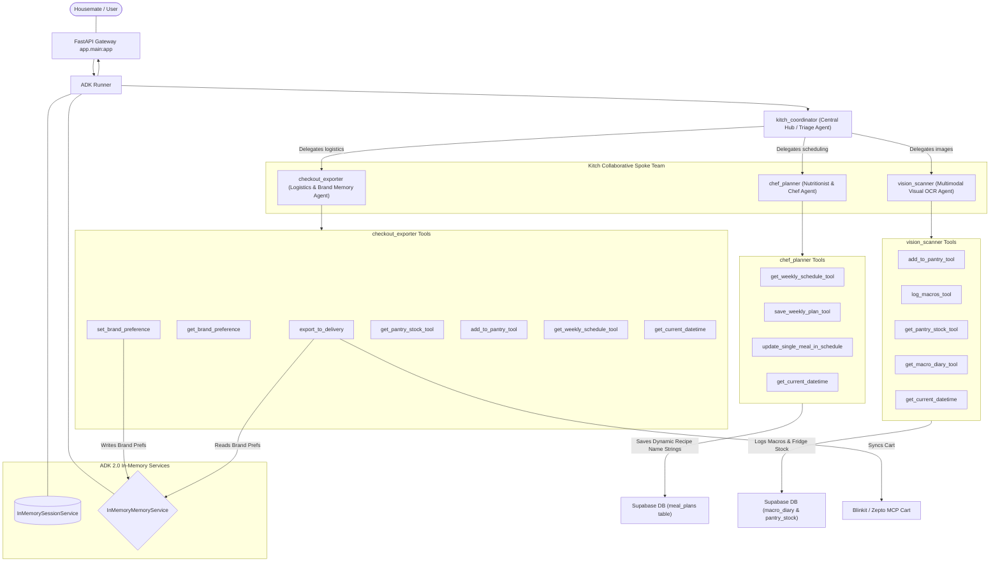

# Kitch: ADK 2.0 Multi-Agent Topology Specification

This document presents the detailed architectural design and specifications for **Kitch's** collaborative multi-agent team. By leveraging Google Agent Development Kit (ADK) 2.0 native sub-agent routing, we isolate distinct operational domains while maintaining a shared household memory.

---

## 1. Multi-Agent Topology Diagram

Below is the clean, universally compatible architectural flowchart showing the relationship between the central Coordinator and the three specialized Spoke agents:

---

## 2. Detailed Agent Specifications

### A. Kitch Coordinator Agent (`kitch_coordinator`)
*   **Role**: The primary conversational orchestrator and general manager.
*   **Sub-Agents Registered**: `chef_planner`, `vision_scanner`, `checkout_exporter`.
*   **Tools**: None (delegates all computational and database tasks to specialized Spokes).
*   **Memory Scope**: Ephemeral short-term scratchpad and general chat thread continuity.
*   **Instruction Focus**:
    *   Acts as the empathetic, welcoming face of Kitch.
    *   Extracts active user settings from the session context (identifying which housemate is logged in).
    *   Triages conversational inputs. If the user asks about meal planning, uploads a plate photo, or requests checkout, the Coordinator immediately hands over active execution to the matching Spoke agent.

---

### B. Chef Planner Agent (`chef_planner`)
*   **Role**: The household nutritionist and personal chef.
*   **Sub-Agents**: None.
*   **Tools**:
    1.  `get_weekly_schedule_tool()`: Queries Supabase's `meal_plans` table to retrieve what is currently scheduled.
    2.  `save_weekly_plan_tool(weekly_plan: dict)`: Inserts/upserts a structured 7-day meal plan array into the Supabase database. Day columns (`breakfast_recipe_id`, `lunch_recipe_id`, `dinner_recipe_id`, `snack_recipe_id`) store the **actual text names** of the custom recipes (e.g. `"Avocado Toast"`, `"Spaghetti Carbonara"`).
    3.  `update_single_meal_in_schedule(day: str, meal_category: str, new_recipe_name: str)`: Conversationally swaps a single meal slot and updates it in the database in real-time, preserving other slots.
    4.  `get_current_datetime()`: Utility tool to get the current date and time context.
*   **Memory & Database Scope**: Collaborative household database tables (`meal_plans`).
*   **Instruction Focus**:
    *   **Fully Dynamic Reasoning**: Generates healthy, balanced recipes dynamically from its own mind, tailored perfectly to active household dietary preferences (balanced, keto, vegan, Indian) and allergy exclusions. No static database or IDs exist.
    *   Calculates scaled ingredient portions dynamically in conversational replies based on requested household sizes or dinner party guests.
    *   Ensures that every meal swap request is translated into a clean database write using the recipe name string.

---

### C. Vision Scanner Agent (`vision_scanner`)
*   **Role**: The multimodal vision interpretation engine.
*   **Sub-Agents**: None.
*   **Tools**:
    1.  `add_to_pantry_tool(user_name: str, ingredient_name: str, amount: float, unit: str)`: Appends segmented fridge items directly into Supabase's pantry stock.
    2.  `log_macros_tool(user_name: str, meal_name: str, calories: int, protein: int, carbs: int, fat: int, fiber: int)`: Inserts estimated plate calories and macros into the individual housemate's macro diary.
    3.  `get_pantry_stock_tool(user_name: str)`: Fetches current pantry items.
    4.  `get_macro_diary_tool(user_name: str)`: Queries logs for daily totals.
    5.  `get_current_datetime()`: Provides date and time context.
*   **Memory & Database Scope**: Ingests multimodal image bytes; writes to shared pantry or isolated individual macro tables.
*   **Instruction Focus**:
    *   Triggered when image payloads are submitted (plate snapshots or fridge interior scans).
    *   Natively interprets visual contents, estimates volume sizes, and immediately executes DB logging tools to synchronize database state with visual evidence.
    *   Empathizes with nutrient goals, congratulates calorie targets, and handles text-described meals (e.g., *"I ate rotis"*) gracefully.

---

### D. Checkout Exporter Agent (`checkout_exporter`)
*   **Role**: The household logistics and smart brand-mapping coordinator.
*   **Sub-Agents**: None.
*   **Tools**:
    1.  `export_to_delivery(items: list[dict], provider: str)`: Filters unstocked required items, checks brand memory rules, and pushes payloads to the Blinkit/Zepto MCP cart.
    2.  `get_brand_preference(ingredient: str)`: Native tool helper representing brand lookup confirmations.
    3.  `set_brand_preference(ingredient: str, branded_sku: str)`: Native tool to write a brand choice permanently to the shared household `MemoryService` when discussed.
    4.  `get_pantry_stock_tool(user_name: str)`: Queries what's currently in the household stock.
    5.  `add_to_pantry_tool(user_name: str, ingredient_name: str, amount: float, unit: str)`: Registers existing items.
    6.  `get_weekly_schedule_tool()`: Fetches recipe names in the active meal plan.
    7.  `get_current_datetime()`: Date and time context.
*   **Memory & Database Scope**: Queries the unified household `MemoryService` and communicates with the Stdio/SSE MCP delivery server tools.
*   **Instruction Focus**:
    *   **Agent-Driven Shopping Lists**: Generates required grocery lists dynamically using its own culinary knowledge. It pulls current planned recipe names (`get_weekly_schedule_tool`), pulls pantry stock (`get_pantry_stock_tool`), scales ingredient requirements for household sizes, performs the subtraction mathematically, and formats the shopping list in clean markdown with categories.
    *   If the user says they already have items at home, it calls `add_to_pantry_tool` to update pantry stock first, then compiles the updated grocery list.
    *   Applies semantic mappings to replace generic items with branded preferences from native memory during checkouts.
    *   Enforces secure Human-in-the-Loop confirmations before order placement.
