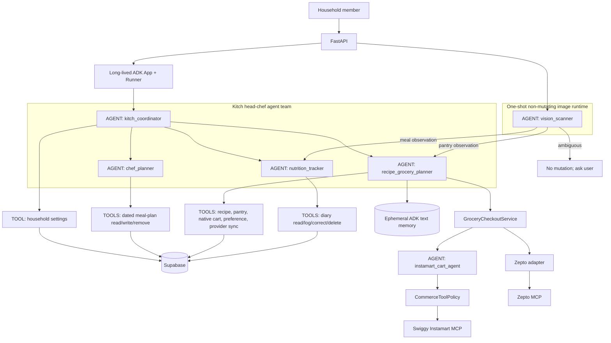

# Kitch AI Agent Architecture

This is the authoritative description of the Gemini + Google ADK topology, domain ownership, memory, and authority boundaries.

## Topology

Every box labelled `AGENT` is a Gemini-backed ADK `LlmAgent`. Tools and services are ordinary Python. Supabase is durable structured state. ADK memory is intentionally process-local flexible text until the Vertex AI memory migration.

`vision_scanner` is a real agent but not a conversational sub-agent. It is one-shot so image classification does not inherit chat assumptions and cannot mutate state. It returns exactly `meal`, `pantry`, or `ambiguous`, structured observations, and no confidence score. Camera and Gallery are only upload mechanisms.

`pantry_reconciliation_mode` is a one-shot structured mode used by the Recipe/Grocery domain before a pantry transaction. It reasons about real-world coverage; the backend validates exact cart IDs and nonnegative quantities before commit.

## Capability matrix

| Agent | Reads | May mutate | Cannot do |
| --- | --- | --- | --- |
| `kitch_coordinator` | Routing context and provider status | Diet, household size, calorie target, timezone | Provider auth/default, carts, payment, order |
| `chef_planner` | Exact dated plans and calendar context | Future ranges, slots and dates; bulk removal after confirmation | Recipes, pantry, groceries, past plans |
| `recipe_grocery_planner` | Recipes, pantry, native cart, memory, provider status | Recipes, pantry, native cart, preferences, reversible provider sync | OAuth, provider default, payment, checkout, cancellation |
| `nutrition_tracker` | Active user's diary | Log, correct, delete one entry; clear day after confirmation | Pantry or household plans |
| `vision_scanner` | Image and accompanying text | Nothing | Tools or persistence claims |
| `instamart_cart_agent` | Scoped intent, preferences and allowed MCP tools | Instamart cart during authorized operation | Checkout, auth, address mutation, provider default |

The complete team is the “head chef.” The coordinator routes; it does not accumulate every domain mutation tool.

## Pantry model

Pantry is shared household state. Recipe/Grocery Planner reads rows, `pantry_revision`, and `pantry_reviewed_at`.

- `patch_pantry_tool` atomically applies `add`, `set`, `adjust`, and single `remove` operations.
- `replace_pantry_tool` creates a pending destructive action; an empty replacement means an empty pantry.
- Current-inventory photos use `set`; explicitly newly purchased stock uses `add`.
- Full replacement updates `pantry_reviewed_at`; incremental edits do not claim a full review.
- Reconciliation calculates each native row’s `purchase_amount`, `purchase_unit`, and `pantry_allocation`.
- The database locks the revision, mutates pantry and cart allocation together, increments the revision, and invalidates provider reviews. Failures roll back everything.

The retired `already_stocked` and `stock_note` snapshots must not return.

## Image routing

1. FastAPI sends the same image+text payload to Vision Scanner for Camera and Gallery.
2. `meal` routes to Nutrition Tracker.
3. `pantry` routes to Recipe/Grocery Planner.
4. `ambiguous` makes no mutation. The browser retains the file and offers “Treat as meal” and “Treat as pantry.”

## Memory

Household food, allergy, brand, pack, and ordering preferences remain natural-language ADK memory, not relational catalogue rules. Agents access it through tools. The current `InMemoryMemoryService` is ephemeral across backend restarts; Vertex AI is the planned durability layer.

Structured product state—pantry, meal plans, recipes, grocery rows, nutrition, settings, and checkout drafts—always belongs in Supabase. Memory never substitutes for failed persistence.

## Commerce safety

Recipe/Grocery Planner owns `sync_provider_cart_tool`. A provider named in chat applies only to that operation; otherwise the backend uses the provider last selected in the UI. Chat never changes that selection.

`CommerceToolPolicy` carries server-owned `read`, `cart_write`, or `checkout` authority. Cart mutation is reversible. Checkout is excluded from agent toolsets and permitted only in the UI Place Order endpoint after durable draft, lease, snapshot, address, payment, revalidation, and acknowledgement checks.

## Confirmation model

Single explicitly identified deletions execute directly. Bulk deletion and complete replacement create an expiring, single-use `pending_agent_actions` row. Chat returns `CONFIRM_DESTRUCTIVE_ACTION`; the frontend shows exact impact and calls confirmation. Cancellation performs no mutation. Backend state—not prompt wording—enforces this.

## Deliberated decisions

Accepted:

- Domain ownership stays split among planning, recipe/grocery/pantry, and nutrition specialists.
- Vision is non-mutating and classifies before persistence.
- Preference memory remains flexible text.
- Native cart is the durable conduit between planning and provider projections.
- Provider sync belongs to Recipe/Grocery Planner; ordering remains UI-only.

Rejected:

- Giving every mutation tool to the coordinator: this makes routing and authority opaque.
- Keeping nutrition inside Vision Scanner: interpretation and diary ownership differ.
- Inferring image purpose from Camera or Gallery.
- A pantry-only `clear_pantry` tool: replacement consistently covers empty, partial, and observed inventories.
- Rigid SQL preference rules for messy product catalogues.
- A `grocery_ordering_agent` router before demonstrated multi-provider routing complexity.
- Provider-specific coordinator sync tools; one provider-neutral specialist tool avoids a tool soup.
- Agent access to auth, saved provider default, payment, checkout, cancellation, or confirmation bypass.

## Persistence postcondition

Agents may claim success only after a successful tool result. FastAPI independently tracks persistence failures and returns 503 even if the agent framework catches a tool exception and continues producing text.
