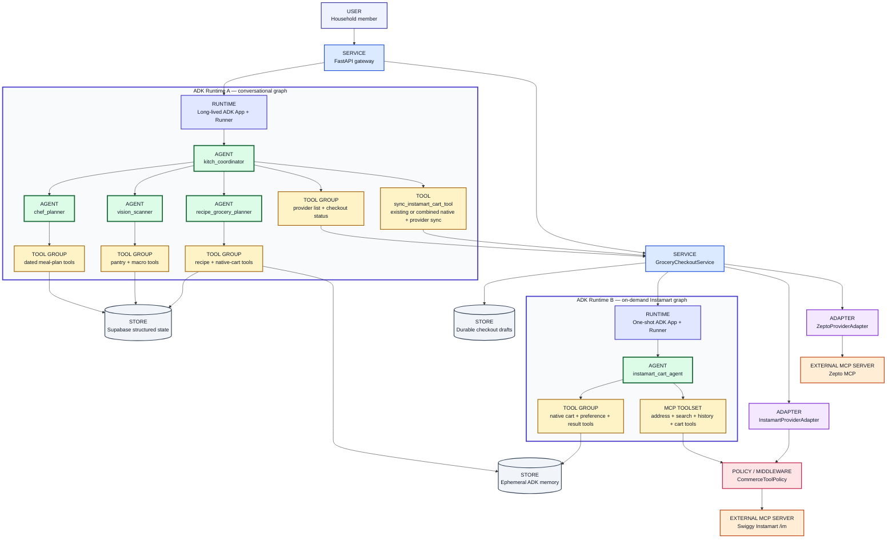

# Kitch AI Agent Architecture

This is the authoritative description of Kitch's AI implementation: agent
topology, ADK runtime shape, routing, tools, model boundary, memory, and
commerce-agent safety.

Product intent lives in `vision_and_requirements.md`. End-to-end application
design and API boundaries live in `system_architecture.md`. Stack and
implementation details live in `current_technology_stack.md`.

---

# Part 1: Agent Topology

This part is scoped to agent roles, routing, tools, memory boundaries, and state ownership.

---

## Topology Summary

Kitch uses two related Google ADK execution graphs:

- One long-lived parent coordinator with three registered specialist
  sub-agents.
- One separate, operation-scoped Instamart cart agent created by
  `GroceryCheckoutService` for an authorized synchronization operation. It is
  not a fourth coordinator sub-agent.
- Three coordinator commerce tools: two read-only tools and one explicit
  Instamart cart-sync tool.
- Python tools for deterministic side effects.
- Supabase for structured app state.
- ADK memory for flexible household preferences.
- A provider-neutral commerce layer in which Zepto remains adapter-driven while
  Instamart catalogue matching and cart preparation are agent-driven.

### How to read the topology

| Type | Meaning in Kitch | Uses Gemini reasoning? | Example |
| :--- | :--- | :---: | :--- |
| **Agent** | A Gemini-backed ADK `LlmAgent` with instructions and an allowed set of tools or sub-agents. | **Yes** | `chef_planner`, `instamart_cart_agent` |
| **Tool** | A callable capability exposed to an agent. It may read state, write state, or invoke a guarded backend service. | No | `get_meal_schedule_tool`, `sync_instamart_cart_tool` |
| **Runtime** | ADK `App`, `Runner`, session, and memory machinery that executes an agent graph. | No | Main conversational runner, operation-scoped Instamart runner |
| **Service** | Deterministic backend orchestration called by HTTP routes or tools. It is ordinary Python, not an LLM. | No | `GroceryCheckoutService` |
| **Adapter** | Deterministic provider-specific translation, normalization, OAuth, and checkout code. | No | `InstamartProviderAdapter` |
| **Policy / middleware** | Server-owned authorization that permits or denies tool calls independently of model output. It is not exposed as a model tool. | No | `CommerceToolPolicy` |
| **Store** | Durable or ephemeral state storage. | No | Supabase, ADK memory |
| **External MCP server** | A remote server that publishes provider tools. It is neither a Kitch agent nor a database. | No | Swiggy Instamart `/im` MCP |

The two ADK runtime boxes both contain real agents. Runtime A is always available
for conversation and contains the coordinator's registered sub-agents. Runtime
B is created only for an authorized Instamart sync, refresh, or order preflight.
`GroceryCheckoutService` invokes Runtime B directly, which is why
`instamart_cart_agent` is not drawn as a child of `kitch_coordinator`.

Provider sync is intentionally outside the `recipe_grocery_planner`. The
dedicated Instamart cart agent handles provider product reasoning during an
authorized initial sync, explicit refresh, or mandatory UI order preflight. The
backend owns authority, durable review, payment, and order approval boundaries.

## Agent-topology decisions

These choices were explicitly deliberated. Future changes should revisit them
only when product evidence changes, not merely to make the graph look more
symmetrical.

### Accepted: one coordinator sync bridge to an operation-scoped provider agent

`kitch_coordinator` retains `sync_instamart_cart_tool`. It is a narrow bridge,
not a replacement for the Instamart agent: the tool establishes backend-owned
scope and invokes `GroceryCheckoutService`, which runs the actual
`instamart_cart_agent`. Both the Groceries UI and explicit chat synchronization
therefore use the same provider workflow.

A combined request such as "add one Dairy Milk chocolate and sync to
Instamart" reuses this tool. Declared native-cart changes are persisted first;
the Instamart agent then receives the resulting complete eligible native cart.
If provider address discovery or synchronization subsequently fails, Kitch
preserves the confirmed native intent, reports the provider failure as a
partial outcome, and emits no provider-cart success action.

### Accepted: native cart is a conduit and reconciliation source

The native cart connects recipe planning, standalone chat requests, manual UI
edits, and provider projection. Calling it authoritative means Kitch can rebuild
or switch an external provider cart from durable household intent. It does not
mean users must manually visit the native-cart UI before every provider action.

Recipe-derived rows remain linked to recipe artifacts. Standalone requests such
as chocolate, milk, or eggs create manual native rows without fabricating a
recipe.

### Accepted: provider matching remains agentic; transaction control remains deterministic

The Instamart agent interprets live product names, brands, packs, quantities,
and preferences. `GroceryCheckoutService` still owns leases, durable drafts,
confirmed MCP result capture, revalidation, approval snapshots, and UI-only
checkout. This is a division of responsibility, not a second matching layer.

### Rejected: remove chat synchronization and make the UI button the only gateway

This was considered and rejected because explicit chat synchronization was an
intentional product capability. Removing the bridge would unnecessarily block
reversible cart preparation even though checkout remains separately protected.

### Rejected: add another composite commerce tool to the coordinator

A separate "mutate native cart and synchronize provider" tool would duplicate
the existing sync entry point and make the parent agent accumulate edge-case
tools. Combined requests instead extend the existing sync tool contract.

### Rejected: add a `grocery_ordering_agent` and provider-sub-agent tree now

An additional routing layer is not justified with the current provider and
intent complexity. It would add latency and another handoff without removing
the application service required by UI entry, leases, persistence, and checkout
safety. Reconsider only if multiple active providers create demonstrated
conversational routing complexity.

### Rejected: register provider cart workers as long-lived conversational sub-agents

Provider agents operate with address-scoped MCP credentials and reversible
cart-write authority for a single transaction. Operation-scoped sessions reduce
cross-cart context leakage, close MCP connections deterministically, and allow
the UI to invoke the same worker without manufacturing a chat handoff.

### Rejected: replace flexible preference memory with deterministic catalogue rules

Food, allergy, brand, and pack preferences remain natural-language ADK memory.
Live catalogues express equivalent products and quantities inconsistently, so
the provider agent must interpret preferences against actual results. Retrieval
relevance can be improved without converting these memories into rigid product
matching tables.

### Rejected: bypass the native cart for chat-originated provider items

Allowing an ad-hoc provider item to exist only in Instamart would split Kitch's
shopping intent across systems and make rebuilds, provider switching, and drift
repair unreliable. Chat may feel direct, but the requested item is first
represented in native intent before the complete provider projection is built.

### Rejected: require every native-cart row to come from a recipe artifact

That rule correctly protects recipe-derived ingredient lists from drifting away
from their recipes, but it incorrectly blocks ordinary staples and explicit
items such as chocolate, milk, or eggs. Recipe-derived rows remain linked and
transactional; explicitly requested standalone rows are stored as manual native
intent by the existing grocery specialist.

---

## Why ADK 2.0 Is the Agent Runtime

Kitch uses Google ADK 2.0 instead of Antigravity SDK for the product runtime.

**Why:**

- ADK provides runtime primitives needed by the application: `LlmAgent`, `Runner`, tools, callbacks, sessions, memory services, and app-level context compaction.
- ADK has a direct path to managed Vertex AI services for persistent sessions and memory.
- ADK keeps the agent graph explicit and inspectable for future developers.
- Antigravity SDK is valuable for agent development workflows, but Kitch needs a stable runtime substrate rather than a development harness as the production app core.

The decision is not a rejection of Antigravity as a development tool. It is a separation between "tools used to build the app" and "framework used by the app at runtime."

---

## `kitch_coordinator`

Role:

- Parent triage agent and conversational entry point.

Responsibilities:

- Interpret natural language intent.
- Route dated schedule creation, exact-range lookup, and meal swaps to `chef_planner`.
- Route food logging, macro diary, pantry scanning, and image-based intake/pantry requests to `vision_scanner`.
- Route recipes, cooking steps, ingredients, grocery planning, standalone native-cart edits, and household food preferences to `recipe_grocery_planner`.
- Answer simple greetings and general chat directly.
- Avoid exposing internal agent names to users.

Tools:

- `list_grocery_providers_tool` — reads provider descriptors and connection
  state.
- `get_grocery_checkout_status_tool` — reads one provider's durable checkout
  status.
- `sync_instamart_cart_tool` — invokes the same guarded Instamart sync service
  used by the Groceries UI, but only for explicit Instamart cart intent. A
  combined add/update/remove-and-sync request carries its native changes through
  this same tool before the resulting complete eligible cart is synchronized.

Why the coordinator has a narrowly scoped write tool:

- Provider sync is an explicit conversational intent rather than ordinary
  grocery planning.
- One bridge keeps the coordinator surface small; no separate tool is added for
  every combination of native mutation and provider synchronization.
- The tool can replace a reversible Instamart cart, but cannot select payment or
  call checkout.
- `GroceryCheckoutService`, `CommerceToolPolicy`, operation leases, and exact
  MCP-result capture remain authoritative; the coordinator cannot claim success
  from text alone.

State available:

- Active user.
- Dietary profile.
- Household size.
- Household members.
- Household timezone and exact current date/time.
- Tomorrow, current-week dates, and next-week dates.
- Visible planner week and selected ISO date supplied as UI context.

---

## `chef_planner`

Role:

- Lightweight household meal scheduler.

Responsibilities:

- Generate dynamic meal schedules for exact requested calendar ranges.
- Resolve tomorrow, this week, next week, exact dates, and rolling ranges using
  the household timezone.
- Include exact dates in meal-plan responses.
- Atomically replace only a requested date range.
- Read existing plans by exact inclusive date range.
- Apply one or more dated slot changes without rewriting unrelated dates.
- Answer schedule questions such as "what's for dinner tonight?"

Tools:

- `get_meal_schedule_tool`
- `replace_meal_plan_range_tool`
- `update_dated_meals_tool`
- `get_current_datetime`

Persistence:

- Writes to Supabase `meal_plans`.
- Meal plans are shared household state.
- Meal slots store meal name strings, not recipe IDs.

Why meal names only:

- Weekly planning should stay fast and lightweight.
- Full recipe and ingredient generation is deferred until the user asks for a recipe or groceries.
- This avoids generating unused recipes for every scheduled meal.

Constraints:

- No static recipe database.
- No local recipe IDs.
- No snack planning.
- No ingredients or grocery cart generation.

---

## `vision_scanner`

Role:

- Food intake logger and pantry/fridge scanner.

Responsibilities:

- Estimate calories and macros from text meal descriptions.
- Estimate calories and macros from plate photos.
- Log meals to the active user's macro diary.
- Detect pantry/fridge items from text or uploaded images.
- Add detected ingredients to shared household pantry.
- Summarize daily nutrition totals.

Tools:

- `add_to_pantry_tool`
- `log_macros_tool`
- `get_pantry_stock_tool`
- `get_macro_diary_tool`
- `get_current_datetime`

Persistence:

- Pantry updates go to shared Supabase `pantry_stock`.
- Macro logs go to individual Supabase `macro_diary`.

Why pantry is shared but macros are individual:

- Pantry is a physical household inventory.
- Macro diaries are personal health records.

Photo-plus-grocery behavior:

- Fridge photos remain a `vision_scanner` responsibility.
- If the same upload also asks for groceries, FastAPI first runs pantry detection, then runs a follow-up recipe+grocery turn against the updated pantry.

Why this two-step flow:

- It prevents the grocery planner from ordering items the user just showed Kitch they already have.

---

## `recipe_grocery_planner`

Role:

- Recipe, ingredient, pantry-aware grocery, standalone native-cart, and
  household food-preference planner.

Responsibilities:

- Generate recipe cards and ingredients for recipe-only requests.
- Generate recipe cards and ingredients for grocery requests.
- Resolve only the requested scope: a dish, tonight's dinner, tomorrow, next N days, or the full week only if explicitly requested.
- Read exact date ranges only for schedule-based recipe/grocery requests.
- Read pantry stock before grocery planning.
- Save every recipe+ingredient output as a `recipe_grocery_plans` artifact.
- Save native grocery cart rows only when the user asks for groceries/cart/buy/order.
- Link agent-created cart rows to the source recipe+grocery artifact.
- Preserve manual cart rows across agent replanning.
- Add, update, and remove explicitly requested standalone cart rows without
  fabricating a recipe artifact. These rows use `source=manual`.
- Save and search flexible household food preferences in ADK memory.

Tools:

- `get_meal_schedule_tool`
- `get_pantry_stock_tool`
- `add_to_pantry_tool`
- `get_grocery_cart_tool`
- `modify_native_grocery_cart_tool`
- `clear_planned_grocery_cart_tool`
- `save_recipe_grocery_plan_tool`
- `get_recipe_grocery_plan_tool`
- `list_recipe_grocery_plans_tool`
- `set_household_food_preference_tool`
- `search_household_food_preferences_tool`
- `get_current_datetime`

Persistence and memory:

- Reads meal names from Supabase `meal_plans`.
- Reads/writes pantry through Supabase `pantry_stock`.
- Writes recipe+ingredient artifacts to Supabase `recipe_grocery_plans`.
- Writes native grocery rows to Supabase `grocery_cart_items`.
- Writes household food preferences to ADK memory using `user_id="shared_household"`.

Why recipe and grocery are one agent:

- Ingredients only make sense relative to a recipe.
- Grocery rows must be derived from the same recipe that the user will cook.
- Splitting recipe generation from grocery generation caused the risk of buying the wrong items or omitting needed ingredients.

Why standalone cart edits remain here:

- The existing grocery specialist already owns Kitch's provider-neutral
  shopping intent.
- A chocolate bar, cleaning-adjacent food item, or household staple need not be
  justified by a recipe.
- Keeping this capability off the coordinator avoids turning the parent agent
  into a collection of persistence edge cases.

Why provider sync is excluded:

- Provider catalog matching, addresses, payments, and order state are commerce-layer concerns.
- The recipe+grocery agent should not be able to place real orders.
- Provider cart writes require an explicit UI or chat synchronization request;
  payment and checkout still require UI controls and backend review snapshots.

Constraints:

- Recipe-only requests do not update the native grocery cart.
- Grocery requests save both the artifact and native cart rows.
- Recipe-derived cart rows must come from the same recipe cards; explicitly
  requested standalone rows are allowed without a recipe artifact.
- Pantry-covered rows remain in the cart with `alreadyStocked=true`.
- The agent does not call provider MCP, sync, payment, or order-placement tools.

---

## Provider Boundary

Current backend-owned provider behavior:

- Native cart remains Kitch's source of truth.
- "Source of truth" is a data-reconciliation role, not a mandatory UI step:
  recipes, direct chat edits, and manual UI edits may all contribute native
  intent before provider projection.
- `ProviderRegistry` describes Zepto, Swiggy Instamart, and disabled Blinkit.
- `GroceryCheckoutService` applies native-snapshot validation, synchronization,
  revalidation, persisted leases, approval snapshots, and order safety.
- Zepto and Instamart implement the same `GroceryProviderAdapter` contract.
- A sync succeeds only after the resulting provider cart is read back and
  reconciled against every selected native row.
- Drafts older than five minutes are marked stale outside the chat graph. The
  user explicitly refreshes and repairs them before payment; material changes
  reset payment and acknowledgement.
- A real order requires a provider-returned payment method, explicit frontend
  acknowledgement, and one unchanged final provider check.

`instamart_cart_agent` is a dedicated Gemini ADK agent with Swiggy's native MCP
tools: `get_addresses`, `search_products`, `your_go_to_items`, `update_cart`,
and `get_cart`. It reads the backend-scoped native selection, searches explicit
process-local ordering preferences, treats Swiggy history as weaker evidence,
interprets pack and quantity descriptions semantically, and automatically
chooses the best reasonable orderable match. Multiple brands or pack sizes are
normal search results, not grounds for rejection.

The agent updates the complete Instamart cart once and may repair it once after
reading the confirmed cart. An after-tool callback captures the exact MCP
results. Durable product, price, quantity, and bill state comes from the final
`get_cart`, while the model contributes persisted match reasoning, preference
source, quantity coverage, excess, alternatives, and confidence.

`CommerceToolPolicy` carries server-owned `read`, `cart_write`, and `checkout`
authority in request context unavailable to the model. The agent toolset omits
checkout entirely. Middleware independently denies checkout from chat, sync,
and revalidation, denies unknown mutating tools, and allows checkout only from
the UI place-order endpoint after the durable snapshot checks pass.

Why checkout remains outside the agent topology:

- Provider tools can modify real external carts and place real orders.
- Product safety requires explicit approval boundaries.
- Provider responses include operational details that should be reviewed by the user, not hidden inside an agent turn.

The coordinator receives read-only provider status plus one explicit
`sync_instamart_cart_tool`. That tool invokes the same guarded service used by
the Groceries UI. For a combined explicit request it applies declared native
changes first, then passes the resulting complete eligible cart through the
same service and Instamart agent. FastAPI emits `UPDATE_PROVIDER_CART` only
when the durable Instamart draft actually changes. The tool has no order
capability.

This is the intended topology. The currently reproducible failure in which an
explicit Instamart sync request is routed to recipe/native-grocery handling is
tracked as KI-001 in `known_issues_and_optimizations.md`; it is a routing bug,
not the designed ownership model.

---

## Shared vs Individual State

Shared household state:

- Weekly meal plan.
- Planning week date window.
- Recipe+grocery artifacts.
- Pantry/fridge stock.
- Native grocery cart.
- Household food preferences.
- Brand preferences.
- Household size and planning diet profile.

Individual state:

- Active chat/session context.
- Macro diary logs.
- Daily nutrition progress.

Why:

- Food planning and pantry purchasing happen for the home.
- Nutrition tracking happens for the person.

---

## Current Memory and Session Services

Current local services:

- `InMemorySessionService`
- `InMemoryMemoryService`

Planned production replacements:

- `VertexAISessionService`
- `VertexAIMemoryBank`

Why in-memory now:

- Faster local iteration while the core product loop is still changing.
- No cloud session/memory setup required during early development.
- Backend restarts intentionally clear transient chat/session memory.
- Structured product records already persist in Supabase.

Why Vertex later:

- Deployed users need durable sessions and durable household preferences.
- Vertex services align with the ADK runtime path.
- Migration can happen without changing agent responsibilities.

Food and brand preferences remain flexible text for agent reference. They are intentionally not modeled as rigid preference tables.

---

# Part 2: AI Runtime Architecture

Kitch's AI layer is a Google ADK 2.0 multi-agent system behind a FastAPI gateway. Agents handle culinary reasoning and call Python tools. Python tools perform deterministic side effects. Supabase persists structured records. ADK memory stores flexible but explicitly ephemeral household preferences.

---

## Runtime Shape

The topology diagram above is authoritative. There are three entry paths:

1. **Ordinary chat or image request:** the browser calls FastAPI, which runs the
   main ADK graph beginning at `kitch_coordinator`.
2. **Groceries UI provider action:** the browser calls a provider-keyed FastAPI
   route, which invokes `GroceryCheckoutService`. Instamart actions may create
   the operation-scoped Instamart ADK graph; Zepto remains adapter-driven.
3. **Explicit chat-based Instamart sync:** `kitch_coordinator` calls
   `sync_instamart_cart_tool`, which enters the same `GroceryCheckoutService`
   path as the UI and creates the same operation-scoped Instamart graph.

The browser never calls an agent or provider MCP server directly. FastAPI owns
request context, persistence postconditions, provider authority, and frontend
state-sync actions.

---

## Why Google ADK 2.0

Kitch previously explored agent development through Antigravity-oriented workflows, but the application runtime is now Google ADK 2.0.

**Why ADK:**

- `LlmAgent` gives explicit agent responsibilities and tool lists.
- `Runner` gives a standard execution path for chat turns and multimodal turns.
- `App` supports callbacks and context compaction.
- ADK has first-class session and memory service abstractions.
- ADK can later move to Vertex AI managed memory/session services.
- ADK keeps the runtime understandable for new developers and coding agents.

**Why not Antigravity SDK as runtime:**

- Antigravity is better treated as a development/agent-building environment.
- Kitch needs a stable app runtime with service abstractions, docs, and deployment paths.
- The product should not depend on a dev harness for production chat/session/memory behavior.

---

## ADK Primitives in Use

Locations:

- Main coordinator graph: `backend/app/agent/core.py`
- One-shot Instamart graph: `backend/app/agent/instamart_cart_agent.py`

Current primitives:

- `LlmAgent`
- `Runner`
- `App`
- `InMemorySessionService`
- `InMemoryMemoryService`
- `EventsCompactionConfig`
- `LlmEventSummarizer`
- Native ADK `Gemini` model adapter, configured with `KITCH_LLM_MODEL`.
- `McpToolset` with a five-tool Instamart allowlist for the operation-scoped cart agent.

Why model configuration is environment-driven:

- Local Google AI Studio testing and Vertex AI deployment use the same Gemini adapter.
- The Gemini model version can be changed without editing agent definitions.
- Non-Gemini model IDs are rejected during backend startup.

---

## Agent Team

### `kitch_coordinator`

Parent triage agent.

Responsibilities:

- Understand user intent.
- Route dated schedule creation, schedule lookup, and swaps to `chef_planner`.
- Route food logging, macro diary, pantry, and image tasks to `vision_scanner`.
- Route recipes, ingredients, grocery planning, standalone native-cart edits,
  and household food preferences to `recipe_grocery_planner`.
- Answer simple general chat directly.

Why:

- A coordinator keeps user conversation natural while keeping side-effect tools on specialist agents.

### `chef_planner`

Lightweight meal scheduling agent.

Responsibilities:

- Generate dynamic schedules for exact requested calendar ranges.
- Treat "next week" as the upcoming Monday-Sunday planning window while
  resolving tomorrow and other scopes independently.
- Include exact dates in meal-plan responses.
- Save dated meal plans to Supabase transactionally.
- Store actual meal names, not recipe IDs.
- Update one meal slot without rewriting the rest of the plan.
- Answer schedule questions such as "what's for dinner tonight?"

Why lightweight:

- Weekly schedule creation should not become recipe and grocery generation for 21 meals.
- Recipe details are generated only when the user asks for them.

### `vision_scanner`

Food intake and pantry/fridge scanning agent.

Responsibilities:

- Estimate macros from text meal descriptions.
- Estimate macros from plate photos.
- Log meals to the active member's macro diary.
- Detect pantry/fridge items from text or photos.
- Add detected stock to the shared household pantry.

Why separated:

- Vision and macro logging are different from recipe/grocery reasoning.
- Pantry updates from photos should happen before grocery planning.

### `recipe_grocery_planner`

Recipe, ingredient, and native grocery planning agent.

Responsibilities:

- Generate recipe cards and structured ingredients for recipe-only requests.
- Save recipe-only outputs as `recipe_grocery_plans` without touching the native grocery cart.
- Generate recipe cards and structured ingredients for grocery requests.
- Read only the requested exact date/meal scope from the dated schedule.
- Read pantry stock before grocery planning.
- Save pantry-aware native cart rows derived from the same recipe cards.
- Link native cart rows to the source recipe+grocery artifact.
- Preserve manual cart rows by replacing only `source=agent` rows.
- Add, update, and remove standalone `source=manual` native-cart rows directly
  from chat without creating a fake recipe artifact.
- Store and search household food preferences in ADK memory.
- Avoid Zepto/Blinkit/provider tools.

Why recipe+grocery together:

- Grocery rows should be based on the recipe the user will actually cook.
- Separate recipe and grocery agents created a risk of mismatched ingredients.

### `instamart_cart_agent`

Separate operation-scoped commerce specialist. It is instantiated by
`InstamartCartAgentService` for an authorized sync/revalidation/preflight run;
it is not registered in `kitch_coordinator.sub_agents`.

Responsibilities:

- Read the backend-scoped native selection and selected address.
- Read exact household ordering preferences and weaker Swiggy history.
- Search the address-scoped Instamart catalogue iteratively.
- Interpret brands, product equivalence, real-world pack wording, requested
  quantity coverage, excess, and alternatives.
- Replace the complete Instamart cart once, with at most one repair update.
- Read the resulting cart and record match reasoning against the exact captured
  MCP results.

MCP tools:

- `get_addresses`
- `search_products`
- `your_go_to_items`
- `update_cart`
- `get_cart`

Local tools:

- `read_scoped_native_cart_tool`
- `search_ordering_preferences_tool`
- `store_ordering_preference_tool`
- `record_instamart_cart_result_tool`

Safety boundary:

- Checkout, payment selection, address mutation, cancellation, and unknown
  mutating tools are absent or denied.
- The model supplies selection reasoning; the captured final `get_cart` supplies
  durable product, quantity, price, and bill truth.

---

## Tool Boundary

Meal schedule tools:

- `get_meal_schedule_tool`
- `replace_meal_plan_range_tool`
- `update_dated_meals_tool`
- `get_current_datetime`

Pantry and macro tools:

- `get_pantry_stock_tool`
- `add_to_pantry_tool`
- `log_macros_tool`
- `get_macro_diary_tool`

Recipe+grocery tools:

- `get_grocery_cart_tool`
- `modify_native_grocery_cart_tool`
- `clear_planned_grocery_cart_tool`
- `save_recipe_grocery_plan_tool`
- `get_recipe_grocery_plan_tool`
- `list_recipe_grocery_plans_tool`
- `set_household_food_preference_tool`
- `search_household_food_preferences_tool`
- `get_pantry_stock_tool`
- `add_to_pantry_tool`

Provider tools/adapters:

- `list_grocery_providers_tool` and `get_grocery_checkout_status_tool` are
  read-only coordinator tools.
- `sync_instamart_cart_tool` authorizes only reversible Instamart cart writes
  after an explicit chat instruction. It also accepts declared native-cart
  changes for a combined request, rather than requiring another coordinator
  tool.
- The dedicated cart agent can search and update Instamart, but no agent can
  select payment or place an order.

Why:

- Agents should not be able to place real orders through ordinary conversation.
- Provider actions need explicit UI review and approval.

---

## Session State Injection

FastAPI syncs these values into ADK session state before each chat turn:

- `user:profile_name`
- `user:dietary_profile`
- `app:household_size`
- `app:household_members`
- `app:planner_week_start`
- `app:planner_selected_date`

The before-agent callback injects:

- `current_datetime`
- `current_day_of_week`
- `current_date`
- `tomorrow_date`
- `household_timezone`
- `current_week_start`
- `current_week_end`
- `current_week_dates`
- `planning_week_start`
- `planning_week_end`
- `planning_week_dates`

Why:

- Agents receive today, tomorrow, the current week, the next calendar week,
  and the user's visible planner context as distinct concepts.
- All reads and writes use ISO dates; weekday names are never schedule keys.

---

## Memory Model

Supabase stores structured state:

- Meal schedules.
- Recipe+grocery artifacts.
- Pantry stock.
- Grocery cart rows.
- Macro logs.
- Household profile settings.

ADK memory stores flexible, explicitly ephemeral household preferences:

- Food preferences such as "we prefer not to use tofu."
- Category exclusions such as "avoid mushrooms."
- Planning styles such as "prefer high protein dinners."
- Provider/brand preferences such as "butter: Amul butter."

Why this split:

- Structured UI records need deterministic storage and schema.
- Preferences need natural-language flexibility, but they are not durable until
  the planned Vertex migration.

Persistence rule for every agent:

- A tool result may be described as saved or updated only after it returns
  success. A failed or missing persistence result means nothing was saved; the
  FastAPI request postcondition enforces this even if an agent framework
  continues after a tool error.

---

## Current Session and Memory Services

Current services:

- `InMemorySessionService`
- `InMemoryMemoryService`

Planned services:

- `VertexAISessionService`
- `VertexAIMemoryBank`

Why in-memory now:

- Local development is faster.
- Resetting session/memory on backend restart is acceptable during prototyping.
- Supabase persists the records the UI depends on.
- Managed memory will be easier to validate after the deployed app flow is stable.

Why Vertex later:

- Deployed users need memory and sessions to survive backend restarts.
- Vertex aligns with ADK service abstractions.
- The agent graph can stay the same while swapping service implementations.

---

## Context Compaction

The ADK `App` uses `EventsCompactionConfig` with `LlmEventSummarizer`.

Current settings:

- `compaction_interval=4`
- `overlap_size=1`

Why:

- Long-running household conversations can grow quickly.
- Compaction keeps session context bounded while preserving recent conversation state.

This is separate from product persistence. Meal plans, recipes, groceries, pantry, and macro logs are stored in Supabase, not only in compacted chat context.
