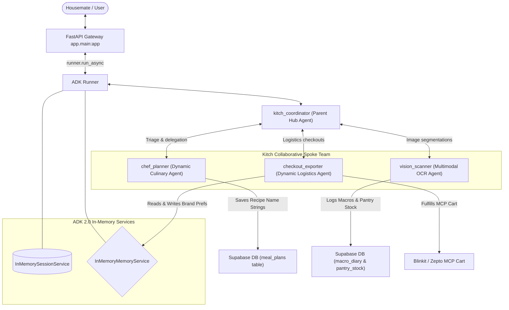

# AI Layer Architectural Proposal: Kitch (Google ADK 2.0 Dynamic Engine)

> [!NOTE]
> This document outlines the core **AI Layer Architecture** for Kitch. We rely exclusively on the **Google Agent Development Kit (ADK) 2.0** (`google.adk`) as our singular agentic harness, implementing autonomous multi-agent routing (Hub-and-Spoke Topology), dynamic LLM-based recipe and scaling reasoning, in-memory compactor logic, and Supabase database integration.

---

## 1. Core Framework & Harness: Google ADK 2.0

The Google ADK 2.0 framework serves as our exclusive agentic harness. It coordinates the cognitive loop, persists sessions, manages native shared memory, and isolates operational domains across cooperative specialist sub-agents.



---

## 2. Dynamic Hub-and-Spoke Subagents

To prevent context window bloat, the **Kitch Coordinator Agent** natively routes requests to three specialized sub-agents. Sub-agents run in isolated context windows, returning only clean, structured markdown results back to the Coordinator.

### A. Kitch Coordinator Agent (`kitch_coordinator`)
*   **Role**: Primary parent orchestrator and general manager.
*   **Instruction**: Triage user requests, direct household parameters (household size, diet profiles), manage overall state, and delegate operational commands behind the scenes without explicitly exposing agent names.

### B. Chef Planner Agent (`chef_planner`)
*   **Role**: Empathetic household nutritionist and private chef.
*   **Dynamic Recipe Logic**: **Generates all recipes and plans dynamically from its own mind.** No static databases or IDs exist. Recipes are stored in the Supabase database as actual text recipe names (e.g. `"Avocado & Poached Egg Toast"`, `"Spaghetti Carbonara"`) under breakfast, lunch, dinner, and snack columns.
*   **Tools**: `get_weekly_schedule_tool()`, `save_weekly_plan_tool()`, `update_single_meal_in_schedule()`, `get_current_datetime()`.

### C. Vision Scanner Agent (`vision_scanner`)
*   **Role**: Multimodal computer vision analyst.
*   **Multimodal Input**: Natively ingests raw image bytes utilizing ADK 2.0 `Part` builders, segmenting fridge interior shelves (ocr scan) or post-meal plates (estimating macros).
*   **Tools**: `add_to_pantry_tool()`, `log_macros_tool()`, `get_pantry_stock_tool()`, `get_macro_diary_tool()`, `get_current_datetime()`.

### D. Checkout Exporter Agent (`checkout_exporter`)
*   **Role**: Smart logistics coordinator and delivery exporter.
*   **Dynamic Grocery calculations**: Compiles, scales, and subtracts grocery lists dynamically using its own culinary reasoning. It fetches current planned recipe names (`get_weekly_schedule_tool`), retrieves pantry stock (`get_pantry_stock_tool`), scales ingredients for the household size, subtracts stock mathematically, and formats the shopping checklist in markdown.
*   **Tools**: `get_weekly_schedule_tool()`, `get_pantry_stock_tool()`, `add_to_pantry_tool()`, `set_brand_preference()`, `get_brand_preference()`, `export_to_delivery()`, `get_current_datetime()`.

---

## 3. Platform-Agnostic Intermediary Grocery List

To prevent our grocery core from being tightly coupled to a single delivery merchant:
1.  **Intermediate State**: Pantry stocks and planned recipe names are persisted in live Supabase postgres tables.
2.  **Dynamic Brand Preferences Mapping**: Stored brand preferences (e.g. mapping bread to `"Baker's Dozen Whole Wheat"`) are saved to the unified `InMemoryMemoryService` under `user_id="shared_household"`.
3.  **MCP Exporters**: When exporting, `checkout_exporter` maps generic required checklist items to branded preferences from native memory, then pushes the target list directly to the `Blinkit` or `Zepto` MCP adapter tools.

---

## 4. Pure Python ADK 2.0 Blueprint

Below is the technical assembly blueprint using pure `google.adk` primitives, matching the production application:

```python
import os
from google.adk.agents.llm_agent import LlmAgent
from google.adk.runners import Runner
from google.adk.sessions import InMemorySessionService
from google.adk.memory import InMemoryMemoryService
from google.adk.apps.app import App, EventsCompactionConfig
from google.adk.apps.llm_event_summarizer import LlmEventSummarizer
from google.adk.models.lite_llm import LiteLlm

# Initialize model using stable Azure OpenAI LiteLLM driver
azure_llm = LiteLlm(
    model="openai/gpt-5.5",
    api_key=os.environ["OPENAI_API_KEY"],
    api_base=os.environ["OPENAI_API_BASE"],
    custom_llm_provider="openai"
)

# 1. Assemble sub-agents with tools
chef_planner = LlmAgent(
    model=azure_llm,
    name="chef_planner",
    instruction="Generate recipes and weekly plans dynamically. Save recipe name strings to DB.",
    tools=[get_weekly_schedule_tool, save_weekly_plan_tool, update_single_meal_in_schedule]
)

checkout_exporter = LlmAgent(
    model=azure_llm,
    name="checkout_exporter",
    instruction="Fetch plan names and pantry stock. Scale and subtract grocery items dynamically.",
    tools=[get_weekly_schedule_tool, get_pantry_stock_tool, export_to_delivery]
)

# 2. Assemble coordinator parent agent
kitch_coordinator = LlmAgent(
    model=azure_llm,
    name="kitch_coordinator",
    sub_agents=[chef_planner, checkout_exporter],
    before_agent_callback=inject_datetime_callback
)

# 3. Enable background compaction to compress context turns
app_instance = App(
    name="kitch",
    root_agent=kitch_coordinator,
    events_compaction_config=EventsCompactionConfig(
        compaction_interval=4,
        overlap_size=1,
        summarizer=LlmEventSummarizer(llm=azure_llm)
    )
)

# 4. Instantiate central runner
runner = Runner(
    app=app_instance,
    session_service=InMemorySessionService(),
    memory_service=InMemoryMemoryService()
)
```
