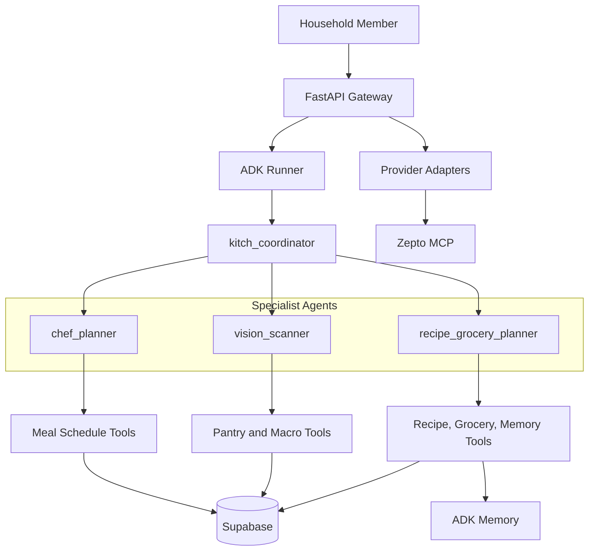

# Kitch: Current Agent Topology

This document focuses only on agent roles, routing, tools, memory boundaries, and state ownership. Broader system architecture lives in `current_architecture.md`.

---

## Topology Overview

Kitch uses a hub-and-spoke Google ADK 2.0 topology:

- One parent coordinator agent.
- Three specialist sub-agents.
- Python tools for database, memory, and app-state side effects.
- Shared household state for schedules, recipe+grocery plans, pantry, native cart, and food preferences.
- Individual state for macro diary logging.

Provider sync is not part of the recipe+grocery agent. The Zepto adapter remains behind backend HTTP endpoints and can later move behind a dedicated provider agent.

---

## `kitch_coordinator`

Role:

- Main conversational triage agent.

Responsibilities:

- Interpret natural language intent.
- Route weekly schedule creation, schedule lookup, and meal swaps to `chef_planner`.
- Route food logging, macro diary, pantry scanning, and image requests to `vision_scanner`.
- Route recipes, cooking steps, ingredients, grocery planning, and food preferences to `recipe_grocery_planner`.
- Answer simple general chat directly.

Tools:

- None.

State available:

- Active user.
- Dietary profile.
- Household size.
- Household members.
- Current date/time.
- Upcoming planning week dates.

---

## `chef_planner`

Role:

- Lightweight household meal scheduler.

Responsibilities:

- Generate dynamic weekly meal schedules.
- Plan "next week" as the upcoming Monday-Sunday date window.
- Include exact dates in meal-plan responses.
- Save structured weekly plans.
- Read existing weekly plans.
- Change one meal slot without rewriting the week.
- Answer schedule questions such as "what's for dinner tonight?"

Tools:

- `get_weekly_schedule_tool`
- `save_weekly_plan_tool`
- `update_single_meal_in_schedule`
- `get_current_datetime`

Persistence:

- Writes to Supabase `meal_plans`.
- Meal plans are shared household state.
- Meal slots store meal name strings, not recipe IDs.

Constraints:

- No static recipe database.
- No local recipe IDs.
- No snack planning.
- Detailed recipes, ingredients, and groceries are not generated here.

---

## `vision_scanner`

Role:

- Food intake logger and pantry/fridge scanner.

Responsibilities:

- Estimate calories and macros from text meal descriptions.
- Estimate calories and macros from plate photos.
- Log meals to the active user's macro diary.
- Detect pantry/fridge items from text or uploaded images.
- Add detected ingredients to shared household pantry.
- Summarize daily nutrition totals.

Tools:

- `add_to_pantry_tool`
- `log_macros_tool`
- `get_pantry_stock_tool`
- `get_macro_diary_tool`
- `get_current_datetime`

Persistence:

- Pantry updates go to shared Supabase `pantry_stock`.
- Macro logs go to individual Supabase `macro_diary`.

Photo-plus-grocery behavior:

- Fridge photos remain a `vision_scanner` responsibility.
- If the same upload also asks for groceries, FastAPI runs recipe+grocery planning after the pantry update completes.

---

## `recipe_grocery_planner`

Role:

- Recipe, ingredient, pantry-aware grocery, native cart, and household food-preference planner.

Responsibilities:

- Generate recipe cards and ingredients for recipe-only requests.
- Generate recipe cards and ingredients for grocery requests.
- Resolve only the requested scope: a dish, tonight's dinner, tomorrow, next N days, or the full week if explicitly requested.
- Read the weekly schedule only for schedule-based grocery/recipe requests.
- Read pantry stock before grocery planning.
- Save every recipe+ingredient output as a `recipe_grocery_plans` artifact.
- Save native grocery cart rows only when the user asks for groceries/cart/buy/order.
- Link agent-created cart rows to the source recipe+grocery artifact.
- Preserve manual cart rows across agent replanning.
- Save and search flexible household food preferences in ADK memory.

Tools:

- `get_weekly_schedule_tool`
- `get_pantry_stock_tool`
- `add_to_pantry_tool`
- `get_grocery_cart_tool`
- `clear_planned_grocery_cart_tool`
- `save_recipe_grocery_plan_tool`
- `get_recipe_grocery_plan_tool`
- `list_recipe_grocery_plans_tool`
- `set_household_food_preference_tool`
- `search_household_food_preferences_tool`
- `get_current_datetime`

Persistence and memory:

- Reads meal names from Supabase `meal_plans`.
- Reads/writes pantry through Supabase `pantry_stock`.
- Writes recipe+ingredient artifacts to Supabase `recipe_grocery_plans`.
- Writes native grocery rows to Supabase `grocery_cart_items`.
- Writes household food preferences to ADK memory using `user_id="shared_household"`.

Constraints:

- Recipe-only requests do not update the native grocery cart.
- Grocery requests save both the artifact and native cart rows.
- Cart rows must be derived from the same recipe cards.
- Pantry-covered rows remain in the cart with `alreadyStocked=true`.
- The agent does not call Zepto, Blinkit, provider sync, export, or order-placement tools.

---

## Provider Boundary

Provider behavior is outside the current agent topology.

Current backend-owned provider behavior:

- Native cart remains the Kitch source of truth.
- `ZeptoProviderAdapter` can sync unchecked, non-stocked native cart rows to Zepto through backend HTTP routes.
- Real order placement requires a separate frontend approval button.

Future direction:

- Provider cart translation can move behind a separate provider agent if the product needs agentic catalog/substitution reasoning.

---

## Shared vs Individual State

Shared household state:

- Weekly meal plan.
- Planning week date window.
- Recipe+grocery artifacts.
- Pantry/fridge stock.
- Native grocery cart.
- Household food preferences.
- Household size and planning diet profile.

Individual state:

- Active chat/session context.
- Macro diary logs.
- Daily nutrition progress.

---

## Current Memory Services

Current local services:

- `InMemorySessionService`
- `InMemoryMemoryService`

Planned production replacements:

- `VertexAISessionService`
- `VertexAIMemoryBank`

Food and brand preferences remain flexible text for agent reference. They are intentionally not modeled as rigid preference tables.
