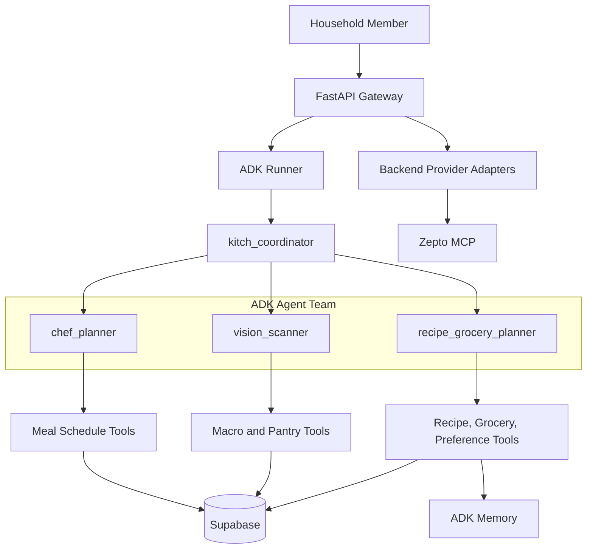

# Kitch: Current Agent Topology

This document is scoped to agent roles, routing, tools, memory boundaries, and state ownership. Product intent lives in `vision_and_requirements.md`. System design and API boundaries live in `current_architecture.md`. Stack and implementation details live in `current_technology_stack.md`.

---

## Topology Summary

Kitch uses a Google ADK 2.0 hub-and-spoke topology:

- One parent coordinator agent.
- Three specialist sub-agents.
- Python tools for deterministic side effects.
- Supabase for structured app state.
- ADK memory for flexible household preferences.
- Backend provider adapters for Zepto and future delivery providers.

Provider sync is intentionally outside the `recipe_grocery_planner`. The agent owns native recipe+grocery planning. The backend owns provider cart sync and order approval boundaries.

---

## Why ADK 2.0 Is the Agent Runtime

Kitch uses Google ADK 2.0 instead of Antigravity SDK for the product runtime.

**Why:**

- ADK provides runtime primitives needed by the application: `LlmAgent`, `Runner`, tools, callbacks, sessions, memory services, and app-level context compaction.
- ADK has a direct path to managed Vertex AI services for persistent sessions and memory.
- ADK keeps the agent graph explicit and inspectable for future developers.
- Antigravity SDK is valuable for agent development workflows, but Kitch needs a stable runtime substrate rather than a development harness as the production app core.

The decision is not a rejection of Antigravity as a development tool. It is a separation between "tools used to build the app" and "framework used by the app at runtime."

---

## `kitch_coordinator`

Role:

- Parent triage agent and conversational entry point.

Responsibilities:

- Interpret natural language intent.
- Route weekly schedule creation, schedule lookup, and meal swaps to `chef_planner`.
- Route food logging, macro diary, pantry scanning, and image-based intake/pantry requests to `vision_scanner`.
- Route recipes, cooking steps, ingredients, grocery planning, and household food preferences to `recipe_grocery_planner`.
- Answer simple greetings and general chat directly.
- Avoid exposing internal agent names to users.

Tools:

- None.

Why no tools:

- The coordinator should not perform side effects. It should choose the correct specialist. This reduces accidental writes and keeps responsibilities clear.

State available:

- Active user.
- Dietary profile.
- Household size.
- Household members.
- Current date/time.
- Upcoming planning week dates.

---

## `chef_planner`

Role:

- Lightweight household meal scheduler.

Responsibilities:

- Generate dynamic weekly meal schedules.
- Treat "next week" as the upcoming Monday-Sunday planning window.
- Include exact dates in meal-plan responses.
- Save structured weekly plans.
- Read existing weekly plans.
- Change one meal slot without rewriting the week.
- Answer schedule questions such as "what's for dinner tonight?"

Tools:

- `get_weekly_schedule_tool`
- `save_weekly_plan_tool`
- `update_single_meal_in_schedule`
- `get_current_datetime`

Persistence:

- Writes to Supabase `meal_plans`.
- Meal plans are shared household state.
- Meal slots store meal name strings, not recipe IDs.

Why meal names only:

- Weekly planning should stay fast and lightweight.
- Full recipe and ingredient generation is deferred until the user asks for a recipe or groceries.
- This avoids generating unused recipes for every scheduled meal.

Constraints:

- No static recipe database.
- No local recipe IDs.
- No snack planning.
- No ingredients or grocery cart generation.

---

## `vision_scanner`

Role:

- Food intake logger and pantry/fridge scanner.

Responsibilities:

- Estimate calories and macros from text meal descriptions.
- Estimate calories and macros from plate photos.
- Log meals to the active user's macro diary.
- Detect pantry/fridge items from text or uploaded images.
- Add detected ingredients to shared household pantry.
- Summarize daily nutrition totals.

Tools:

- `add_to_pantry_tool`
- `log_macros_tool`
- `get_pantry_stock_tool`
- `get_macro_diary_tool`
- `get_current_datetime`

Persistence:

- Pantry updates go to shared Supabase `pantry_stock`.
- Macro logs go to individual Supabase `macro_diary`.

Why pantry is shared but macros are individual:

- Pantry is a physical household inventory.
- Macro diaries are personal health records.

Photo-plus-grocery behavior:

- Fridge photos remain a `vision_scanner` responsibility.
- If the same upload also asks for groceries, FastAPI first runs pantry detection, then runs a follow-up recipe+grocery turn against the updated pantry.

Why this two-step flow:

- It prevents the grocery planner from ordering items the user just showed Kitch they already have.

---

## `recipe_grocery_planner`

Role:

- Recipe, ingredient, pantry-aware grocery, native cart, and household food-preference planner.

Responsibilities:

- Generate recipe cards and ingredients for recipe-only requests.
- Generate recipe cards and ingredients for grocery requests.
- Resolve only the requested scope: a dish, tonight's dinner, tomorrow, next N days, or the full week only if explicitly requested.
- Read the weekly schedule only for schedule-based recipe/grocery requests.
- Read pantry stock before grocery planning.
- Save every recipe+ingredient output as a `recipe_grocery_plans` artifact.
- Save native grocery cart rows only when the user asks for groceries/cart/buy/order.
- Link agent-created cart rows to the source recipe+grocery artifact.
- Preserve manual cart rows across agent replanning.
- Save and search flexible household food preferences in ADK memory.

Tools:

- `get_weekly_schedule_tool`
- `get_pantry_stock_tool`
- `add_to_pantry_tool`
- `get_grocery_cart_tool`
- `clear_planned_grocery_cart_tool`
- `save_recipe_grocery_plan_tool`
- `get_recipe_grocery_plan_tool`
- `list_recipe_grocery_plans_tool`
- `set_household_food_preference_tool`
- `search_household_food_preferences_tool`
- `get_current_datetime`

Persistence and memory:

- Reads meal names from Supabase `meal_plans`.
- Reads/writes pantry through Supabase `pantry_stock`.
- Writes recipe+ingredient artifacts to Supabase `recipe_grocery_plans`.
- Writes native grocery rows to Supabase `grocery_cart_items`.
- Writes household food preferences to ADK memory using `user_id="shared_household"`.

Why recipe and grocery are one agent:

- Ingredients only make sense relative to a recipe.
- Grocery rows must be derived from the same recipe that the user will cook.
- Splitting recipe generation from grocery generation caused the risk of buying the wrong items or omitting needed ingredients.

Why provider sync is excluded:

- Zepto/Blinkit catalog matching, addresses, payments, and order state are provider concerns.
- The recipe+grocery agent should not be able to place real orders.
- Provider actions require explicit UI controls and backend review snapshots.

Constraints:

- Recipe-only requests do not update the native grocery cart.
- Grocery requests save both the artifact and native cart rows.
- Cart rows must be derived from the same recipe cards.
- Pantry-covered rows remain in the cart with `alreadyStocked=true`.
- The agent does not call Zepto, Blinkit, provider sync, export, or order-placement tools.

---

## Provider Boundary

Current backend-owned provider behavior:

- Native cart remains Kitch's source of truth.
- `ZeptoProviderAdapter` can sync selected, non-stocked native cart rows to Zepto through backend HTTP routes.
- Zepto sync creates a review snapshot.
- Real order placement requires a separate frontend approval button.

Why provider behavior is outside the agent topology:

- Provider tools can modify real external carts and place real orders.
- Product safety requires explicit approval boundaries.
- Provider responses include operational details that should be reviewed by the user, not hidden inside an agent turn.

Future direction:

- Provider cart translation can move behind a separate provider agent if the product later needs agentic catalog/substitution reasoning.
- Even then, order placement should remain guarded by frontend approval.

---

## Shared vs Individual State

Shared household state:

- Weekly meal plan.
- Planning week date window.
- Recipe+grocery artifacts.
- Pantry/fridge stock.
- Native grocery cart.
- Household food preferences.
- Brand preferences.
- Household size and planning diet profile.

Individual state:

- Active chat/session context.
- Macro diary logs.
- Daily nutrition progress.

Why:

- Food planning and pantry purchasing happen for the home.
- Nutrition tracking happens for the person.

---

## Current Memory and Session Services

Current local services:

- `InMemorySessionService`
- `InMemoryMemoryService`

Planned production replacements:

- `VertexAISessionService`
- `VertexAIMemoryBank`

Why in-memory now:

- Faster local iteration while the core product loop is still changing.
- No cloud session/memory setup required during early development.
- Backend restarts intentionally clear transient chat/session memory.
- Structured product records already persist in Supabase.

Why Vertex later:

- Deployed users need durable sessions and durable household preferences.
- Vertex services align with the ADK runtime path.
- Migration can happen without changing agent responsibilities.

Food and brand preferences remain flexible text for agent reference. They are intentionally not modeled as rigid preference tables.
