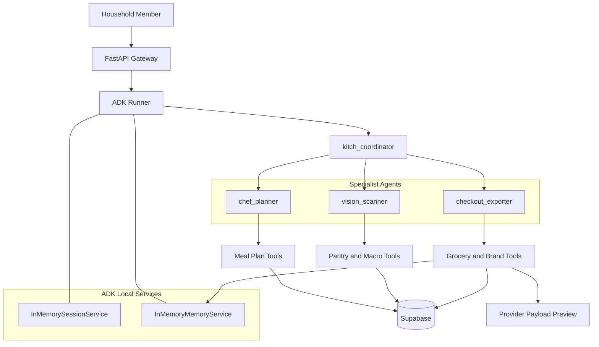

# Kitch: Current Agent Topology

This document describes the current agent team in Kitch. It is focused only on agent roles, routing, tools, memory boundaries, and state ownership.

For broader system architecture, see `current_architecture.md`. For technology choices, see `current_technology_stack.md`.

---

## 1. Topology Overview

Kitch uses a hub-and-spoke ADK topology:

- One parent coordinator agent.
- Three specialist sub-agents.
- Explicit Python tools for database, memory, and payload side effects.
- Shared household state for meal plans, pantry, grocery preparation, and brand preferences.
- Individual state for macro diary logging.

---

## 2. Coordinator Agent

### `kitch_coordinator`

Role:

- Main conversational triage agent.

Responsibilities:

- Interpret the user request.
- Route meal planning and schedule questions to `chef_planner`.
- Route food logging, macro diary, pantry, and image tasks to `vision_scanner`.
- Route grocery, shopping list, brand preference, and provider-payload tasks to `checkout_exporter`.
- Handle simple general chat itself.

Tools:

- None.

State available in session:

- Active user.
- Dietary profile.
- Household size.
- Household members.
- Current date/time.
- Upcoming planning week dates.

Routing rule:

- The user should never need to know or name the sub-agent. Routing should happen from natural language intent.

---

## 3. Chef Planner Agent

### `chef_planner`

Role:

- Household nutritionist and recipe planner.

Responsibilities:

- Generate dynamic weekly meal plans.
- Plan "next week" as the upcoming Monday-Sunday date window.
- Include exact dates in meal-plan responses.
- Save structured weekly plans.
- Read existing weekly plans.
- Change one meal slot without rewriting the week.
- Answer schedule questions such as "what's for dinner tonight?"
- Scale portions for household size or guests in conversational replies.

Tools:

- `get_weekly_schedule_tool()`
- `save_weekly_plan_tool(weekly_plan: dict)`
- `update_single_meal_in_schedule(day: str, meal_category: str, new_recipe_name: str)`
- `get_current_datetime()`

Persistence:

- Writes to Supabase `meal_plans`.
- Meal plan rows are shared household state.
- Meal slot columns store recipe name strings, not recipe IDs.

Important constraints:

- No static recipe database.
- No local recipe IDs such as `b1` or `d2`.
- Full plan creation should save all seven days.
- Single-slot edits should preserve the rest of the plan.

---

## 4. Vision Scanner Agent

### `vision_scanner`

Role:

- Food intake logger and pantry/fridge scanner.

Responsibilities:

- Estimate calories and macros from text meal descriptions.
- Estimate calories and macros from plate photos.
- Log meals to the active user's diary.
- Detect pantry/fridge items from text or uploaded images.
- Add detected ingredients to shared household pantry.
- Summarize daily nutrition totals.

Tools:

- `add_to_pantry_tool(user_name: str, ingredient_name: str, amount: float, unit: str)`
- `log_macros_tool(user_name: str, meal_name: str, calories: int, protein: int, carbs: int, fat: int, fiber: int)`
- `get_pantry_stock_tool(user_name: str)`
- `get_macro_diary_tool(user_name: str)`
- `get_current_datetime()`

Persistence:

- Writes pantry updates to Supabase `pantry_stock` under the shared household profile.
- Writes macro logs to Supabase `macro_diary` under the active member profile.

Important constraints:

- Fridge/pantry scans update shared household inventory.
- Plate/food logs update only the active member's macro diary.
- If the user does not name a person, use the active session user.

---

## 5. Checkout Exporter Agent

### `checkout_exporter`

Role:

- Grocery reasoning, brand preference memory, and provider-payload preparation.

Responsibilities:

- Compile grocery requirements from the saved weekly plan.
- Read shared pantry stock.
- Infer ingredients from dynamic recipe name strings.
- Scale quantities for household size.
- Subtract pantry stock.
- Save household brand preferences.
- Apply household brand preferences to provider payloads.
- Prepare Blinkit/Zepto-style payload previews.

Tools:

- `get_weekly_schedule_tool()`
- `get_pantry_stock_tool(user_name: str)`
- `add_to_pantry_tool(user_name: str, ingredient_name: str, amount: float, unit: str)`
- `set_brand_preference(ingredient: str, branded_sku: str)`
- `get_brand_preference(ingredient: str)`
- `export_to_delivery(items: list[dict], provider: str)`
- `get_current_datetime()`

Persistence and memory:

- Reads meal plans from Supabase.
- Reads/writes pantry through Supabase.
- Writes brand preferences to ADK memory using `user_id="shared_household"`.
- Reads brand preferences from ADK memory during payload preparation.

Important constraints:

- Current checkout behavior prepares payloads only.
- Real Blinkit/Zepto MCP cart insertion is not wired.
- The agent must not claim that a real cart changed.
- Provider automation, when added later, must remain human-approved.

---

## 6. Shared vs Individual State

Shared household state:

- Weekly meal plan.
- Planning week date window.
- Pantry and fridge stock.
- Grocery requirements.
- Brand preferences.
- Household size and planning diet profile.

Individual state:

- Active chat/session context.
- Macro diary logs.
- Daily nutrition progress.

---

## 7. Current Memory Services

Current local services:

- `InMemorySessionService`
- `InMemoryMemoryService`

Planned production replacements:

- `VertexAISessionService`
- `VertexAIMemoryBank`

Brand memory remains flexible text for agent reference. It is intentionally not modeled as a rigid brand preference database.

---

## 8. Current Topology Boundaries

Known boundaries:

- The grocery list is conversationally generated today; a structured grocery-list artifact is still pending.
- Checkout payload preparation exists; provider MCP cart insertion is deferred.
- Household membership is fixed in local config until multi-household registration exists.
- ADK memory/session persistence is local in-memory until deployment migration.
