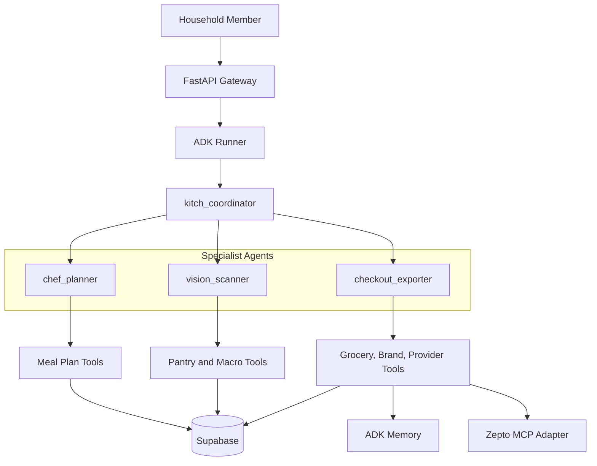

# Kitch: Current Agent Topology

This document focuses only on agent roles, routing, tools, memory boundaries, and state ownership. Broader system architecture lives in `current_architecture.md`.

---

## Topology Overview

Kitch uses a hub-and-spoke ADK topology:

- One parent coordinator agent.
- Three specialist sub-agents.
- Explicit Python tools for database, memory, and provider side effects.
- Shared household state for plans, pantry, grocery cart, and brand preferences.
- Individual state for macro diary logging.

---

## `kitch_coordinator`

Role:

- Main conversational triage agent.

Responsibilities:

- Interpret natural language intent.
- Route meal planning and schedule questions to `chef_planner`.
- Route food logging, macro diary, pantry, and image requests to `vision_scanner`.
- Route groceries, shopping lists, brand preferences, and provider cart actions to `checkout_exporter`.
- Answer simple general chat directly.

Tools:

- None.

State available:

- Active user.
- Dietary profile.
- Household size.
- Household members.
- Current date/time.
- Upcoming planning week dates.

---

## `chef_planner`

Role:

- Household meal planner and recipe generator.

Responsibilities:

- Generate dynamic weekly meal plans.
- Plan "next week" as the upcoming Monday-Sunday date window.
- Include exact dates in meal-plan responses.
- Save structured weekly plans.
- Read existing weekly plans.
- Change one meal slot without rewriting the week.
- Answer schedule questions such as "what's for dinner tonight?"
- Scale portions conversationally for household size or guests.

Tools:

- `get_weekly_schedule_tool`
- `save_weekly_plan_tool`
- `update_single_meal_in_schedule`
- `get_current_datetime`

Persistence:

- Writes to Supabase `meal_plans`.
- Meal plans are shared household state.
- Meal slots store recipe name strings, not recipe IDs.

Constraints:

- No static recipe database.
- No local recipe IDs.
- Full plan creation should save all seven days.
- Single-slot edits should preserve the rest of the plan.

---

## `vision_scanner`

Role:

- Food intake logger and pantry/fridge scanner.

Responsibilities:

- Estimate calories and macros from text meal descriptions.
- Estimate calories and macros from plate photos.
- Log meals to the active user's macro diary.
- Detect pantry/fridge items from text or uploaded images.
- Add detected ingredients to shared household pantry.
- Summarize daily nutrition totals.

Tools:

- `add_to_pantry_tool`
- `log_macros_tool`
- `get_pantry_stock_tool`
- `get_macro_diary_tool`
- `get_current_datetime`

Persistence:

- Pantry updates go to shared Supabase `pantry_stock`.
- Macro logs go to individual Supabase `macro_diary`.

Photo-plus-grocery behavior:

- Fridge photos remain a `vision_scanner` responsibility.
- If the same upload also asks for groceries, FastAPI runs grocery planning after the pantry update completes.

---

## `checkout_exporter`

Role:

- Grocery planner, brand preference manager, and provider cart coordinator.

Responsibilities:

- Compile grocery requirements from saved meal plans, scoped days, single meals, or standalone dishes.
- Read shared pantry stock before planning.
- Infer ingredients from dynamic recipe name strings.
- Scale quantities for household size.
- Save native grocery cart rows.
- Include needed rows and pantry-covered rows.
- Preserve manual rows across agent replanning.
- Save and apply household brand preferences.
- Sync unchecked, non-stocked native cart rows to Zepto when requested.
- Report Zepto matches, unavailable items, and provider errors.
- Never place a real order from ordinary chat.

Tools:

- `get_weekly_schedule_tool`
- `get_pantry_stock_tool`
- `add_to_pantry_tool`
- `get_grocery_cart_tool`
- `save_grocery_cart_tool`
- `clear_planned_grocery_cart_tool`
- `set_brand_preference`
- `get_brand_preference`
- `sync_native_cart_to_zepto_tool`
- `get_zepto_cart_tool`
- `place_zepto_order_tool`
- `export_to_delivery`
- `get_current_datetime`

Persistence and memory:

- Reads meal plans from Supabase.
- Reads/writes pantry through Supabase.
- Writes native grocery rows to Supabase `grocery_cart_items`.
- Writes brand preferences to ADK memory using `user_id="shared_household"`.
- Brand preferences influence provider search terms, not native row names.

Provider boundary:

- Native cart is the Kitch source of truth.
- Zepto MCP is reached only through `ZeptoProviderAdapter`.
- Zepto cart sync may add items after the user asks for Zepto.
- Order placement requires a separate frontend approval button.

---

## Shared vs Individual State

Shared household state:

- Weekly meal plan.
- Planning week date window.
- Pantry/fridge stock.
- Native grocery cart.
- Brand preferences.
- Household size and planning diet profile.

Individual state:

- Active chat/session context.
- Macro diary logs.
- Daily nutrition progress.

---

## Current Memory Services

Current local services:

- `InMemorySessionService`
- `InMemoryMemoryService`

Planned production replacements:

- `VertexAISessionService`
- `VertexAIMemoryBank`

Brand memory remains flexible text for agent reference. It is intentionally not modeled as a rigid brand preference database.
