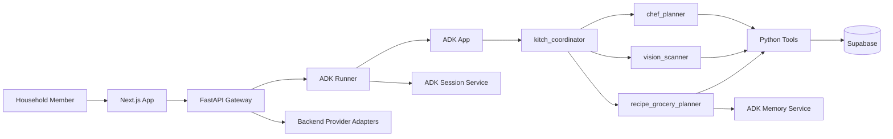

# Kitch: Current AI Architecture

Kitch's AI layer is a Google ADK 2.0 multi-agent system behind a FastAPI gateway. Agents handle culinary reasoning and call Python tools. Python tools perform deterministic side effects. Supabase persists structured records. ADK memory stores flexible household preferences.

---

## Runtime Shape

The browser never calls agents directly. It calls FastAPI. FastAPI creates ADK-compatible content, runs the ADK `Runner`, and returns the final response plus state-sync hints.

---

## Why Google ADK 2.0

Kitch previously explored agent development through Antigravity-oriented workflows, but the application runtime is now Google ADK 2.0.

**Why ADK:**

- `LlmAgent` gives explicit agent responsibilities and tool lists.
- `Runner` gives a standard execution path for chat turns and multimodal turns.
- `App` supports callbacks and context compaction.
- ADK has first-class session and memory service abstractions.
- ADK can later move to Vertex AI managed memory/session services.
- ADK keeps the runtime understandable for new developers and coding agents.

**Why not Antigravity SDK as runtime:**

- Antigravity is better treated as a development/agent-building environment.
- Kitch needs a stable app runtime with service abstractions, docs, and deployment paths.
- The product should not depend on a dev harness for production chat/session/memory behavior.

---

## ADK Primitives in Use

Location: `backend/app/agent/core.py`

Current primitives:

- `LlmAgent`
- `Runner`
- `App`
- `InMemorySessionService`
- `InMemoryMemoryService`
- `EventsCompactionConfig`
- `LlmEventSummarizer`
- Native ADK `Gemini` model adapter or ADK `LiteLlm` model adapter, selected by environment variables.

Why model configuration is environment-driven:

- Local testing has used OpenAI-compatible/LiteLLM settings.
- Production is intended to use Gemini.
- The app should not hardcode one model provider into agent definitions.

---

## Agent Team

### `kitch_coordinator`

Parent triage agent.

Responsibilities:

- Understand user intent.
- Route weekly schedule creation, schedule lookup, and swaps to `chef_planner`.
- Route food logging, macro diary, pantry, and image tasks to `vision_scanner`.
- Route recipes, ingredients, grocery planning, and household food preferences to `recipe_grocery_planner`.
- Answer simple general chat directly.

Why:

- A coordinator keeps user conversation natural while keeping side-effect tools on specialist agents.

### `chef_planner`

Lightweight meal scheduling agent.

Responsibilities:

- Generate dynamic weekly meal schedules.
- Treat "next week" as the upcoming Monday-Sunday planning window.
- Include exact dates in meal-plan responses.
- Save structured weekly meal plans to Supabase.
- Store actual meal names, not recipe IDs.
- Update one meal slot without rewriting the rest of the plan.
- Answer schedule questions such as "what's for dinner tonight?"

Why lightweight:

- Weekly schedule creation should not become recipe and grocery generation for 21 meals.
- Recipe details are generated only when the user asks for them.

### `vision_scanner`

Food intake and pantry/fridge scanning agent.

Responsibilities:

- Estimate macros from text meal descriptions.
- Estimate macros from plate photos.
- Log meals to the active member's macro diary.
- Detect pantry/fridge items from text or photos.
- Add detected stock to the shared household pantry.

Why separated:

- Vision and macro logging are different from recipe/grocery reasoning.
- Pantry updates from photos should happen before grocery planning.

### `recipe_grocery_planner`

Recipe, ingredient, and native grocery planning agent.

Responsibilities:

- Generate recipe cards and structured ingredients for recipe-only requests.
- Save recipe-only outputs as `recipe_grocery_plans` without touching the native grocery cart.
- Generate recipe cards and structured ingredients for grocery requests.
- Read only the requested meal/day scope from the weekly schedule.
- Read pantry stock before grocery planning.
- Save pantry-aware native cart rows derived from the same recipe cards.
- Link native cart rows to the source recipe+grocery artifact.
- Preserve manual cart rows by replacing only `source=agent` rows.
- Store and search household food preferences in ADK memory.
- Avoid Zepto/Blinkit/provider tools.

Why recipe+grocery together:

- Grocery rows should be based on the recipe the user will actually cook.
- Separate recipe and grocery agents created a risk of mismatched ingredients.

---

## Tool Boundary

Meal schedule tools:

- `get_weekly_schedule_tool`
- `save_weekly_plan_tool`
- `update_single_meal_in_schedule`
- `get_current_datetime`

Pantry and macro tools:

- `get_pantry_stock_tool`
- `add_to_pantry_tool`
- `log_macros_tool`
- `get_macro_diary_tool`

Recipe+grocery tools:

- `get_grocery_cart_tool`
- `clear_planned_grocery_cart_tool`
- `save_recipe_grocery_plan_tool`
- `get_recipe_grocery_plan_tool`
- `list_recipe_grocery_plans_tool`
- `set_household_food_preference_tool`
- `search_household_food_preferences_tool`
- `get_pantry_stock_tool`
- `add_to_pantry_tool`

Provider tools/adapters:

- Zepto sync, Zepto cart reads, and Zepto order placement exist behind backend routes and adapter code.
- They are not part of the `recipe_grocery_planner` tool list.
- `place_zepto_order_tool` is intentionally non-executing from chat.

Why:

- Agents should not be able to place real orders through ordinary conversation.
- Provider actions need explicit UI review and approval.

---

## Session State Injection

FastAPI syncs these values into ADK session state before each chat turn:

- `user:profile_name`
- `user:dietary_profile`
- `app:household_size`
- `app:household_members`

The before-agent callback injects:

- `current_datetime`
- `current_day_of_week`
- `current_date`
- `planning_week_start`
- `planning_week_end`
- `planning_week_dates`

Why:

- Agents need today's real date and the upcoming planning week as separate concepts.
- This prevents the UI and agent from treating a future Saturday in the generated plan as "today."

---

## Memory Model

Supabase stores structured state:

- Meal schedules.
- Recipe+grocery artifacts.
- Pantry stock.
- Grocery cart rows.
- Macro logs.
- Household profile settings.

ADK memory stores flexible household preferences:

- Food preferences such as "we prefer not to use tofu."
- Category exclusions such as "avoid mushrooms."
- Planning styles such as "prefer high protein dinners."
- Provider/brand preferences such as "butter: Amul butter."

Why this split:

- Structured UI records need deterministic storage and schema.
- Preferences need natural-language flexibility.

---

## Current Session and Memory Services

Current services:

- `InMemorySessionService`
- `InMemoryMemoryService`

Planned services:

- `VertexAISessionService`
- `VertexAIMemoryBank`

Why in-memory now:

- Local development is faster.
- Resetting session/memory on backend restart is acceptable during prototyping.
- Supabase persists the records the UI depends on.
- Managed memory will be easier to validate after the deployed app flow is stable.

Why Vertex later:

- Deployed users need memory and sessions to survive backend restarts.
- Vertex aligns with ADK service abstractions.
- The agent graph can stay the same while swapping service implementations.

---

## Context Compaction

The ADK `App` uses `EventsCompactionConfig` with `LlmEventSummarizer`.

Current settings:

- `compaction_interval=4`
- `overlap_size=1`

Why:

- Long-running household conversations can grow quickly.
- Compaction keeps session context bounded while preserving recent conversation state.

This is separate from product persistence. Meal plans, recipes, groceries, pantry, and macro logs are stored in Supabase, not only in compacted chat context.
