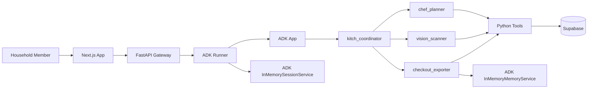

# Kitch: Current AI Architecture

This document describes the current AI layer in Kitch. The implementation is a Google ADK 2.0 multi-agent system running behind a FastAPI gateway.

Kitch uses agents for reasoning and intent routing, explicit Python tools for side effects, Supabase for structured application state, and ADK memory/session services for local prototyping. The current local memory and session services are intentionally temporary and will later move to Vertex AI managed services.

---

## 1. Runtime Shape

The browser never calls agents directly. It sends requests to FastAPI. FastAPI creates ADK-compatible messages, runs the ADK `Runner`, and returns the final agent response plus any state-sync hint for the frontend.

---

## 2. Current ADK Primitives

The AI layer is assembled in `backend/app/agent/core.py`.

Current primitives:

- `google.adk.agents.llm_agent.LlmAgent`
- `google.adk.runners.Runner`
- `google.adk.apps.app.App`
- `google.adk.sessions.InMemorySessionService`
- `google.adk.memory.InMemoryMemoryService`
- `google.adk.apps.llm_event_summarizer.LlmEventSummarizer`
- `google.adk.apps.app.EventsCompactionConfig`
- `google.adk.models.lite_llm.LiteLlm`

The active model is configured through ADK `LiteLlm` in OpenAI-compatible mode.

Environment variables:

- `OPENAI_MODEL_NAME`
- `OPENAI_API_KEY`
- `OPENAI_API_BASE`

---

## 3. Agent Team

### Coordinator: `kitch_coordinator`

The coordinator is the parent agent. It has no tools of its own.

Responsibilities:

- Understand user intent.
- Route meal-planning requests to `chef_planner`.
- Route food logging, macro diary, pantry, and image requests to `vision_scanner`.
- Route grocery, shopping list, brand preference, and provider-payload requests to `checkout_exporter`.
- Answer simple general chat directly.

The coordinator receives active session state such as active user, dietary profile, household size, and household members.

### Chef Planner: `chef_planner`

The chef planner owns meal planning and recipe reasoning.

Responsibilities:

- Generate dynamic weekly meal plans.
- Treat "next week" as the upcoming Monday-Sunday planning window.
- Echo exact dates in meal-plan responses.
- Save structured weekly plans to Supabase.
- Store actual recipe name strings, not recipe IDs.
- Update single meal slots without rewriting the full plan.
- Answer schedule questions such as "what's for dinner tonight?"
- Scale recipes conversationally for guests or different household sizes.

Important current rule:

- There is no static recipe database. Recipes are agent-generated and persisted as text names in `meal_plans`.

### Vision Scanner: `vision_scanner`

The vision scanner owns food intake logging and pantry recognition.

Responsibilities:

- Estimate macros from text meal descriptions.
- Estimate macros from plate photos.
- Log meals to the active member's macro diary.
- Detect pantry/fridge items from text or images.
- Add detected stock to the shared household pantry.
- Summarize daily intake from diary records.

Important state boundary:

- Macro diary is individual.
- Pantry is shared household state.

### Checkout Exporter: `checkout_exporter`

The checkout exporter owns grocery reasoning and delivery preparation.

Responsibilities:

- Fetch the current shared weekly plan.
- Fetch shared pantry stock.
- Infer ingredients from dynamic recipe names.
- Scale grocery requirements for household size.
- Subtract pantry stock.
- Save household brand preferences to ADK memory.
- Apply brand preferences during provider-payload preparation.
- Prepare Blinkit/Zepto-style payloads for review.

Current product boundary:

- Real Blinkit/Zepto MCP cart insertion is not wired yet. The tool prepares payloads only.

---

## 4. Session State Injection

FastAPI syncs app state into ADK session state before each chat turn.

Session keys:

- `user:profile_name`
- `user:dietary_profile`
- `app:household_size`
- `app:household_members`

The `before_agent_callback` also injects time context:

- `current_datetime`
- `current_day_of_week`
- `current_date`
- `planning_week_start`
- `planning_week_end`
- `planning_week_dates`

This is what lets the chef planner distinguish today's real date from the upcoming planning week.

---

## 5. Persistence Split

### Supabase Stores Structured Application State

Supabase owns data that the app must render and update deterministically:

- Household profile settings.
- Shared weekly meal plans.
- Shared pantry stock.
- Individual macro diary logs.

### ADK Memory Stores Agent-Native Preferences

ADK memory currently stores flexible household brand preferences.

Current namespace:

- `app_name="kitch"`
- `user_id="shared_household"`

This is intentionally not a strict relational model. The preference memory is meant to remain natural and flexible for agent reference.

### Future Managed Services

Current local services:

- `InMemorySessionService`
- `InMemoryMemoryService`

Planned deployment replacements:

- `VertexAISessionService`
- `VertexAIMemoryBank`

---

## 6. Tool Boundary

The AI layer uses Python tools for explicit side effects.

Meal plan tools:

- `get_weekly_schedule_tool`
- `save_weekly_plan_tool`
- `update_single_meal_in_schedule`
- `get_current_datetime`

Pantry and macro tools:

- `get_pantry_stock_tool`
- `add_to_pantry_tool`
- `log_macros_tool`
- `get_macro_diary_tool`

Brand and checkout tools:

- `set_brand_preference`
- `get_brand_preference`
- `export_to_delivery`

Design rule:

- Agents reason and decide.
- Tools perform concrete reads and writes.
- The frontend renders state returned by the backend.

---

## 7. Context Compaction

The ADK `App` uses `EventsCompactionConfig` with an `LlmEventSummarizer`.

Current settings:

- `compaction_interval=4`
- `overlap_size=1`

This keeps long-running sessions from growing without bound while preserving enough recent context for continuity.

---

## 8. Known AI-Layer Boundaries

Current known boundaries:

- Brand memory is in-memory during local testing.
- Checkout exporter prepares payloads only; live provider MCP execution is deferred.
- Grocery lists can be generated conversationally, but the structured dashboard grocery-list artifact is still pending.
- Household membership is prefilled in config until auth and multi-household registration exist.

---

## 9. Source of Truth

For implementation details, use these files:

- `backend/app/agent/core.py`
- `backend/app/agent/tools.py`
- `backend/app/main.py`
- `backend/app/supabase_client.py`
- `backend/app/household_config.py`
