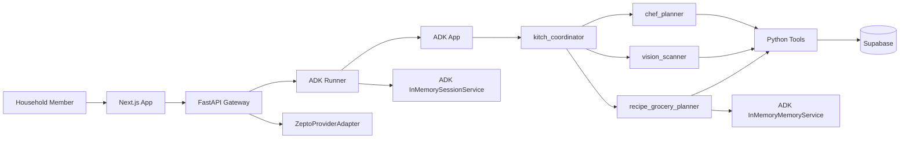

# Kitch: Current AI Architecture

Kitch's AI layer is a Google ADK 2.0 multi-agent system behind a FastAPI gateway. Agents reason and route intent. Python tools perform side effects. Supabase stores structured application state. ADK memory stores flexible household preferences.

---

## Runtime Shape

The browser never calls agents directly. It calls FastAPI. FastAPI creates ADK-compatible messages, runs the ADK `Runner`, and returns the final agent response plus any state-sync hint.

---

## ADK Primitives

Location: `backend/app/agent/core.py`

Current primitives:

- `LlmAgent`
- `Runner`
- `App`
- `InMemorySessionService`
- `InMemoryMemoryService`
- `EventsCompactionConfig`
- `LlmEventSummarizer`
- ADK Gemini or LiteLLM model adapters, selected by environment variables.

The local in-memory services are intentional for development. They will be replaced by Vertex AI managed session and memory services after deployment testing.

---

## Agent Team

### `kitch_coordinator`

Parent triage agent.

Responsibilities:

- Understand the user's intent.
- Route weekly schedule creation, schedule lookup, and swaps to `chef_planner`.
- Route food logging, macro diary, pantry, and image tasks to `vision_scanner`.
- Route recipes, ingredients, grocery planning, and household food preferences to `recipe_grocery_planner`.
- Answer simple general chat directly.

### `chef_planner`

Lightweight meal scheduling agent.

Responsibilities:

- Generate dynamic weekly meal schedules.
- Treat "next week" as the upcoming Monday-Sunday planning window.
- Include exact dates in meal-plan responses.
- Save structured weekly meal plans to Supabase.
- Store actual meal names, not recipe IDs.
- Update one meal slot without rewriting the rest of the plan.
- Answer schedule questions such as "what's for dinner tonight?"

There is no static recipe database. The weekly planner does not save ingredients or detailed recipes for every meal upfront.

### `vision_scanner`

Food intake and pantry/fridge scanning agent.

Responsibilities:

- Estimate macros from text meal descriptions.
- Estimate macros from plate photos.
- Log meals to the active member's macro diary.
- Detect pantry/fridge items from text or photos.
- Add detected stock to the shared household pantry.

If a fridge photo is submitted with a grocery request, the API first runs the photo/pantry update turn, then runs a follow-up recipe+grocery turn against the updated pantry.

### `recipe_grocery_planner`

Recipe, ingredient, and native grocery planning agent.

Responsibilities:

- Generate recipe cards and structured ingredients for recipe-only requests.
- Save recipe-only outputs as `recipe_grocery_plans` without touching the native grocery cart.
- Generate recipe cards and structured ingredients for grocery requests.
- Read only the requested meal/day scope from the weekly schedule.
- Read pantry stock before grocery planning.
- Save pantry-aware native cart rows derived from the same recipe cards.
- Link native cart rows to the source recipe+grocery artifact.
- Preserve manual cart rows by replacing only `source=agent` rows.
- Store and search household food preferences in ADK memory.
- Avoid Zepto/Blinkit/provider tools.

---

## Tool Boundary

Meal schedule tools:

- `get_weekly_schedule_tool`
- `save_weekly_plan_tool`
- `update_single_meal_in_schedule`
- `get_current_datetime`

Pantry and macro tools:

- `get_pantry_stock_tool`
- `add_to_pantry_tool`
- `log_macros_tool`
- `get_macro_diary_tool`

Recipe+grocery tools:

- `get_grocery_cart_tool`
- `clear_planned_grocery_cart_tool`
- `save_recipe_grocery_plan_tool`
- `get_recipe_grocery_plan_tool`
- `list_recipe_grocery_plans_tool`
- `set_household_food_preference_tool`
- `search_household_food_preferences_tool`
- `get_pantry_stock_tool`
- `add_to_pantry_tool`

Provider tools and adapters:

- `sync_native_cart_to_zepto_tool`, `get_zepto_cart_tool`, `place_zepto_order_tool`, and `export_to_delivery` remain in backend code for HTTP/provider flows and legacy preview support.
- They are not part of the `recipe_grocery_planner` tool list.
- `place_zepto_order_tool` is intentionally non-executing from chat. Real order placement happens only through the backend approval endpoint after a frontend button click.

---

## Session State Injection

FastAPI syncs these values into ADK session state before each chat turn:

- `user:profile_name`
- `user:dietary_profile`
- `app:household_size`
- `app:household_members`

The before-agent callback injects:

- `current_datetime`
- `current_day_of_week`
- `current_date`
- `planning_week_start`
- `planning_week_end`
- `planning_week_dates`

This lets agents reason about today's real date separately from the upcoming planning week.

---

## Memory Model

Supabase stores structured app state:

- Meal schedules.
- Recipe+grocery artifacts.
- Pantry stock.
- Grocery cart rows.
- Macro logs.
- Household profile settings.

ADK memory stores flexible household preferences:

- Food preferences such as "we prefer not to use tofu".
- Category exclusions such as "avoid mushrooms".
- Provider/brand preferences such as `butter: Amul butter`.

Food preferences affect recipe and ingredient generation. Brand memory affects provider search terms, not the generic native cart row.

---

## Context Compaction

The ADK `App` uses `EventsCompactionConfig` with `LlmEventSummarizer`.

Current settings:

- `compaction_interval=4`
- `overlap_size=1`

This keeps long-running sessions from growing without bound while preserving recent conversational context.
