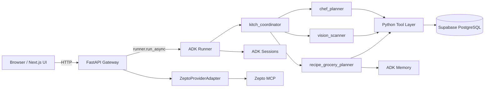
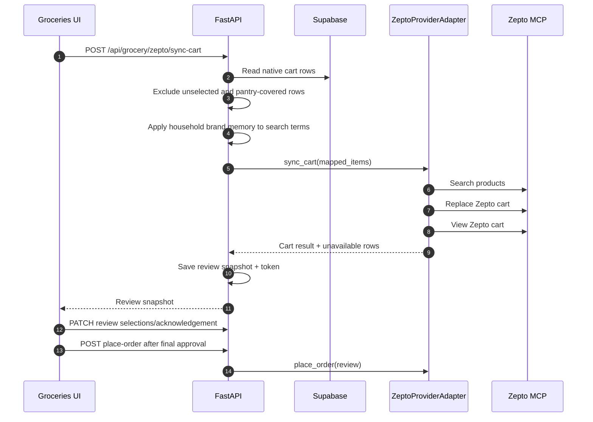

# Kitch: Current System Design

This document describes the current end-to-end system design: frontend, backend gateway, ADK runtime, persistence, provider adapters, and approval boundaries.

For product intent, read `vision_and_requirements.md`.
For AI runtime and agent roles, read `current_ai_agent_architecture.md`.
For concrete stack/configuration, read `current_technology_stack.md`.

---

## System Summary

Kitch is a household meal planning, recipe, grocery, pantry, nutrition, and delivery-prep app.

The current design separates responsibilities deliberately:

- The frontend renders state and collects explicit user actions.
- FastAPI owns browser-facing APIs, state hydration, multimodal request orchestration, and provider approval boundaries.
- ADK agents reason about user intent and call Python tools.
- Python tools perform deterministic side effects.
- Supabase stores structured product state.
- ADK memory stores flexible household food and brand preferences.
- Provider adapters translate Kitch's native cart into provider carts.

---

## Core Design Decisions

### Google ADK is the app runtime

Kitch uses Google ADK 2.0 for the runtime agent graph.

**Why:** the product needs explicit agent routing, tools, multimodal message support, session state, memory, callbacks, and context compaction. ADK provides these as application runtime primitives and has a path to Vertex AI managed services. Antigravity SDK remains useful for development workflows, but Kitch should not depend on a development harness as the production runtime.

### FastAPI sits between the browser and agents

The browser never calls agents directly. It calls FastAPI.

**Why:** FastAPI can normalize payloads, sync session state, orchestrate photo-plus-text flows, guard provider/order actions, and return a stable API shape to the frontend. This keeps the frontend free of ADK runtime details.

### Supabase stores structured product records

Supabase stores meal plans, recipe+grocery artifacts, pantry stock, native cart rows, profiles, and macro logs.

**Why:** these are deterministic records that the UI must render and users must be able to review. They should not live only in chat memory.

### ADK memory stores flexible preference text

Household food and brand preferences are stored in ADK memory as flexible text.

**Why:** preferences are naturally conversational and can be fuzzy. A strict schema would prematurely constrain how users express preferences and how agents apply them.

### Provider sync is not agent-owned

Zepto sync and order approval sit behind backend HTTP endpoints and `ZeptoProviderAdapter`.

**Why:** provider operations modify real external state. Chat should not be able to place orders. The backend can create review snapshots and require explicit frontend approval before order placement.

---

## Frontend Duties

Location: `frontend/src/app`

The frontend owns presentation and explicit user actions.

Current duties:

- Render the household dashboard.
- Render the Recipes page for recipe+grocery artifacts.
- Render the Groceries page for native cart review and Zepto checkout prep.
- Render individual nutrition state.
- Render shared weekly plan state.
- Render pantry/grocery state from backend APIs.
- Send text chat turns to `POST /api/chat`.
- Upload image-plus-text requests to `POST /api/upload-photo`.
- Trigger Zepto cart sync through `POST /api/grocery/zepto/sync-cart`.
- Patch Zepto review selections through `PATCH /api/grocery/zepto/review/{review_id}`.
- Trigger final order placement through `POST /api/grocery/zepto/place-order`.

The frontend does not:

- Own meal planning logic.
- Generate recipes or groceries.
- Call ADK directly.
- Call Zepto MCP directly.
- Place orders from chat text.
- Store the source of truth for meal plans or carts.

Why:

- The UI should remain a thin product surface over backend-owned state and safety boundaries.
- Explicit button actions are easier to reason about than implicit agent side effects for provider cart and order operations.

---

## Backend Gateway Duties

Location: `backend/app/main.py`

FastAPI owns orchestration, API stability, and safety.

Current routes:

| Route | Duty |
| :--- | :--- |
| `POST /api/chat` | Runs a text chat turn through the ADK runner. |
| `POST /api/upload-photo` | Sends image bytes and optional text to ADK; handles photo-plus-grocery two-step orchestration. |
| `GET /api/state/{user_name}` | Returns dashboard state: profile, pantry, macro diary, weekly plan, native cart, and latest recipe+grocery metadata. |
| `POST /api/pantry/add` | Adds pantry stock manually. |
| `DELETE /api/pantry/remove/{user_name}/{item_name}` | Removes pantry stock manually. |
| `POST /api/diary/clear/{user_name}` | Clears one user's macro diary. |
| `GET /api/grocery/cart` | Returns the shared native household grocery cart. |
| `POST /api/grocery/cart/items` | Adds a manual native grocery cart row. |
| `PATCH /api/grocery/cart/items/{id}` | Updates one native grocery cart row. |
| `DELETE /api/grocery/cart/items/{id}` | Deletes one native grocery cart row. |
| `DELETE /api/grocery/cart/planned` | Deletes agent-planned cart rows while preserving manual rows. |
| `GET /api/recipe-grocery/plans` | Lists recent recipe+grocery artifacts. |
| `GET /api/recipe-grocery/plans/latest` | Returns the latest recipe+grocery artifact. |
| `GET /api/recipe-grocery/plans/{id}` | Returns one recipe+grocery artifact. |
| `POST /api/grocery/export` | Legacy provider payload preview. |
| `GET /api/grocery/zepto/status` | Returns simplified Zepto readiness state for the UI. |
| `POST /api/grocery/zepto/sync-cart` | Replaces Zepto cart from selected, non-stocked native cart rows and creates a review snapshot. |
| `GET /api/grocery/zepto/review/{review_id}` | Returns a saved Zepto review snapshot. |
| `PATCH /api/grocery/zepto/review/{review_id}` | Updates review-only metadata such as address/payment selection and acknowledgement. |
| `POST /api/grocery/zepto/place-order` | Places a Zepto order only after explicit frontend approval and token validation. |
| `GET /api/health` | Health check. |

Why the backend owns review snapshots:

- A user must approve the exact provider cart they saw.
- Order placement should not rerun LLM reasoning or product matching after approval.
- Confirmation token plus snapshot hash prevents stale or modified reviews from being submitted silently.

---

## Agent Runtime Duties

Location: `backend/app/agent/core.py`

The ADK runtime contains:

- `kitch_coordinator`
- `chef_planner`
- `vision_scanner`
- `recipe_grocery_planner`

Agents reason over:

- User text.
- Optional image content.
- Current date/time.
- Active user.
- Household size.
- Household members.
- Dietary profile.
- Weekly schedule.
- Pantry state.
- Household preferences.

Agents do not reason over:

- UI layout.
- Zepto payment UI state.
- Frontend route state.
- Final order placement.

Why:

- Agents should handle culinary reasoning and state updates through tools.
- UI and provider safety workflows should remain deterministic backend/frontend logic.

---

## Persistence Design

Location: `backend/app/supabase_client.py`
Schema: `backend/database/supabase_schema.sql`

Supabase tables:

| Table | Shared or individual | Duty |
| :--- | :--- | :--- |
| `profiles` | Prototype user/shared profile | Stores configured users and profile defaults. |
| `meal_plans` | Shared household | Stores weekly breakfast/lunch/dinner meal name strings. |
| `recipe_grocery_plans` | Shared household | Stores recipe cards, ingredients, pantry notes, request scope, and cart update metadata. |
| `pantry_stock` | Shared household | Stores current pantry/fridge inventory. |
| `grocery_cart_items` | Shared household | Stores native provider-agnostic cart rows. |
| `macro_diary` | Individual | Stores active-user nutrition logs. |

Important modeling decisions:

- `meal_plans` still has legacy `*_recipe_id` column names, but values are meal name strings.
- `snack_recipe_id` may exist in schema for compatibility, but the product does not plan snacks.
- `recipe_grocery_plan_id` links agent-created cart rows back to the recipe+grocery artifact that produced them.
- `source=manual` rows survive later agent grocery planning.
- `already_stocked=true` rows remain visible but are excluded from provider sync.

Why this model:

- Meal plans need to be lightweight.
- Recipes and grocery rows need an auditable artifact.
- Provider carts should never become Kitch's source of truth.

---

## Native Cart to Zepto Flow

Location: `backend/app/providers/zepto.py`

Important rules:

- User selection on the native cart means "include this row when moving to Zepto."
- Pantry-covered rows are never included.
- Zepto sync can replace the current Zepto cart.
- Prices and fees are shown only after Zepto returns them.
- Actual address labels should be shown with address details when exposed by Zepto.
- The UI should say "Signed in to Zepto," not expose MCP/OAuth implementation details.

Why:

- Users care about what went into the cart, not internal matching terminology.
- Provider auth and tool mechanics are implementation details.
- Real order placement needs a human review point.

---

## Memory and Session Design

Current local ADK services:

- `InMemorySessionService`
- `InMemoryMemoryService`

Current persistent app state:

- Supabase.

Current memory contents:

- Household food preferences.
- Household brand preferences.

Why in-memory services now:

- The product is still in local/deployment testing.
- In-memory sessions make restarts predictable during development.
- Supabase already persists the deterministic records that the UI needs.
- Vertex AI service setup can wait until the deployed runtime is validated.

Planned migration:

- `VertexAISessionService` for durable sessions.
- `VertexAIMemoryBank` for durable household preferences.

Why the migration is deferred:

- It avoids coupling early product experimentation to managed memory setup.
- It lets the current app stabilize before introducing cloud-state debugging.
- The code already uses ADK service abstractions, so the migration should not require changing the agent topology.

---

## Known Boundaries

- Local backend restarts clear ADK sessions and in-memory preferences.
- Supabase schema must stay in sync with `recipe_grocery_plans` and `grocery_cart_items.recipe_grocery_plan_id`.
- Zepto MCP OAuth/auth is external to Kitch.
- Blinkit live integration is not implemented.
- Multi-household registration is not implemented.
- Provider order placement is live and must remain guarded.
- The current household is configured in code until real registration exists.
