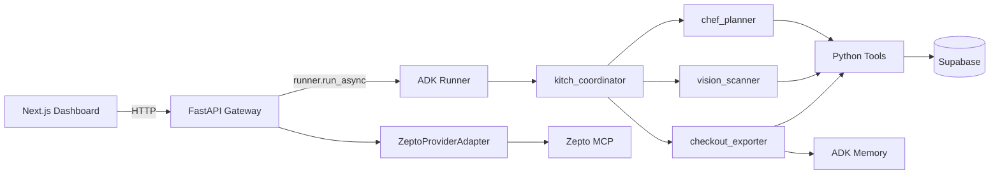

# Kitch: Current Architecture

This document describes the app as it exists now: a Google ADK 2.0 multi-agent backend, a Next.js dashboard, Supabase persistence, a native household grocery cart, and optional Zepto MCP cart sync.

The key architectural rule is separation of duties. The frontend renders and collects user intent. FastAPI owns browser-facing APIs and approval boundaries. ADK agents reason and call tools. Supabase stores structured app state. Zepto-specific behavior stays behind a provider adapter.

---

## System Shape

Kitch is a household meal planning, pantry, nutrition, grocery, and delivery-prep assistant.

---

## Frontend Duties

Location: `frontend/src/app`

The frontend owns presentation and user interaction only.

Current duties:

- Render the household dashboard, planner, pantry/grocery page, macro diary, and floating chat input.
- Send text chat turns to `POST /api/chat`.
- Upload plate/fridge images plus optional user text to `POST /api/upload-photo`.
- Load live state from `GET /api/state/{user_name}`.
- Render the shared native grocery cart returned by the backend.
- Let users manually add grocery cart rows with `source=manual`.
- Mark native cart rows checked through backend cart endpoints.
- Show pantry-covered grocery rows as disabled/muted.
- Trigger Zepto cart sync from the native cart.
- Show the actual Zepto sync result and require a final button click before order placement.

The frontend does not own recipe selection, grocery reasoning, brand memory, provider matching, or checkout logic.

---

## Backend Gateway Duties

Location: `backend/app/main.py`

FastAPI owns API orchestration and safety boundaries.

Current routes:

| Route | Duty |
| :--- | :--- |
| `POST /api/chat` | Runs a text chat turn through the ADK runner. |
| `POST /api/upload-photo` | Sends image bytes and accompanying text to ADK. If a fridge photo also asks for groceries, pantry is updated first, then a second grocery-planning turn runs. |
| `GET /api/state/{user_name}` | Returns profile, pantry, macro diary, weekly plan, and native grocery cart. |
| `POST /api/pantry/add` | Adds pantry stock manually. |
| `DELETE /api/pantry/remove/{user_name}/{item_name}` | Removes pantry stock manually. |
| `POST /api/diary/clear/{user_name}` | Clears an individual user's macro diary. |
| `GET /api/grocery/cart` | Returns the shared native household grocery cart. |
| `POST /api/grocery/cart/items` | Adds a manual native grocery cart row. |
| `PATCH /api/grocery/cart/items/{id}` | Updates a native grocery cart row. |
| `DELETE /api/grocery/cart/items/{id}` | Deletes a native grocery cart row. |
| `DELETE /api/grocery/cart/planned` | Deletes agent-planned rows while preserving manual rows. |
| `POST /api/grocery/export` | Legacy provider payload preview route. |
| `POST /api/grocery/zepto/sync-cart` | Replaces Zepto cart from unchecked, non-stocked native cart rows. |
| `POST /api/grocery/zepto/place-order` | Places a Zepto order only after a frontend approval token. |
| `GET /api/health` | Health check. |

Order safety:

- Chat text alone cannot place a real order.
- Zepto cart sync is allowed after the user asks for it.
- Real order placement requires a confirmation token produced by `/api/grocery/zepto/sync-cart` and submitted by the frontend approval button.

---

## Agent Duties

Location: `backend/app/agent/core.py`

Kitch uses one parent coordinator and three specialist sub-agents.

- `kitch_coordinator`: routes natural language intent.
- `chef_planner`: creates and edits meal plans.
- `vision_scanner`: logs meals and updates pantry from photos/text.
- `checkout_exporter`: plans groceries, saves native cart rows, manages brand preferences, and syncs to Zepto when requested.

The agents do not know frontend layout details. They reason over meal names, pantry state, household size, current date/time, and user intent.

---

## Persistence Duties

Location: `backend/app/supabase_client.py`

Supabase stores deterministic app state:

- `profiles`: configured users and shared household profile.
- `meal_plans`: shared household weekly meal plan.
- `pantry_stock`: shared household pantry/fridge stock.
- `grocery_cart_items`: shared provider-agnostic grocery cart.
- `macro_diary`: individual user nutrition logs.

Native grocery cart fields:

- `id`
- `profile_id`
- `ingredient_name`
- `amount`
- `unit`
- `category`
- `source`
- `checked`
- `already_stocked`
- `stock_note`
- `created_at`
- `updated_at`

Planning rule:

- Agent-planned grocery runs replace prior `source=agent` rows.
- Manual rows with `source=manual` survive later agent planning.
- Pantry-covered rows remain in the native cart with `already_stocked=true`.
- Provider export excludes rows where `checked=true` or `already_stocked=true`.

---

## Provider Boundary

Location: `backend/app/providers/zepto.py`

Zepto-specific behavior is isolated in `ZeptoProviderAdapter`.

Current flow:

1. Read unchecked, non-stocked native cart rows.
2. Apply household brand memory to provider search terms.
3. Connect to Zepto MCP at `https://mcp.zepto.co.in/mcp` unless overridden.
4. Clear/replace the existing Zepto cart.
5. Search Zepto for each item.
6. Auto-select the best returned match.
7. Add matched items to Zepto cart.
8. Fetch and return the Zepto cart summary when available.
9. Surface unavailable items or auth/tool errors as recoverable UI errors.

Environment variables:

- `ZEPTO_MCP_URL`
- `ZEPTO_MCP_ACCESS_TOKEN`
- `ZEPTO_MCP_BEARER_TOKEN`
- `ZEPTO_ACCESS_TOKEN`
- `ZEPTO_MCP_HEADERS`
- `ZEPTO_MCP_ENABLED`

The native Kitch cart remains provider-agnostic. Zepto product names, quantities, prices, fees, auth states, and order states are provider responses, not Kitch source-of-truth fields.

---

## Memory and Sessions

Current local services:

- `InMemorySessionService`
- `InMemoryMemoryService`

Current memory use:

- Household brand preferences live in ADK memory under `user_id="shared_household"`.
- Preferences remain plain text so agents can use them flexibly.

Planned replacement:

- `VertexAISessionService`
- `VertexAIMemoryBank`

Backend restarts clear local sessions and memory until that migration is done.
