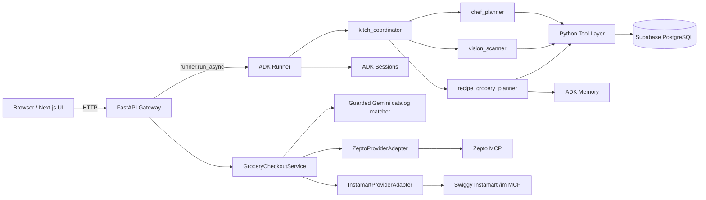

# Kitch: Current System Design

This document describes the current end-to-end system design: frontend, backend gateway, ADK runtime, persistence, provider adapters, and approval boundaries.

For product intent, read `vision_and_requirements.md`.
For AI runtime and agent roles, read `current_ai_agent_architecture.md`.
For concrete stack/configuration, read `current_technology_stack.md`.

---

## System Summary

Kitch is a household meal planning, recipe, grocery, pantry, nutrition, and delivery-prep app.

The current design separates responsibilities deliberately:

- The frontend renders state and collects explicit user actions.
- FastAPI owns browser-facing APIs, state hydration, multimodal request orchestration, and provider approval boundaries.
- ADK agents reason about user intent and call Python tools.
- Python tools perform deterministic side effects.
- Supabase stores authoritative structured product state.
- ADK memory stores explicitly ephemeral household food and brand preferences.
- Provider adapters translate Kitch's native cart into provider carts.



---

## Core Design Decisions

### Google ADK is the app runtime

Kitch uses Google ADK 2.0 for the runtime agent graph.

**Why:** the product needs explicit agent routing, tools, multimodal message support, session state, memory, callbacks, and context compaction. ADK provides these as application runtime primitives and has a path to Vertex AI managed services. Antigravity SDK remains useful for development workflows, but Kitch should not depend on a development harness as the production runtime.

### FastAPI sits between the browser and agents

The browser never calls agents directly. It calls FastAPI.

**Why:** FastAPI can normalize payloads, sync session state, orchestrate photo-plus-text flows, guard provider/order actions, and return a stable API shape to the frontend. This keeps the frontend free of ADK runtime details.

### Supabase stores structured product records

Supabase stores meal plans, recipe+grocery artifacts, pantry stock, native cart rows, profiles, and macro logs.

**Why:** these are deterministic records that the UI must render and users must be able to review. They should not live only in chat memory.

### ADK memory stores flexible preference text

Household food and brand preferences are stored in ADK memory as flexible text.

**Why:** preferences are naturally conversational and can be fuzzy. A strict schema would prematurely constrain how users express preferences and how agents apply them.

### Provider sync is not agent-owned

Provider sync and order approval sit behind provider-keyed backend HTTP endpoints, `GroceryCheckoutService`, and adapters implementing `GroceryProviderAdapter`.

**Why:** provider operations modify real external state. Chat should not be able to place orders. The backend can create review snapshots and require explicit frontend approval before order placement.

---

## Frontend Duties

Location: `frontend/src/app`

The frontend owns presentation and explicit user actions.

Current duties:

- Render the household dashboard.
- Render the Recipes page for recipe+grocery artifacts.
- Render the Groceries page as a provider-neutral, six-stage vertical checkout
  workflow with compact numbered markers and a collapsible native cart.
- Fetch Zepto, Swiggy Instamart, and disabled Blinkit descriptors from the
  backend registry rather than maintaining a frontend route registry.
- Render individual nutrition state.
- Render shared calendar-date plan state with navigable Monday-Sunday views.
- Render pantry/grocery state from backend APIs.
- Send text chat turns to `POST /api/chat`.
- Upload image-plus-text requests to `POST /api/upload-photo`.
- Use provider-keyed checkout, connection, address, revalidation, payment, and
  order routes advertised by the backend.

The frontend does not:

- Own meal planning logic.
- Generate recipes or groceries.
- Call ADK directly.
- Call any provider MCP server directly.
- Place orders from chat text.
- Store the source of truth for meal plans or carts.

Why:

- The UI should remain a thin product surface over backend-owned state and safety boundaries.
- Explicit button actions are easier to reason about than implicit agent side effects for provider cart and order operations.

---

## Backend Gateway Duties

Location: `backend/app/main.py`

FastAPI owns orchestration, API stability, and safety.

Current routes:

| Route | Duty |
| :--- | :--- |
| `POST /api/chat` | Runs a text chat turn through the ADK runner. |
| `POST /api/upload-photo` | Sends image bytes and optional text to ADK; handles photo-plus-grocery two-step orchestration. |
| `GET /api/state/{user_name}` | Returns dashboard state, including the authoritative current calendar-week meal plan and next chronological meal. |
| `GET /api/meal-plan?week_start=YYYY-MM-DD` | Returns one Monday-Sunday planning window with all seven exact dates, including empty days. |
| `POST /api/pantry/add` | Adds pantry stock manually. |
| `PATCH /api/household/profile` | Persists shared diet and household-size settings. |
| `DELETE /api/pantry/remove/{user_name}/{item_name}` | Removes pantry stock manually. |
| `POST /api/diary/clear/{user_name}` | Clears one user's macro diary. |
| `GET /api/grocery/cart` | Returns the shared native household grocery cart. |
| `POST /api/grocery/cart/items` | Adds a manual native grocery cart row. |
| `PATCH /api/grocery/cart/items/{id}` | Updates one native grocery cart row. |
| `DELETE /api/grocery/cart/items/{id}` | Deletes one native grocery cart row. |
| `DELETE /api/grocery/cart/planned` | Deletes agent-planned cart rows while preserving manual rows. |
| `GET /api/recipe-grocery/plans` | Lists recent recipe+grocery artifacts. |
| `GET /api/recipe-grocery/plans/latest` | Returns the latest recipe+grocery artifact. |
| `GET /api/recipe-grocery/plans/{id}` | Returns one recipe+grocery artifact. |
| `GET /api/grocery/providers` | Returns backend-owned provider descriptors, capabilities, environment, routes, and connection state. |
| `POST /api/grocery/providers/{provider}/connection/start` | Starts a supported delegated connection flow. |
| `GET /api/grocery/providers/{provider}/oauth/callback` | Validates and consumes a one-time OAuth callback. |
| `DELETE /api/grocery/providers/{provider}/connection` | Disconnects the household provider account and invalidates its draft. |
| `GET /api/grocery/providers/{provider}/addresses` | Reads saved addresses through the selected provider adapter. |
| `POST /api/grocery/providers/{provider}/checkout/sync` | Resolves the address context, replaces the provider cart, reconciles the read-back cart, and saves a durable draft. |
| `GET/PATCH /api/grocery/providers/{provider}/checkout` | Restores or updates the selected provider/environment draft. |
| `POST /api/grocery/providers/{provider}/checkout/revalidate` | Repairs and reconciles stale provider cart state. |
| `POST /api/grocery/providers/{provider}/checkout/place-order` | Revalidates and places only the exact approved snapshot. |
| `POST /api/grocery/providers/{provider}/checkout/payment-status` | Polls only when the discovered provider capability documents payment status. |
| `GET /api/health` | Readiness check for elevated database access, required schema, and the configured household profile. |

Why the backend owns durable checkout drafts:

- A user must approve the exact provider cart they saw.
- Order placement should not rerun LLM reasoning or product matching after approval.
- Confirmation token plus snapshot hash prevents stale or modified reviews from being submitted silently.
- Persisted operation leases serialize sync, repair, and order operations per household/provider.

---

## Agent Runtime Duties

Location: `backend/app/agent/core.py`

The ADK runtime contains:

- `kitch_coordinator`
- `chef_planner`
- `vision_scanner`
- `recipe_grocery_planner`

Agents reason over:

- User text.
- Optional image content.
- Current date/time.
- Active user.
- Household size.
- Household members.
- Dietary profile.
- Weekly schedule.
- Pantry state.
- Household preferences.

Agents do not reason over:

- UI layout.
- Zepto payment UI state.
- Frontend route state.
- Final order placement.

Why:

- Agents should handle culinary reasoning and state updates through tools.
- UI and provider safety workflows should remain deterministic backend/frontend logic.

---

## Persistence Design

Location: `backend/app/supabase_client.py`
Schema: `backend/database/supabase_schema.sql`

Supabase tables:

| Table | Shared or individual | Duty |
| :--- | :--- | :--- |
| `profiles` | Prototype user/shared profile | Stores configured users, timezone, profile defaults, and preferred grocery provider. |
| `meal_plans` | Shared household | Stores breakfast/lunch/dinner meal names keyed by exact calendar date. |
| `recipe_grocery_plans` | Shared household | Stores recipe cards, ingredients, pantry notes, request scope, and cart update metadata. |
| `pantry_stock` | Shared household | Stores current pantry/fridge inventory. |
| `grocery_cart_items` | Shared household | Stores native provider-agnostic cart rows. |
| `macro_diary` | Individual | Stores active-user nutrition logs. |
| `provider_checkout_drafts` | Shared household | Stores environment-scoped cart projections, mappings, approval snapshots, payment/order state, ambiguous outcomes, and operation leases. |
| `provider_connections` | Shared household | Stores one encrypted household access token and connection status per provider/environment. |
| `provider_oauth_clients` | Backend configuration | Stores one dynamic OAuth client registration per provider/environment. |
| `provider_oauth_flows` | Backend transient state | Stores expiring, single-use hashed OAuth state and encrypted PKCE verifier records. |

Important modeling decisions:

- `meal_plans` is uniquely keyed by `(profile_id, plan_date)`; weekdays are
  derived display labels, so Thursday in one week cannot overwrite another.
- FastAPI deletes `meal_plans` rows before the household's current date at
  startup and after each `profiles.timezone_name` midnight. The planner is an
  active/future schedule, not historical meal-plan storage.
- The household profile stores the IANA timezone used to resolve relative dates.
- New plan ranges and targeted multi-meal edits use transactional RPCs.
- The product plans breakfast, lunch, and dinner only.
- `recipe_grocery_plan_id` links agent-created cart rows back to the recipe+grocery artifact that produced them.
- `source=manual` rows survive later agent grocery planning.
- `already_stocked=true` rows remain visible but are excluded from provider sync.

Why this model:

- Meal plans need to be lightweight.
- Recipes and grocery rows need an auditable artifact.
- Provider carts should never become Kitch's source of truth.

### Durable-storage contract

- All structured tables have RLS enabled. Browser roles have no table or sequence
  privileges; the browser accesses state only through FastAPI.
- FastAPI requires `SUPABASE_SECRET_KEY` (`sb_secret_...`) or the temporary
  legacy `SUPABASE_SERVICE_ROLE_KEY`. Publishable, anon, malformed, and
  ambiguous `SUPABASE_KEY` credentials prevent startup.
- Empty reads are valid state. Authorization, connection, schema, malformed
  response, and unconfirmed-write failures are not empty state: they become a
  safe HTTP 503 response and no success action is returned to the UI.
- Saving a recipe artifact and replacing agent-generated cart rows is one
  PostgreSQL transaction. A cart failure rolls back the artifact write and
  leaves the previous cart unchanged.
- Frontend state changes only after a confirmed 2xx response. A persistence
  failure preserves the last confirmed state and shows that nothing was saved.

---

## Native Cart to Ordering Provider Flow

The frontend and API are provider-neutral. Zepto and Swiggy Instamart implement
the same adapter contract. Provider-specific MCP identifiers remain inside the
adapter and normalized mappings stored in the draft.

```mermaid
sequenceDiagram
    autonumber
    participant UI as Groceries UI
    participant API as FastAPI
    participant DB as Supabase
    participant Service as GroceryCheckoutService
    participant Adapter as Selected provider adapter
    participant MCP as Provider MCP

    UI->>API: GET /api/grocery/providers
    API-->>UI: descriptors, capabilities, connection state, routes
    UI->>API: GET /api/grocery/providers/{provider}/addresses
    API->>Adapter: list_addresses()
    Adapter->>MCP: List saved addresses
    MCP-->>UI: Saved address options
    UI->>UI: User selects delivery address
    UI->>UI: Wait for native saves; lock edits; show transfer dialog
    UI->>API: POST .../{provider}/checkout/sync + address id
    API->>Service: sync native snapshot
    Service->>DB: Read cart; acquire provider/environment lease
    Service->>Adapter: establish address and sync selected rows
    Adapter->>MCP: Address-scoped search
    Adapter->>MCP: Replace complete provider cart
    Adapter->>MCP: Read provider cart
    Adapter-->>API: Cart result + unavailable rows + normalized totals
    Service->>DB: Save durable draft + bill + mappings + token
    API-->>UI: Confirmed checkout draft
    UI->>UI: Close dialog; unlock edits; show review
    UI->>API: PATCH checkout payment/acknowledgement
    UI->>API: POST revalidate after explicit stale-cart refresh
    API->>Adapter: Validate products; repair and reconcile if necessary
    UI->>API: POST place-order after final approval
    API->>Adapter: Mandatory final revalidation
    API->>Adapter: place_order(review)
```

Important rules:

- User selection means "include this native row in the chosen provider projection."
- Pantry-covered rows are never included.
- The main page chronology is native cart, ordering app, delivery address,
  transfer, provider cart review, then payment and order.
- Numbered stage markers are light green while pending and dark green only
  when their underlying state is complete. Native-cart, selection, provider,
  or address changes invalidate the provider review and return transfer,
  review, and order markers to pending.
- The household preference is restored. Without one, connected Zepto is chosen
  first, then connected Instamart; otherwise provider selection stays active.
  Blinkit is disabled and cannot issue API calls.
- A saved delivery address is required before sync.
- Provider sync cannot start while a native-cart write is still in flight.
- Once sync starts, the frontend disables native-cart selection, quantity,
  unit, add, delete, clear, address, and quick-action controls. A modal progress
  dialog retains focus until the request succeeds or fails.
- Product search cannot start until the selected provider confirms the address/store context.
- Search results do not count as cart success. The adapter must confirm exact
  provider identifiers and quantities in the returned provider cart.
- Missing or ambiguous availability is unverified and cannot unlock ordering.
- A review is locked to the address/store context used during product resolution.
- Changing the native cart, selection, provider, or address invalidates the
  current review and requires a new cart sync.
- Synchronization replaces the complete selected-provider cart.
- The backend exposes normalized `cart_summary` values in minor currency units.
  A provider-returned final total is authoritative. If the provider omits a
  final total, Kitch may sum exact provider selling prices multiplied by exact
  cart quantities only when the response contains no fee, tax, discount, or
  other adjustment. Otherwise the total remains unavailable.
- The cart summary is included in the review snapshot hash.
- Drafts are stored in `provider_checkout_drafts` with backend-only RLS and
  survive frontend/backend restarts.
- Groceries-page entry restores drafts and automatically reads saved addresses,
  but does not search products, mutate carts, or revalidate provider state.
  Drafts older than five minutes are visibly stale and require explicit refresh
  before payment or approval.
- Replacements, price changes, pack changes, quantity changes, and cart drift
  reset payment and acknowledgement. Unresolved native items remain in the
  approval snapshot as explicitly omitted rows; confirmed partial carts may
  proceed, while carts with no confirmed items remain blocked.
- The cart-item review occupies the main workflow; subtotal, fees, discount,
  total, and total-source explanation are shown in the right summary sidebar.
- Provider-cart rows show the provider image, mapped native item, unit price,
  read-only quantity, pack size, and line subtotal. Rows are ordered by line
  subtotal descending. Kitch does not expose provider-cart quantity controls
  until direct cart editing is implemented.
- The transfer stage is a single compact action row; it does not introduce a
  second internal section for its one button.
- Actual address labels are shown when the selected provider exposes them.
- The UI distinguishes enabled, connected, reconnect-required, degraded,
  production-gated, and address/store-ready states.
- Instamart uses only `/im`, discovers tool schemas, and becomes degraded when
  required capabilities are missing or incompatible.
- Instamart calls `get_payment_options` for the fresh cart. UPI is exclusive
  when returned; its opaque app ID is echoed unchanged, or the documented QR
  flag is used. COD is offered only when UPI is absent and Cash is returned.
- Checkout timeouts are not blindly retried. Order history is checked first;
  unresolved duplicate risk is persisted as an ambiguous `unknown` outcome.

Why:

- Users care about what went into the cart, not internal matching terminology.
- Provider auth and tool mechanics are implementation details.
- Real order placement needs a human review point.

---

## Memory and Session Design

Current local ADK services:

- `InMemorySessionService`
- `InMemoryMemoryService`

Current persistent app state:

- Supabase.

Current memory contents:

- Household food preferences.
- Household brand preferences.

Why in-memory services now:

- The product is still in local/deployment testing.
- In-memory sessions make restarts predictable during development.
- Supabase already persists the deterministic records that the UI needs.
- Vertex AI service setup can wait until the deployed runtime is validated.

Planned migration:

- `VertexAISessionService` for durable sessions.
- `VertexAIMemoryBank` for durable household preferences.

Why the migration is deferred:

- It avoids coupling early product experimentation to managed memory setup.
- It lets the current app stabilize before introducing cloud-state debugging.
- The code already uses ADK service abstractions, so the migration should not require changing the agent topology.

---

## Known Boundaries

- Local backend restarts clear ephemeral ADK sessions and preferences.
- Apply versioned Supabase migrations before starting FastAPI in every
  environment. The bootstrap schema must remain synchronized with them.
- Provider OAuth and production approval remain externally controlled.
- Blinkit live integration is not implemented.
- Instamart production is gated until explicit approval and staging validation.
- Multi-household registration is not implemented.
- Provider order placement is live and must remain guarded.
- The current household is configured in code until real registration exists.
