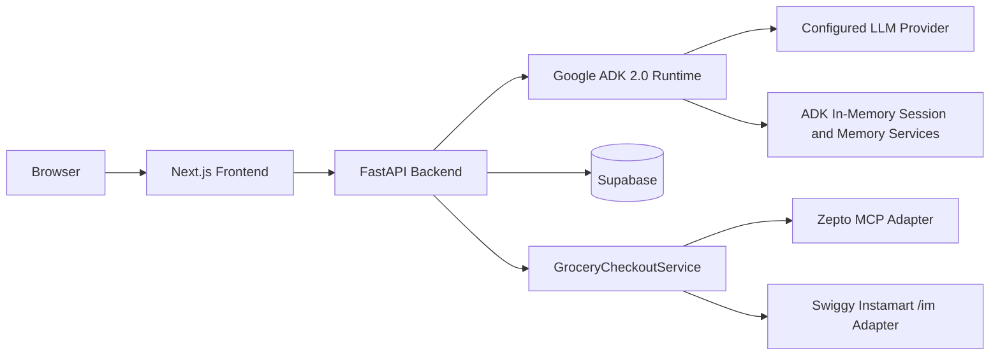

# Kitch: Current Technical Implementation and Stack

This document describes the concrete implementation stack, local development commands, environment variables, persistence schema, deployment direction, and implementation tradeoffs.

For product direction, read `vision_and_requirements.md`.
For system design, read `current_architecture.md`.
For AI runtime and agent routing, read `current_ai_agent_architecture.md`.

---

## Runtime Split

Kitch is split into:

1. Next.js frontend.
2. FastAPI backend gateway.
3. Google ADK 2.0 agent runtime.
4. Supabase persistence.
5. Native Gemini model runtime.
6. A provider-neutral commerce layer with Zepto and Swiggy Instamart adapters.



Why this split:

- Frontend can iterate as a product UI without embedding agent runtime concerns.
- FastAPI can own orchestration, state hydration, and safety boundaries.
- ADK can focus on agent reasoning and tools.
- Supabase can persist deterministic app state.
- Provider integrations can be swapped without changing native grocery planning.

---

## Frontend Stack

Location: `frontend/`

Current packages:

- Next.js `16.2.6`
- React `19.2.4`
- React DOM `19.2.4`
- Tailwind CSS package present
- ESLint `9`
- `eslint-config-next` `16.2.6`

Current scripts:

- `npm run dev`
- `npm run build`
- `npm run start`
- `npm run lint`

Current local dev command:

```bash
npm run dev -- --hostname 127.0.0.1 --port 3000
```

Current frontend responsibilities:

- Render household dashboard.
- Render Recipes page.
- Render Groceries page.
- Render individual nutrition state.
- Render floating chat input and expanded chat history.
- Upload image-plus-text requests.
- Trigger native cart edits.
- Trigger provider-keyed cart sync, revalidation, payment approval, and checkout.
- Connect or disconnect providers that advertise delegated authentication.

Why the UI is not the source of truth:

- Meal plans, recipes, grocery rows, pantry, and macros must survive reloads and be accessible to agents.
- The frontend should render backend state rather than invent state locally.

---

## Backend Stack

Location: `backend/`

Current packages:

- `google-adk[db]>=2.0.0`
- `fastapi>=0.100.0`
- `uvicorn>=0.22.0`
- `supabase>=1.0.0`
- `pydantic>=2.0.0`
- `python-multipart>=0.0.6`
- `python-dotenv>=1.0.0`
- `mcp>=1.0.0`
- `aiosqlite>=0.18.0`
- `sqlalchemy>=2.0.0`
- `opentelemetry-exporter-otlp-proto-http>=1.28.0`
- `httpx>=0.27.0`
- `cryptography>=44.0.0`

Current local dev command:

```bash
venv/bin/python -m uvicorn app.main:app --host 127.0.0.1 --port 8000
```

Why FastAPI:

- The app needs a Python backend for ADK, multimodal message assembly, MCP clients, Supabase access, and provider approval boundaries.
- FastAPI gives a simple typed HTTP surface to the Next.js app.

---

## Agent Runtime Stack

Location: `backend/app/agent/`

Current framework:

- Google ADK 2.0.

Current ADK services:

- `InMemorySessionService`
- `InMemoryMemoryService`
- `App`
- `Runner`
- `LlmAgent`
- `EventsCompactionConfig`
- `LlmEventSummarizer`
- Optional ADK OpenTelemetry tracing via `backend/app/telemetry.py`

Current agent team:

- `kitch_coordinator`
- `chef_planner`
- `vision_scanner`
- `recipe_grocery_planner`

Why ADK:

- It provides production runtime primitives for agents, tools, sessions, memory, callbacks, and compaction.
- It has a clear migration path to Vertex AI managed services.
- It keeps agent topology explicit and understandable.

Why not Antigravity SDK as runtime:

- Antigravity-style tooling is useful for development and coding-agent workflows.
- Kitch needs a runtime framework inside the deployed app.
- ADK better matches the desired production path and service abstractions.

Provider mutations remain in deterministic backend services. The coordinator
has only read-only provider-status tools; the recipe planner has no provider
tools. A constrained Gemini catalog matcher may select an allowlisted candidate
but has no MCP, credential, mutation, payment, or order access.

---

## Persistence Stack

Current database:

- Supabase PostgreSQL.

Schema location:

- `backend/database/supabase_schema.sql`

Current tables:

- `profiles`
- `meal_plans`
- `recipe_grocery_plans`
- `pantry_stock`
- `grocery_cart_items`
- `macro_diary`
- `provider_checkout_drafts`
- `provider_connections`
- `provider_oauth_clients`
- `provider_oauth_flows`

State ownership:

- `profiles`: configured prototype members and shared household profile settings.
- `meal_plans`: shared household schedule keyed by exact `plan_date`, with
  breakfast, lunch, and dinner meal names only.
- `recipe_grocery_plans`: persisted recipe cards, structured ingredients, pantry considerations, and request scope.
- `pantry_stock`: shared household pantry/fridge inventory.
- `grocery_cart_items`: shared native grocery cart, optionally linked to a recipe+grocery artifact.
- `macro_diary`: individual macro logs.
- `provider_checkout_drafts`: environment-scoped mappings, confirmed cart,
  provider bill, approval snapshot, payment/order outcome, repair history, and lease.
- `provider_connections`: encrypted household provider token and lifecycle state.
- `provider_oauth_clients`: environment-level dynamic OAuth client registration.
- `provider_oauth_flows`: expiring one-time PKCE state and verifier records.

Why Supabase:

- The UI needs deterministic records.
- Agents need reliable state reads before planning.
- Supabase gives fast prototype persistence without building a custom database layer.

Important implementation notes:

- `meal_plans` uses `plan_date`, `breakfast_name`, `lunch_name`, and
  `dinner_name`. Weekday labels are derived and never persisted as identity.
- `profiles.timezone_name` is the authoritative household timezone for today,
  tomorrow, and calendar-week boundaries.
- Past `meal_plans` rows are removed at backend startup and at each household
  midnight so the table retains only current and future planning state.
- `replace_meal_plan_range` and `apply_meal_plan_edits` make range replacement
  and multi-slot edits transactional.

Persistence contract:

- RLS is enabled for every structured-data table. `anon` and
  `authenticated` have no CRUD or sequence access because the frontend uses
  FastAPI rather than direct Supabase access.
- FastAPI uses a Supabase secret key (preferred) or temporary legacy
  service-role key. It refuses startup for `SUPABASE_KEY`, anon, publishable,
  malformed, or missing credentials.
- Database errors are fail-loud: only successful empty reads return an empty
  collection. Failed reads and writes return a standardized HTTP 503 rather
  than a local fallback or apparent success.
- `save_recipe_grocery_plan_with_cart` is a transactional RPC, so an agent cart
  replacement either commits with its artifact or rolls back completely.

---

## Prototype Household Configuration

Location:

- `backend/app/household_config.py`
- `frontend/src/app/householdConfig.js`

Current prototype household:

- Archit
- Anubhav
- Naman

Why configured names are allowed:

- The product is currently being tested as a known three-person household.
- Hardcoding names throughout business logic would block future household registration.
- Central configuration lets the app behave realistically now while leaving migration room.

Deferred:

- Auth-backed member registration.
- Multiple households.
- A first-class household table.

Until then:

- Shared household resources reuse the configured household owner profile id.
- Individual macro diaries still use member-specific ids.

---

## LLM and Environment Configuration

The backend always uses ADK's native `Gemini` adapter. Local testing and cloud deployment use the same model path and differ only in authentication mode.

Gemini model configuration:

| Variable | Purpose |
| :--- | :--- |
| `KITCH_LLM_MODEL` | Gemini model ID. Defaults to `gemini-3.6-flash`; non-Gemini IDs are rejected. |

Gemini authentication variables:

| Variable | Purpose |
| :--- | :--- |
| `GOOGLE_API_KEY` | Google AI Studio key for native Gemini API-key mode. |
| `GOOGLE_GENAI_USE_VERTEXAI` | `FALSE` for AI Studio API-key mode, `TRUE` for Vertex AI / Agent Platform mode. |
| `GOOGLE_CLOUD_PROJECT` | Required for Vertex AI / Agent Platform mode. |
| `GOOGLE_CLOUD_LOCATION` | Required for Vertex AI / Agent Platform mode. |

Recommended production model config:

```bash
KITCH_LLM_MODEL=gemini-3.6-flash
GOOGLE_GENAI_USE_VERTEXAI=FALSE
GOOGLE_API_KEY=...
```

Why Gemini-only:

- Local and deployed behavior use the same native ADK model adapter.
- The configured model is guaranteed to be a Gemini model.
- Agent definitions and the event compactor share one configured Gemini instance.

---

## ADK Session and Memory Configuration

Current local services:

- `InMemorySessionService`
- `InMemoryMemoryService`

Planned deployed services:

- `VertexAISessionService`
- `VertexAIMemoryBank`

Why in-memory now:

- Fast local iteration.
- No cloud memory setup during product exploration.
- Easy reset behavior during backend restarts.
- Supabase already persists product-critical records.

Why Vertex later:

- Deployed users need durable sessions and durable household preferences.
- Vertex services align with ADK abstractions.
- The app can swap service implementations without changing the agent team.

Conscious limitation:

- Backend restarts currently clear chat sessions and in-memory household preferences.
- This is acceptable for local testing and should not be treated as a production behavior.

---

## Supabase Environment Variables

| Variable | Purpose |
| :--- | :--- |
| `SUPABASE_URL` | Supabase project URL. |
| `SUPABASE_SECRET_KEY` | Preferred `sb_secret_...` credential used only by the trusted backend. |
| `SUPABASE_SERVICE_ROLE_KEY` | Temporary legacy `service_role` JWT support. |

`SUPABASE_KEY`, publishable credentials, and anon JWTs are intentionally
rejected. All versioned database migrations must be applied before FastAPI is
started.

Why Supabase is still required even with ADK memory:

- ADK memory is for flexible preferences and conversation context.
- Supabase stores authoritative product records.

---

## ADK Tracing and OpenTelemetry Configuration

Tracing bootstrap location:

- `backend/app/telemetry.py`

Current behavior:

- Kitch runs ADK programmatically behind FastAPI, so tracing is configured in code before the ADK `Runner` is created.
- Tracing is off by default.
- If `KITCH_ADK_TRACING_ENABLED=true`, an OTEL endpoint variable is set, or `LANGSMITH_API_KEY` is set, Kitch calls ADK's `maybe_set_otel_providers()`.
- ADK emits OpenTelemetry spans for agent invocation, model calls, workflow execution, and tool execution.
- Jaeger and LangSmith can be used together. The standard OTEL endpoint handles Jaeger or any collector, and LangSmith is added as an extra OTLP trace exporter when configured.

Environment variables:

| Variable | Purpose |
| :--- | :--- |
| `KITCH_ADK_TRACING_ENABLED` | Set to `true` to request ADK OpenTelemetry setup. Set to `false` to force-disable it. |
| `KITCH_ADK_TRACING_REQUIRED` | Set to `true` if backend startup should fail when tracing cannot be configured. Defaults to best-effort. |
| `OTEL_EXPORTER_OTLP_TRACES_ENDPOINT` | OTLP HTTP traces endpoint, for example `http://127.0.0.1:4318/v1/traces`. |
| `OTEL_EXPORTER_OTLP_ENDPOINT` | General OTLP endpoint if traces, metrics, and logs share one collector. |
| `OTEL_SERVICE_NAME` | Service name shown in trace backends. Defaults to `kitch-backend` when tracing is enabled. |
| `OTEL_RESOURCE_ATTRIBUTES` | Comma-separated resource attributes. Defaults to `service.namespace=kitch,deployment.environment=local` when tracing is enabled. |
| `LANGSMITH_API_KEY` | Optional LangSmith API key. When set, Kitch exports ADK traces to LangSmith in addition to the standard OTEL endpoint. |
| `LANGSMITH_PROJECT` | Optional LangSmith project name. Defaults to LangSmith's project behavior if omitted. |
| `LANGSMITH_OTEL_TRACES_ENDPOINT` | Optional LangSmith OTEL traces endpoint override. Defaults to `https://api.smith.langchain.com/otel/v1/traces`. |
| `KITCH_LANGSMITH_TRACING_ENABLED` | Optional explicit LangSmith tracing toggle. Set to `false` to disable LangSmith export even if a key is present. |

Local Jaeger example:

```bash
docker run --rm --name kitch-jaeger \
  -p 16686:16686 \
  -p 4318:4318 \
  jaegertracing/all-in-one:latest
```

Then set:

```bash
KITCH_ADK_TRACING_ENABLED=true
OTEL_EXPORTER_OTLP_TRACES_ENDPOINT=http://127.0.0.1:4318/v1/traces
OTEL_SERVICE_NAME=kitch-backend
LANGSMITH_API_KEY=...
LANGSMITH_PROJECT=kitch-local
```

Why this is separate from ADK Web:

- `adk web` can export traces when it owns the runtime.
- Kitch owns the runtime through FastAPI, so it uses ADK's programmatic tracing setup and exports to any OTLP-compatible backend.

---

## Grocery Provider Configuration

Provider adapter location:

- `backend/app/providers/zepto.py`

Environment variables:

| Variable | Purpose |
| :--- | :--- |
| `ZEPTO_MCP_URL` | Zepto MCP endpoint. Defaults to `https://mcp.zepto.co.in/mcp`. |
| `ZEPTO_MCP_ACCESS_TOKEN` | Bearer token for Zepto MCP, if available. |
| `ZEPTO_MCP_BEARER_TOKEN` | Alternate bearer token variable. |
| `ZEPTO_ACCESS_TOKEN` | Alternate token variable. |
| `ZEPTO_MCP_HEADERS` | Optional JSON object of extra MCP headers. |
| `ZEPTO_MCP_ENABLED` | Set to `false` to disable Zepto MCP calls. |
| `ZEPTO_MCP_TRANSPORT` | Optional transport override. |
| `ZEPTO_MCP_REMOTE_COMMAND` | Defaults to `npx` for local OAuth bridge mode. |
| `ZEPTO_MCP_REMOTE_ARGS` | Optional custom `mcp-remote` argument list. |

Default local OAuth bridge:

```bash
npx -y mcp-remote https://mcp.zepto.co.in/mcp
```

Shared behavior:

- Kitch syncs selected native rows only through provider-keyed FastAPI endpoints.
- The Groceries UI fetches provider descriptors, routes, capabilities,
  environments, and connection state from `ProviderRegistry`.
- Zepto and Swiggy Instamart are active adapters. Blinkit is a disabled
  `Coming soon` descriptor.
- Checkout actions appear in one six-stage main-column sequence: collapsible
  native review, provider choice, delivery address, transfer, provider cart
  review, then payment and order. Sidebar cards contain the financial summary
  and cart-maintenance shortcuts.
- The frontend automatically loads the selected provider's read-only saved
  addresses, preserves the draft address when valid, and otherwise selects the
  provider-marked default or first provider-returned address. The exact address
  must be visible before sync or payment.
- The frontend waits for pending native-cart writes before sync, then locks cart
  editing behind a modal, focus-retaining transfer animation until the provider
  request completes.
- FastAPI passes the selected address id to the provider adapter.
- The adapter calls `select_saved_address` before catalog search so Zepto can
  establish location serviceability and store context.
- Configuration readiness does not claim store readiness. Store readiness is
  confirmed only after address selection succeeds.
- A review remains locked to the address used for product resolution; changing
  address requires a fresh sync.
- Native-cart or provider-selection changes also invalidate the review so a
  stale snapshot cannot be ordered.
- The complete selected-provider cart is replaced before sync.
- Search matches require explicit sufficient availability and are counted as
  successful only after exact product/store ids and quantities appear in the
  confirmed selected-provider cart.
- Durable checkout drafts live in Supabase rather than backend process memory.
- Groceries entry restores the durable draft and may read saved addresses, but
  never searches products, mutates a provider cart, or revalidates it. Drafts
  older than five minutes are marked stale and require an explicit cart refresh
  before payment or approval.
- Provider product-detail operations validate expected products; unavailable products are
  replaced through a new store-context search and the complete cart is rebuilt
  and reconciled. Unresolved rows remain visible and are excluded from the
  provider order; a confirmed partial cart may proceed after explicit review.
  Ordering remains blocked when no selected item is confirmed.
- Final order placement repeats revalidation and returns `409` when any
  approved product, quantity, pack, price, or total changed.
- Unavailable/unresolved items and replacement history are returned in the review.
- Each adapter normalizes provider-returned subtotal, discount, fee, and total
  values into `cart_summary`. The provider's final total always wins. When it is
  absent, the adapter can sum exact returned selling prices and cart quantities
  only if no fee, tax, discount, or other adjustment is present; otherwise the
  total stays null.
- `cart_summary.total_source` distinguishes `provider`, `line_items`, and
  `unavailable`, while `total_notice` explains the decision to the UI.
- `cart_summary` is covered by the review snapshot hash.
- Provider cart details are presented as a cart review, not internal matching
  terminology.
- Address labels are expanded with actual address text when Zepto exposes it.
- Order placement requires final frontend approval.

Why provider MCP is behind adapters:

- MCP auth, tool names, schemas, catalog fields, and order behavior are provider-controlled.
- Kitch's native cart should remain provider-agnostic.
- Defensive adapter code prevents provider details from leaking into agent tools.

### Swiggy Instamart OAuth and MCP

Instamart uses only Swiggy's `/im` MCP surface. The adapter discovers
`tools/list`, allowlists grocery tools, and validates required input schemas;
missing or incompatible capabilities mark Instamart degraded without making
core Kitch readiness fail.

| Variable | Purpose |
| :--- | :--- |
| `PROVIDER_CREDENTIAL_ENCRYPTION_KEY` | Fernet key for tokens and PKCE verifiers. |
| `SWIGGY_INSTAMART_ENABLED` | Enable the Instamart adapter and provider card. |
| `SWIGGY_INSTAMART_ENV` | `local`, `staging`, or `production`. |
| `SWIGGY_INSTAMART_MCP_URL` | Instamart endpoint; must target `/im`. |
| `SWIGGY_OAUTH_BASE_URL` | OAuth 2.1 and dynamic-registration origin. |
| `SWIGGY_OAUTH_REDIRECT_URI` | Exact callback URI; HTTPS is mandatory in production. |
| `SWIGGY_OAUTH_SCOPE` | Delegated scope, default `mcp:tools`. |
| `SWIGGY_OAUTH_CLIENT_NAME` | Dynamic-registration client name. |
| `SWIGGY_INSTAMART_PRODUCTION_APPROVED` | Explicit production approval gate. |
| `FRONTEND_URL` | Redirect destination after callback. |

One dynamic client registration is stored per environment and one encrypted
connection per household/provider/environment. OAuth state is hashed,
single-use, and expires after ten minutes; PKCE verifiers and access tokens are
encrypted. Since Swiggy does not currently issue a usable refresh token, expiry
or HTTP 401 changes the connection to `reconnect_required`.

Instamart sync establishes address context, searches address-orderable SKUs,
uses `spinId` and `skuId`, replaces the complete cart, calls `get_cart`, and
reconciles every line. Provider bill components are authoritative. A line-item
sum can be shown only as `Item subtotal`, never as payable total when adjustments
are unknown. `get_payment_options` is the source of UPI apps and QR flow;
opaque app IDs are passed through unchanged. UPI is exclusive when returned,
and COD is allowed only if UPI is absent and Cash is returned. Checkout timeouts are reconciled through
documented order history before any retry; unresolved duplicate risk is stored
as `unknown`.

---

## Multimodal Handling

Current image flow:

- Browser stages image attachments without auto-submitting.
- User may add accompanying text.
- Browser uploads file bytes and text to FastAPI.
- FastAPI creates ADK content with text instructions and an image part.
- Plate photos route to intake logging.
- Fridge photos route to pantry updates.
- If the same fridge upload includes a grocery request, a follow-up recipe+grocery planning turn runs after pantry updates.

Why image attach does not auto-submit:

- Users often need to add context such as "this is tomorrow's dinner prep" or "ignore the bottle on the side."
- Auto-submitting removed that natural multimodal workflow.

---

## Frontend State and Chat Rendering

Current chat behavior:

- Chat session is continuous while the backend process is alive.
- Expanded chat panel can show recent messages and reveal earlier messages.
- Agent replies render markdown.
- Chat history is frontend-visible but not fully persisted across backend restarts until Vertex sessions are introduced.

Why:

- Users need to see prior conversation context during a session.
- Long-term persistence is deferred to Vertex session service rather than a custom frontend history database.

---

## Deployment Direction

Current intended split:

- Frontend: Vercel or equivalent Next.js hosting.
- Backend: Python hosting that can run FastAPI/ADK and MCP client processes.
- Database: Supabase.
- ADK session/memory: migrate from local in-memory services to Vertex AI managed services after deployment testing.

Why backend and frontend are not collapsed into one simple static deployment:

- The backend needs Python, ADK, multimodal handling, MCP clients, and provider approval logic.
- Agent turns and image requests can be longer-running than simple static/API edge functions.
- A persistent backend process is easier to reason about while integrating provider MCP services and later Vertex services.

---

## Known Boundaries

- Backend restarts clear in-memory sessions and memory.
- Supabase migrations, including `20260815_multi_provider_grocery_platform.sql`,
  must be applied before starting FastAPI. That migration discards existing
  provider drafts but preserves the native cart.
- Provider auth and environment access must be completed before live sync works.
- Blinkit live cart insertion is not implemented.
- Instamart production remains gated until approval and the staging soak complete.
- Auth and multi-household registration are deferred.
- Local prototype members live in configuration.
- Provider order placement is real and must remain behind explicit final approval.
- Snacks are not part of the current product.
