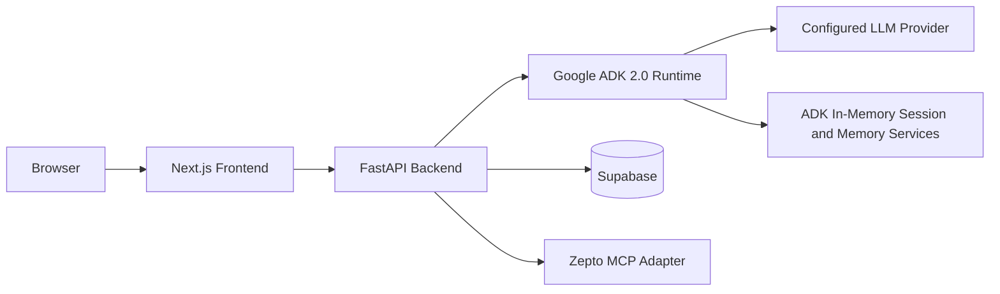

# Kitch: Current Technical Implementation and Stack

This document describes the concrete implementation stack, local development commands, environment variables, persistence schema, deployment direction, and implementation tradeoffs.

For product direction, read `vision_and_requirements.md`.
For system design, read `current_architecture.md`.
For agent routing, read `current_agent_topology.md`.

---

## Runtime Split

Kitch is split into:

1. Next.js frontend.
2. FastAPI backend gateway.
3. Google ADK 2.0 agent runtime.
4. Supabase persistence.
5. Configurable LLM provider.
6. Backend provider adapters, currently Zepto MCP for cart sync and guarded order placement.



Why this split:

- Frontend can iterate as a product UI without embedding agent runtime concerns.
- FastAPI can own orchestration, state hydration, and safety boundaries.
- ADK can focus on agent reasoning and tools.
- Supabase can persist deterministic app state.
- Provider integrations can be swapped without changing native grocery planning.

---

## Frontend Stack

Location: `frontend/`

Current packages:

- Next.js `16.2.6`
- React `19.2.4`
- React DOM `19.2.4`
- Tailwind CSS package present
- ESLint `9`
- `eslint-config-next` `16.2.6`

Current scripts:

- `npm run dev`
- `npm run build`
- `npm run start`
- `npm run lint`

Current local dev command:

```bash
npm run dev -- --hostname 127.0.0.1 --port 3000
```

Current frontend responsibilities:

- Render household dashboard.
- Render Recipes page.
- Render Groceries page.
- Render individual nutrition state.
- Render floating chat input and expanded chat history.
- Upload image-plus-text requests.
- Trigger native cart edits.
- Trigger Zepto cart sync.
- Trigger final Zepto order approval.

Why the UI is not the source of truth:

- Meal plans, recipes, grocery rows, pantry, and macros must survive reloads and be accessible to agents.
- The frontend should render backend state rather than invent state locally.

---

## Backend Stack

Location: `backend/`

Current packages:

- `google-adk[db]>=2.0.0`
- `fastapi>=0.100.0`
- `uvicorn>=0.22.0`
- `supabase>=1.0.0`
- `pydantic>=2.0.0`
- `python-multipart>=0.0.6`
- `python-dotenv>=1.0.0`
- `mcp>=1.0.0`
- `aiosqlite>=0.18.0`
- `sqlalchemy>=2.0.0`

Current local dev command:

```bash
venv/bin/python -m uvicorn app.main:app --host 127.0.0.1 --port 8000
```

Why FastAPI:

- The app needs a Python backend for ADK, multimodal message assembly, MCP clients, Supabase access, and provider approval boundaries.
- FastAPI gives a simple typed HTTP surface to the Next.js app.

---

## Agent Runtime Stack

Location: `backend/app/agent/`

Current framework:

- Google ADK 2.0.

Current ADK services:

- `InMemorySessionService`
- `InMemoryMemoryService`
- `App`
- `Runner`
- `LlmAgent`
- `EventsCompactionConfig`
- `LlmEventSummarizer`

Current agent team:

- `kitch_coordinator`
- `chef_planner`
- `vision_scanner`
- `recipe_grocery_planner`

Why ADK:

- It provides production runtime primitives for agents, tools, sessions, memory, callbacks, and compaction.
- It has a clear migration path to Vertex AI managed services.
- It keeps agent topology explicit and understandable.

Why not Antigravity SDK as runtime:

- Antigravity-style tooling is useful for development and coding-agent workflows.
- Kitch needs a runtime framework inside the deployed app.
- ADK better matches the desired production path and service abstractions.

Provider tools such as Zepto sync remain in backend code, but they are not part of the `recipe_grocery_planner` topology.

---

## Persistence Stack

Current database:

- Supabase PostgreSQL.

Schema location:

- `backend/database/supabase_schema.sql`

Current tables:

- `profiles`
- `meal_plans`
- `recipe_grocery_plans`
- `pantry_stock`
- `grocery_cart_items`
- `macro_diary`

State ownership:

- `profiles`: configured prototype members and shared household profile settings.
- `meal_plans`: shared household weekly meal schedule with meal names only.
- `recipe_grocery_plans`: persisted recipe cards, structured ingredients, pantry considerations, and request scope.
- `pantry_stock`: shared household pantry/fridge inventory.
- `grocery_cart_items`: shared native grocery cart, optionally linked to a recipe+grocery artifact.
- `macro_diary`: individual macro logs.

Why Supabase:

- The UI needs deterministic records.
- Agents need reliable state reads before planning.
- Supabase gives fast prototype persistence without building a custom database layer.

Important implementation note:

- The `meal_plans` schema still uses legacy column names like `breakfast_recipe_id`, but these fields now store meal name strings. Do not reintroduce static recipe IDs.

---

## Prototype Household Configuration

Location:

- `backend/app/household_config.py`
- `frontend/src/app/householdConfig.js`

Current prototype household:

- Archit
- Anubhav
- Naman

Why configured names are allowed:

- The product is currently being tested as a known three-person household.
- Hardcoding names throughout business logic would block future household registration.
- Central configuration lets the app behave realistically now while leaving migration room.

Deferred:

- Auth-backed member registration.
- Multiple households.
- A first-class household table.

Until then:

- Shared household resources reuse the configured household owner profile id.
- Individual macro diaries still use member-specific ids.

---

## LLM and Environment Configuration

The backend uses a provider selector so local testing and production do not need the same model provider.

Provider selector:

| Variable | Purpose |
| :--- | :--- |
| `KITCH_LLM_PROVIDER` | `openai_compatible` or `gemini`. Defaults to `openai_compatible`. |
| `KITCH_LLM_MODEL` | Model name passed to the selected adapter. |
| `KITCH_LLM_API_KEY` | Optional generic API key for OpenAI-compatible mode. |
| `KITCH_LLM_API_BASE` | Optional generic base URL. |
| `KITCH_LLM_LITELLM_PREFIX` | Optional LiteLLM model prefix. Defaults to `openai`. |
| `KITCH_LLM_CUSTOM_PROVIDER` | Optional LiteLLM custom provider. Defaults to `openai`. |

Local OpenAI-compatible fallback variables:

| Variable | Purpose |
| :--- | :--- |
| `OPENAI_MODEL_NAME` | Model name for ADK `LiteLlm`. |
| `OPENAI_API_KEY` | Authenticates model calls. |
| `OPENAI_API_BASE` | OpenAI-compatible gateway base URL. |

Production Gemini variables:

| Variable | Purpose |
| :--- | :--- |
| `GOOGLE_API_KEY` | Google AI Studio key for native Gemini API-key mode. |
| `GOOGLE_GENAI_USE_VERTEXAI` | `FALSE` for AI Studio API-key mode, `TRUE` for Vertex AI / Agent Platform mode. |
| `GOOGLE_CLOUD_PROJECT` | Required for Vertex AI / Agent Platform mode. |
| `GOOGLE_CLOUD_LOCATION` | Required for Vertex AI / Agent Platform mode. |

Recommended production model config:

```bash
KITCH_LLM_PROVIDER=gemini
KITCH_LLM_MODEL=gemini-flash-latest
GOOGLE_GENAI_USE_VERTEXAI=FALSE
GOOGLE_API_KEY=...
```

Why configurable model provider:

- Local testing has used OpenAI-compatible routes.
- Production should run on Gemini.
- Agent definitions should not change when the model provider changes.

---

## ADK Session and Memory Configuration

Current local services:

- `InMemorySessionService`
- `InMemoryMemoryService`

Planned deployed services:

- `VertexAISessionService`
- `VertexAIMemoryBank`

Why in-memory now:

- Fast local iteration.
- No cloud memory setup during product exploration.
- Easy reset behavior during backend restarts.
- Supabase already persists product-critical records.

Why Vertex later:

- Deployed users need durable sessions and durable household preferences.
- Vertex services align with ADK abstractions.
- The app can swap service implementations without changing the agent team.

Conscious limitation:

- Backend restarts currently clear chat sessions and in-memory household preferences.
- This is acceptable for local testing and should not be treated as a production behavior.

---

## Supabase Environment Variables

| Variable | Purpose |
| :--- | :--- |
| `SUPABASE_URL` | Supabase project URL. |
| `SUPABASE_KEY` | Supabase API key used by the backend. |

Why Supabase is still required even with ADK memory:

- ADK memory is for flexible preferences and conversation context.
- Supabase stores authoritative product records.

---

## Zepto MCP Configuration

Provider adapter location:

- `backend/app/providers/zepto.py`

Environment variables:

| Variable | Purpose |
| :--- | :--- |
| `ZEPTO_MCP_URL` | Zepto MCP endpoint. Defaults to `https://mcp.zepto.co.in/mcp`. |
| `ZEPTO_MCP_ACCESS_TOKEN` | Bearer token for Zepto MCP, if available. |
| `ZEPTO_MCP_BEARER_TOKEN` | Alternate bearer token variable. |
| `ZEPTO_ACCESS_TOKEN` | Alternate token variable. |
| `ZEPTO_MCP_HEADERS` | Optional JSON object of extra MCP headers. |
| `ZEPTO_MCP_ENABLED` | Set to `false` to disable Zepto MCP calls. |
| `ZEPTO_MCP_TRANSPORT` | Optional transport override. |
| `ZEPTO_MCP_REMOTE_COMMAND` | Defaults to `npx` for local OAuth bridge mode. |
| `ZEPTO_MCP_REMOTE_ARGS` | Optional custom `mcp-remote` argument list. |

Default local OAuth bridge:

```bash
npx -y mcp-remote https://mcp.zepto.co.in/mcp
```

Current behavior:

- Kitch syncs selected native cart rows into Zepto only through backend provider endpoints.
- Existing Zepto cart is replaced before sync.
- Unavailable/unresolved items are returned in the review.
- Zepto cart details are shown as "Zepto Cart" in the UI, not "matched products."
- Address labels are expanded with actual address text when Zepto exposes it.
- Order placement requires final frontend approval.

Why Zepto MCP is behind an adapter:

- MCP auth, tool names, schemas, catalog fields, and order behavior are provider-controlled.
- Kitch's native cart should remain provider-agnostic.
- Defensive adapter code prevents provider details from leaking into agent tools.

---

## Multimodal Handling

Current image flow:

- Browser stages image attachments without auto-submitting.
- User may add accompanying text.
- Browser uploads file bytes and text to FastAPI.
- FastAPI creates ADK content with text instructions and an image part.
- Plate photos route to intake logging.
- Fridge photos route to pantry updates.
- If the same fridge upload includes a grocery request, a follow-up recipe+grocery planning turn runs after pantry updates.

Why image attach does not auto-submit:

- Users often need to add context such as "this is tomorrow's dinner prep" or "ignore the bottle on the side."
- Auto-submitting removed that natural multimodal workflow.

---

## Frontend State and Chat Rendering

Current chat behavior:

- Chat session is continuous while the backend process is alive.
- Expanded chat panel can show recent messages and reveal earlier messages.
- Agent replies render markdown.
- Chat history is frontend-visible but not fully persisted across backend restarts until Vertex sessions are introduced.

Why:

- Users need to see prior conversation context during a session.
- Long-term persistence is deferred to Vertex session service rather than a custom frontend history database.

---

## Deployment Direction

Current intended split:

- Frontend: Vercel or equivalent Next.js hosting.
- Backend: Python hosting that can run FastAPI/ADK and MCP client processes.
- Database: Supabase.
- ADK session/memory: migrate from local in-memory services to Vertex AI managed services after deployment testing.

Why backend and frontend are not collapsed into one simple static deployment:

- The backend needs Python, ADK, multimodal handling, MCP clients, and provider approval logic.
- Agent turns and image requests can be longer-running than simple static/API edge functions.
- A persistent backend process is easier to reason about while integrating Zepto MCP and later Vertex services.

---

## Known Boundaries

- Backend restarts clear in-memory sessions and memory.
- Supabase must be migrated in every environment before relying on `recipe_grocery_plans` and `grocery_cart_items.recipe_grocery_plan_id`.
- Zepto MCP auth/OAuth setup is external and must be completed before live sync works.
- Blinkit live cart insertion is not implemented.
- Auth and multi-household registration are deferred.
- Local prototype members live in configuration.
- Provider order placement is real and must remain behind explicit final approval.
- Snacks are not part of the current product.
