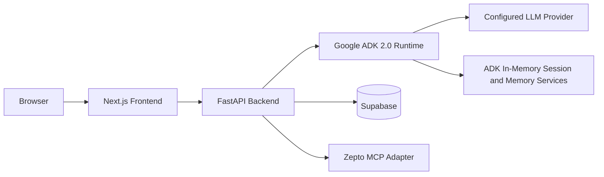

# Kitch: Current Technology Stack

This document describes the stack Kitch currently uses in local development and the intended deployment direction.

---

## Runtime Split

Kitch is split into:

1. Next.js frontend.
2. FastAPI backend gateway.
3. Google ADK 2.0 agent runtime.
4. Supabase persistence.
5. Configurable LLM provider.
6. Backend provider adapters, currently Zepto MCP for cart sync.



---

## Frontend Stack

Location: `frontend/`

Current packages:

- Next.js `16.2.6`
- React `19.2.4`
- React DOM `19.2.4`
- Tailwind CSS package present
- ESLint `9`
- `eslint-config-next` `16.2.6`

Current scripts:

- `npm run dev`
- `npm run build`
- `npm run start`
- `npm run lint`

Current duties:

- Render the Kitch dashboard and floating chat input.
- Render Supabase-backed weekly plan, pantry, grocery cart, and macro state.
- Upload image-plus-text requests.
- Trigger Zepto cart sync and final order approval through backend APIs.

---

## Backend Stack

Location: `backend/`

Current packages:

- `google-adk[db]>=2.0.0`
- `fastapi>=0.100.0`
- `uvicorn>=0.22.0`
- `supabase>=1.0.0`
- `pydantic>=2.0.0`
- `python-multipart>=0.0.6`
- `python-dotenv>=1.0.0`
- `aiosqlite>=0.18.0`
- `sqlalchemy>=2.0.0`
- `mcp>=1.0.0`

Current local dev command:

```bash
venv/bin/python -m uvicorn app.main:app --host 127.0.0.1 --port 8000
```

---

## Agent Runtime Stack

Location: `backend/app/agent/`

Current framework:

- Google ADK 2.0.

Current ADK services:

- `InMemorySessionService`
- `InMemoryMemoryService`
- `App`
- `Runner`
- `LlmAgent`
- `EventsCompactionConfig`
- `LlmEventSummarizer`

Current agent team:

- `kitch_coordinator`
- `chef_planner`
- `vision_scanner`
- `recipe_grocery_planner`

Provider tools such as Zepto sync remain in backend code, but they are not part of the `recipe_grocery_planner` topology.

Deployment direction:

- Replace `InMemorySessionService` with `VertexAISessionService`.
- Replace `InMemoryMemoryService` with `VertexAIMemoryBank`.

---

## Persistence Stack

Current database:

- Supabase PostgreSQL.

Schema location:

- `backend/database/supabase_schema.sql`

Current tables:

- `profiles`
- `meal_plans`
- `recipe_grocery_plans`
- `pantry_stock`
- `grocery_cart_items`
- `macro_diary`

State ownership:

- `profiles`: configured prototype members and shared household profile settings.
- `meal_plans`: shared household weekly meal schedule with meal names only.
- `recipe_grocery_plans`: persisted recipe cards, structured ingredients, pantry considerations, and request scope.
- `pantry_stock`: shared household pantry/fridge inventory.
- `grocery_cart_items`: shared native grocery cart, optionally linked to a recipe+grocery artifact.
- `macro_diary`: individual macro logs.

Prototype identity:

- Current members are configured in `backend/app/household_config.py`.
- Current members are Archit, Anubhav, and Naman.
- Multi-household registration and auth-backed membership are deferred.

---

## LLM and Environment Configuration

The backend uses a provider selector so local testing and production do not need the same model provider.

Provider selector:

| Variable | Purpose |
| :--- | :--- |
| `KITCH_LLM_PROVIDER` | `openai_compatible` or `gemini`. Defaults to `openai_compatible`. |
| `KITCH_LLM_MODEL` | Model name passed to the selected adapter. |
| `KITCH_LLM_API_KEY` | Optional generic API key for OpenAI-compatible mode. |
| `KITCH_LLM_API_BASE` | Optional generic base URL. |
| `KITCH_LLM_LITELLM_PREFIX` | Optional LiteLLM model prefix. Defaults to `openai`. |
| `KITCH_LLM_CUSTOM_PROVIDER` | Optional LiteLLM custom provider. Defaults to `openai`. |

Local OpenAI-compatible fallback variables:

| Variable | Purpose |
| :--- | :--- |
| `OPENAI_MODEL_NAME` | Model name for ADK `LiteLlm`. |
| `OPENAI_API_KEY` | Authenticates model calls. |
| `OPENAI_API_BASE` | OpenAI-compatible gateway base URL. |

Production Gemini variables:

| Variable | Purpose |
| :--- | :--- |
| `GOOGLE_API_KEY` | Google AI Studio key for native Gemini. |
| `GOOGLE_GENAI_USE_VERTEXAI` | `FALSE` for AI Studio API-key mode, `TRUE` for Vertex AI / Agent Platform mode. |
| `GOOGLE_CLOUD_PROJECT` | Required for Vertex AI / Agent Platform mode. |
| `GOOGLE_CLOUD_LOCATION` | Required for Vertex AI / Agent Platform mode. |

Other backend variables:

| Variable | Purpose |
| :--- | :--- |
| `SUPABASE_URL` | Supabase project URL. |
| `SUPABASE_KEY` | Supabase API key used by the backend. |

---

## Zepto MCP Configuration

Provider adapter location:

- `backend/app/providers/zepto.py`

Environment variables:

| Variable | Purpose |
| :--- | :--- |
| `ZEPTO_MCP_URL` | Zepto MCP endpoint. Defaults to `https://mcp.zepto.co.in/mcp`. |
| `ZEPTO_MCP_ACCESS_TOKEN` | Bearer token for Zepto MCP, if available. |
| `ZEPTO_MCP_BEARER_TOKEN` | Alternate bearer token variable. |
| `ZEPTO_ACCESS_TOKEN` | Alternate token variable. |
| `ZEPTO_MCP_HEADERS` | Optional JSON object of extra MCP headers. |
| `ZEPTO_MCP_ENABLED` | Set to `false` to disable Zepto MCP calls. |

Current behavior:

- Kitch syncs native cart rows into Zepto only through backend provider endpoints.
- Existing Zepto cart is cleared/replaced before sync.
- Unmatched items are returned as unavailable.
- Order placement requires final frontend approval.

---

## Multimodal Handling

Current image flow:

- Browser uploads file bytes to FastAPI.
- FastAPI creates ADK content with text instructions and an image part.
- Plate photos route to intake logging.
- Fridge photos route to pantry updates.
- If the same fridge upload includes a grocery request, a follow-up recipe+grocery planning turn runs after pantry updates.

---

## Deployment Direction

Current likely split:

- Frontend: Vercel or equivalent Next.js hosting.
- Backend: persistent Python hosting that can run FastAPI/ADK processes.
- Database: Supabase.
- ADK session/memory: migrate from local in-memory services to Vertex AI managed services.

Reasoning:

- Agent turns and multimodal requests can exceed short serverless expectations.
- The backend benefits from a persistent Python process.
- The frontend can remain separately deployed and communicate over HTTP.

---

## Known Boundaries

- The recipe+grocery UI page is still future UI work; backend persistence and APIs now exist.
- Supabase must be migrated before `recipe_grocery_plans` and `recipe_grocery_plan_id` are persistent outside local fallback mode.
- Zepto MCP auth/OAuth setup is external and must be completed before live sync works.
- Blinkit live cart insertion is not implemented.
- Auth and multi-household registration are deferred.
- Local ADK memory/session services are not persistent across process restarts.
