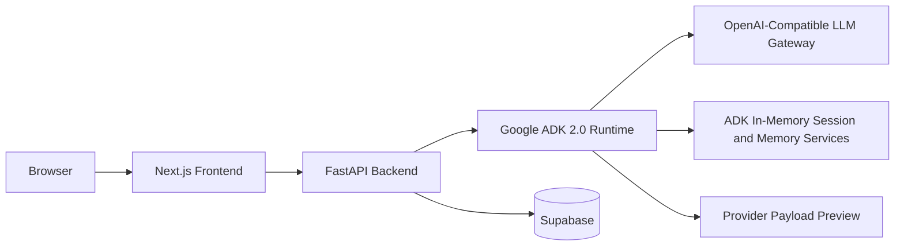

# Kitch: Current Technology Stack

This document describes the stack Kitch currently uses in local development and the intended deployment direction. It avoids future-tense claims where the integration is not implemented yet.

---

## 1. Current Runtime Split

Kitch is split into:

1. Next.js frontend.
2. FastAPI backend gateway.
3. Google ADK 2.0 agent runtime.
4. Supabase persistence.
5. OpenAI-compatible LLM gateway.



---

## 2. Frontend Stack

Location:

- `frontend/`

Current packages:

- Next.js `16.2.6`
- React `19.2.4`
- React DOM `19.2.4`
- Tailwind CSS package present
- ESLint `9`
- `eslint-config-next` `16.2.6`

Current scripts:

- `npm run dev`
- `npm run build`
- `npm run start`
- `npm run lint`

Current local dev command used successfully:

```bash
npm run dev -- --webpack --hostname 127.0.0.1 --port 3000
```

Note:

- The app currently uses a single main app surface under `frontend/src/app`.
- Frontend state syncs with FastAPI and renders Supabase-backed household and personal state.

---

## 3. Backend Stack

Location:

- `backend/`

Current packages:

- `google-adk[db]>=2.0.0`
- `fastapi>=0.100.0`
- `uvicorn>=0.22.0`
- `supabase>=1.0.0`
- `pydantic>=2.0.0`
- `python-multipart>=0.0.6`
- `python-dotenv>=1.0.0`
- `aiosqlite>=0.18.0`
- `sqlalchemy>=2.0.0`

Current local dev command used successfully:

```bash
venv/bin/python -m uvicorn app.main:app --host 127.0.0.1 --port 8000
```

Note:

- The `venv/bin/uvicorn` wrapper in this workspace has had a stale shebang in local testing, so the Python module entrypoint is the reliable local command.

---

## 4. Agent Runtime Stack

Location:

- `backend/app/agent/`

Current framework:

- Google ADK 2.0.

Current model adapter:

- ADK `LiteLlm` in OpenAI-compatible mode.

Current ADK services:

- `InMemorySessionService`
- `InMemoryMemoryService`
- `App`
- `Runner`
- `LlmAgent`
- `EventsCompactionConfig`
- `LlmEventSummarizer`

Current agent team:

- `kitch_coordinator`
- `chef_planner`
- `vision_scanner`
- `checkout_exporter`

Deployment direction:

- Replace `InMemorySessionService` with `VertexAISessionService`.
- Replace `InMemoryMemoryService` with `VertexAIMemoryBank`.

---

## 5. Persistence Stack

Current database:

- Supabase PostgreSQL.

Schema location:

- `backend/database/supabase_schema.sql`

Current tables:

- `profiles`
- `meal_plans`
- `pantry_stock`
- `macro_diary`

Current state ownership:

- `profiles`: configured prototype members and shared household profile settings.
- `meal_plans`: shared household weekly meal plan.
- `pantry_stock`: shared household pantry/fridge inventory.
- `macro_diary`: individual macro logs.

Prototype identity:

- The current household members are configured in `backend/app/household_config.py`.
- The current members are Archit, Anubhav, and Naman.
- Multi-household registration and auth-backed membership are deferred.

---

## 6. LLM and Environment Configuration

Current LLM configuration is loaded from environment variables. The backend uses a provider selector so local testing and production do not need the same model provider.

Provider selector:

| Variable | Purpose |
| :--- | :--- |
| `KITCH_LLM_PROVIDER` | Selects the model adapter. Use `openai_compatible` for LiteLLM/OpenAI-compatible gateways or `gemini` for native ADK Gemini. Defaults to `openai_compatible` for local backward compatibility. |
| `KITCH_LLM_MODEL` | Selects the model name for the configured provider. |
| `KITCH_LLM_API_KEY` | Optional generic API key for OpenAI-compatible LiteLLM mode. |
| `KITCH_LLM_API_BASE` | Optional generic base URL for OpenAI-compatible LiteLLM mode or Gemini custom base URL. |
| `KITCH_LLM_LITELLM_PREFIX` | Optional LiteLLM model prefix. Defaults to `openai`. |
| `KITCH_LLM_CUSTOM_PROVIDER` | Optional LiteLLM custom provider. Defaults to `openai`. |

Local OpenAI-compatible fallback variables:

| Variable | Purpose |
| :--- | :--- |
| `OPENAI_MODEL_NAME` | Selects the model name passed through ADK `LiteLlm`. |
| `OPENAI_API_KEY` | Authenticates model calls. |
| `OPENAI_API_BASE` | Points to the OpenAI-compatible gateway base URL. |

Production Gemini variables:

| Variable | Purpose |
| :--- | :--- |
| `GOOGLE_API_KEY` | Google AI Studio key for native Gemini. |
| `GOOGLE_GENAI_USE_VERTEXAI` | Set to `FALSE` for Google AI Studio API-key mode, or `TRUE` for Vertex AI / Agent Platform mode. |
| `GOOGLE_CLOUD_PROJECT` | Required for Vertex AI / Agent Platform mode. |
| `GOOGLE_CLOUD_LOCATION` | Required for Vertex AI / Agent Platform mode. |

Other backend variables:

| Variable | Purpose |
| :--- | :--- |
| `SUPABASE_URL` | Supabase project URL. |
| `SUPABASE_KEY` | Supabase API key used by the backend. |

The backend loads environment variables through `python-dotenv`.

---

## 7. Multimodal Handling

Current image flow:

- Browser uploads a file to FastAPI.
- FastAPI reads image bytes.
- FastAPI creates ADK-compatible content with text instructions and an image part.
- ADK routes the task to `vision_scanner`.

Current image tasks:

- Plate photo: estimate and log active member macros.
- Fridge photo: detect items and add them to shared pantry.

---

## 8. Grocery and Provider Integration

Current state:

- The checkout exporter prepares Blinkit/Zepto-style payloads.
- Brand memory can alter payload item names.
- The frontend can review payload data.

Not currently implemented:

- Live Blinkit MCP cart insertion.
- Live Zepto cart insertion.
- Order placement.
- Payment flow.

Planned direction:

- Add provider-specific MCP adapters after the provider connection is configured.
- Keep human review before any provider-side execution.

---

## 9. Deployment Direction

Current likely split:

- Frontend: Vercel or equivalent Next.js hosting.
- Backend: persistent Python container such as Render, Railway, Fly.io, or another service that can run long-lived FastAPI/ADK processes.
- Database: Supabase.
- ADK session/memory: migrate from local in-memory services to Vertex AI managed services.

Reasoning:

- Agent turns and multimodal requests can exceed short serverless timeouts.
- The backend benefits from a persistent Python process.
- The frontend can remain separately deployed and communicate over HTTP.

---

## 10. Current Known Stack Boundaries

- Structured dashboard grocery-list artifact is pending.
- Provider MCP cart insertion is deferred.
- Auth and multi-household registration are deferred.
- Local ADK memory/session services are not persistent across process restarts.
- Current household members are prefilled in config.
