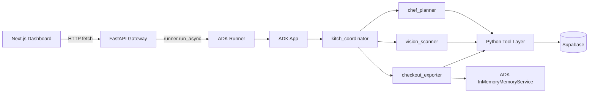

# Kitch: Current Architecture and Implementation Guide

This document replaces the older implementation plan. It describes the app as it exists now: a Google ADK 2.0 multi-agent backend, a Next.js dashboard, Supabase persistence, and temporary in-memory ADK services that will later be replaced by Vertex AI managed services.

The goal of this document is separation of concerns. Frontend behavior stays in the frontend section. Agent topology stays in the agent section. Database details stay in the persistence section.

---

## 1. System Shape

Kitch is a household meal planning, nutrition logging, pantry tracking, and grocery checkout assistant.

At runtime it is split into three major surfaces:

1. **Next.js frontend**
   - Runs the dashboard and chat UI.
   - Displays planner, macro diary, pantry, grocery cart, and checkout approval flows.
   - Calls the FastAPI backend over HTTP.

2. **FastAPI backend gateway**
   - Owns all browser-facing API routes.
   - Creates and syncs ADK sessions.
   - Converts chat text and uploaded images into ADK `Content` messages.
   - Reads and writes Supabase state through a small Python client wrapper.

3. **Google ADK 2.0 agent layer**
   - Uses a parent `kitch_coordinator` agent with three specialized sub-agents.
   - Uses ADK `Runner`, `App`, `LlmAgent`, event compaction, `InMemorySessionService`, and `InMemoryMemoryService`.
   - Calls Python tools for meal plans, pantry updates, macro logs, brand preferences, and checkout export.

---

## 2. Frontend Duties

The frontend lives under `frontend/src/app`.

Its job is presentation and user interaction. It should not own agent reasoning, long-term brand memory, or database rules.

### Current Responsibilities

- Render the main Kitch app shell in `page.js`.
- Let the user switch active household member.
- Let the user switch diet profile and household size.
- Render chat history and send user messages to `/api/chat`.
- Upload fridge and plate photos to `/api/upload-photo`.
- Render Supabase-backed pantry and macro diary state from `/api/state/{user_name}`.
- Provide manual pantry add/remove controls.
- Render the planner, grocery list, and checkout approval modal.
- Call `/api/grocery/export` after the user approves checkout.

### Current Limitation

The frontend still imports `mockData.js` for static recipe IDs, ingredient lists, calories, and default weekly plans.

That means dynamic recipe names generated by the ADK planner can be displayed, but the frontend cannot reliably calculate calories or ingredients for those dynamic recipes unless the backend provides structured derived data.

### Frontend Direction

The frontend should gradually become a state renderer:

- Backend returns planner rows as display-ready meal names.
- Backend or agent returns grocery lists as display-ready native shopping items.
- Frontend stores only UI preferences and temporary interaction state.
- Static recipe catalogs should not be the source of truth for production planning.

---

## 3. API Gateway Duties

The FastAPI backend lives in `backend/app/main.py`.

Its job is orchestration between browser requests, ADK runner turns, and persistence. It should not contain UI policy or deep agent reasoning.

### Current Routes

| Route | Duty |
| :--- | :--- |
| `POST /api/chat` | Runs a text chat turn through the ADK runner. |
| `POST /api/upload-photo` | Sends image bytes plus task instructions to the ADK runner. |
| `GET /api/state/{user_name}` | Returns profile, pantry, macro diary, and weekly plan state. |
| `POST /api/pantry/add` | Adds pantry stock manually. |
| `DELETE /api/pantry/remove/{user_name}/{item_name}` | Removes pantry stock manually. |
| `POST /api/diary/clear/{user_name}` | Clears a user's macro diary. |
| `POST /api/grocery/calculate` | Placeholder for backend-driven grocery calculation. |
| `POST /api/grocery/export` | Calls checkout export for Blinkit or Zepto style providers. |
| `GET /api/health` | Health check. |

### Session Sync

Before each ADK turn, the backend ensures a session exists for the active user.

It writes these values into ADK session state:

- `user:profile_name`
- `user:dietary_profile`
- `app:household_size`

This lets the coordinator and sub-agents reason with the current user profile without pushing all app state into every prompt manually.

### Multimodal Handling

Photo upload uses ADK-compatible content parts:

- A text prompt describing whether this is a fridge scan or plate scan.
- An image part built from uploaded file bytes.

The agent is instructed to call tools directly:

- Fridge scan: call `add_to_pantry_tool`.
- Plate scan: call `log_macros_tool`.

---

## 4. Agent Topology Duties

The agent layer lives in `backend/app/agent/core.py`.

Its job is intent routing and domain-specific reasoning. It should not know frontend layout details.

### Runtime Framework

Current runtime primitives:

- `google.adk.agents.llm_agent.LlmAgent`
- `google.adk.runners.Runner`
- `google.adk.apps.app.App`
- `google.adk.sessions.InMemorySessionService`
- `google.adk.memory.InMemoryMemoryService`
- `google.adk.apps.llm_event_summarizer.LlmEventSummarizer`
- `google.adk.apps.app.EventsCompactionConfig`

### Model Access

The ADK agents currently use `LiteLlm` in OpenAI-compatible mode.

The model name and gateway credentials are loaded from environment variables:

- `OPENAI_MODEL_NAME`
- `OPENAI_API_KEY`
- `OPENAI_API_BASE`

### Coordinator Agent

`kitch_coordinator` is the parent agent.

Its duties:

- Interpret the user's intent.
- Route meal planning requests to `chef_planner`.
- Route food logging, macro diary, pantry, and image requests to `vision_scanner`.
- Route shopping, grocery list, brand preference, and checkout requests to `checkout_exporter`.
- Answer simple general chat directly.

It has no domain tools of its own.

### Chef Planner Agent

`chef_planner` owns meal planning and recipe reasoning.

Its duties:

- Generate dynamic weekly meal plans.
- Store recipe name strings in Supabase.
- Update a single meal slot without rewriting the rest of the plan.
- Answer "what is for dinner" style schedule questions.
- Scale recipes conversationally for different household sizes or guests.

It does not use a static recipe database.

### Vision Scanner Agent

`vision_scanner` owns intake logging and pantry scanning.

Its duties:

- Estimate macros from text meal descriptions.
- Estimate macros from plate photos.
- Log meals to the active user's macro diary.
- Detect fridge or pantry items from images or text.
- Add detected stock to pantry.
- Summarize daily intake from diary records.

Macro logs are individual per user. Pantry stock is currently stored by profile in Supabase, even though the product direction treats pantry as a shared household asset.

### Checkout Exporter Agent

`checkout_exporter` owns grocery reasoning and delivery preparation.

Its duties:

- Fetch the weekly schedule.
- Fetch pantry stock.
- Reason about required ingredients from dynamic meal names.
- Scale required quantities for household size.
- Subtract pantry stock.
- Save brand preferences into ADK memory.
- Apply brand preferences during checkout export.
- Call delivery export tooling after user approval.

---

## 5. Tool Layer Duties

The tool layer lives in `backend/app/agent/tools.py`.

Its job is to expose small, explicit capabilities to the ADK agents. Tool functions should stay narrow and easy to verify.

### Meal Plan Tools

- `get_weekly_schedule_tool`
- `save_weekly_plan_tool`
- `update_single_meal_in_schedule`
- `get_current_datetime`

These tools read and write the `meal_plans` table. Meal columns store recipe names, not recipe IDs.

### Pantry and Macro Tools

- `get_pantry_stock_tool`
- `add_to_pantry_tool`
- `log_macros_tool`
- `get_macro_diary_tool`

These tools delegate to `supabase_client.py`.

### Brand Memory Tools

- `set_brand_preference`
- `get_brand_preference`

Brand preferences currently use ADK native memory.

The current memory namespace is:

- `app_name="kitch"`
- `user_id="shared_household"`

This matches the current prototype approach. It is intentionally not stored in a markdown file anymore.

### Checkout Export Tool

- `export_to_delivery`

This tool:

- Filters items that are already checked or stocked.
- Searches ADK memory for brand preferences.
- Replaces generic names with preferred branded names when a memory match exists.
- Returns a simulated cart synchronization result for the selected provider.

Provider names currently supported:

- `blinkit`
- `zepto`

---

## 6. Persistence Duties

Persistence currently lives in Supabase and the ADK in-memory services.

### Supabase Tables

The SQL schema lives in `backend/database/supabase_schema.sql`.

| Table | Duty |
| :--- | :--- |
| `profiles` | Stores user profile settings such as full name, diet preference, household size, and calorie target. |
| `meal_plans` | Stores planned recipe name strings by day and meal slot. |
| `pantry_stock` | Stores ingredient name, amount, and unit. |
| `macro_diary` | Stores individual meal logs and macro estimates. |

### Supabase Client Wrapper

`backend/app/supabase_client.py` owns direct Supabase access.

It maps current household members to fixed UUIDs:

- `Archit` / `Archit(me)`
- `Anubhav`
- `Naman`

This is a local prototype shortcut. Production auth should replace this fixed mapping.

### ADK Session Service

Current:

- `InMemorySessionService`

Later:

- `VertexAISessionService`

The session service stores conversation/session state for active ADK turns.

### ADK Memory Service

Current:

- `InMemoryMemoryService`

Later:

- `VertexAIMemoryBank`

The memory service stores household brand preferences and other durable agent memories during local testing.

---

## 7. Checkout and Human Approval Duties

Checkout approval begins in the frontend and execution happens through the backend.

### Frontend Duty

The frontend:

- Shows a review modal.
- Displays the cart payload.
- Requires explicit user approval.
- Calls `/api/grocery/export` only after approval.

### Backend Duty

The backend:

- Receives approved checkout items.
- Calls `export_to_delivery`.
- Returns the result.

### Agent and Tool Duty

The checkout exporter:

- Produces or receives the intended grocery items.
- Applies brand memory.
- Targets a provider such as Blinkit or Zepto.

Actual provider automation is still represented by the export shim. A real MCP adapter can replace that implementation without changing the frontend approval concept.

---

## 8. Known Current Gaps

These are not failures of the architecture, but they are important current-state boundaries.

1. **Frontend grocery calculation is still static.**
   - It uses `mockData.js` and recipe IDs.
   - Dynamic ADK-generated meal names do not produce reliable frontend ingredient math yet.

2. **`/api/grocery/calculate` is a placeholder.**
   - It currently returns an empty grocery list.
   - The production direction is backend or agent-driven grocery list generation.

3. **Checkout item shape needs normalization.**
   - The frontend checkout list uses `item` and `quantity`.
   - `export_to_delivery` expects `name` and `amount`.
   - The backend should normalize both shapes before export.

4. **Shared pantry semantics need a final decision.**
   - Product vision says pantry is household-shared.
   - Current database functions store pantry rows by profile ID.

5. **Prototype identity is fixed-name based.**
   - Current users map to hardcoded UUIDs.
   - Real auth should replace this after the core local flows are stable.

6. **Brand memory is in-memory for now.**
   - This is expected during local testing.
   - Deployment should switch it to Vertex AI Memory Bank.

---

## 9. Deployment Direction

The intended evolution is:

1. Keep the current local architecture stable.
2. Move session persistence from `InMemorySessionService` to `VertexAISessionService`.
3. Move brand and household memory from `InMemoryMemoryService` to `VertexAIMemoryBank`.
4. Replace fixed UUID user mapping with real auth-backed identity.
5. Move grocery calculation fully behind backend or agent APIs.
6. Replace the checkout shim with real provider MCP adapters.

---

## 10. Design Principle

Kitch should remain split by duty:

- Frontend renders and collects user approval.
- FastAPI coordinates requests and session state.
- ADK agents reason and choose tools.
- Tools perform explicit side effects.
- Supabase stores structured application data.
- ADK memory stores agent-native household preferences.

This separation keeps the app easier to debug now and easier to migrate to managed Vertex AI services later.
