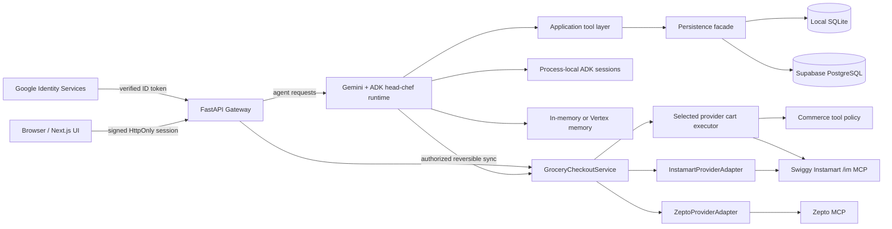

# Kitch System Architecture

This document describes the current end-to-end system design: frontend, backend gateway, ADK runtime, persistence, provider adapters, and approval boundaries.

For product intent, read `vision_and_requirements.md`.
For AI runtime and agent roles, read `ai_agent_topology.md`.
For dependencies, environment variables, local startup, and deployment, read
`runtime_stack_and_configuration.md`.

---

## System Summary

Kitch is a household meal planning, recipe, grocery, pantry, nutrition, and delivery-prep app.

The current design separates responsibilities deliberately:

- The frontend renders state and collects explicit user actions.
- FastAPI owns browser-facing APIs, state hydration, multimodal request orchestration, and provider approval boundaries.
- The Gemini/ADK runtime owns reasoning and tool-mediated domain operations;
  its internal topology is documented separately.
- Images are classified before any domain mutation occurs.
- Provider-specific executors perform authorized catalogue matching and
  reversible cart preparation.
- Python tools perform deterministic side effects.
- The selected SQLite or Supabase adapter stores authoritative structured state.
- The selected ADK memory service stores natural-language household context;
  ADK conversation sessions remain process-local.
- The commerce layer translates Kitch's native cart into provider carts through
  provider-specific execution behind one checkout service.



---

## Core Design Decisions

### Google ADK is the app runtime

Kitch uses Google ADK 2.0 for the runtime agent graph.

**Why:** the product needs explicit agent routing, tools, multimodal message support, session state, memory, callbacks, and context compaction. ADK provides these as application runtime primitives and has a path to Vertex AI managed services. Antigravity SDK remains useful for development workflows, but Kitch should not depend on a development harness as the production runtime.

### FastAPI sits between the browser and agents

The browser never calls agents directly. It calls FastAPI.

**Why:** FastAPI can normalize payloads, sync session state, orchestrate photo-plus-text flows, guard provider/order actions, and return a stable API shape to the frontend. This keeps the frontend free of ADK runtime details.

### SQLite or Supabase stores structured product records

Both adapters store the same meal-plan, recipe, pantry, native-cart, profile,
nutrition and provider workflow contract. SQLite is the single-process local
backend; Supabase is the backend-only hosted backend.

**Why:** these are deterministic records that the UI must render and users must be able to review. They should not live only in chat memory.

### One hosted sign-in owns one household

Hosted Kitch verifies a Google ID token and maps its stable subject to one
internal household and owner profile. All protected APIs then derive household
and member IDs from a server-owned request context. Browser payloads cannot
select a different household. Additional household members remain editable
profiles for personal nutrition context; they are not authenticated users.

Local SQLite mode deliberately skips Google Sign-In and keeps its one local
household bootstrap flow. The accepted model and rejected multi-account model
are recorded in `adr/0005-how-google-sign-in-owns-a-household.md`.

### The configured memory service stores flexible household context

Household food, allergy, planning-style, brand, pack, and ordering context is
stored as flexible natural language. Specialists
decide when a statement is durable and use shared search/update tools. The
Vertex Memory Bank performs semantic retrieval and consolidation. Local
`InMemoryMemoryService` preserves the deliberate agent write/read tools but
resets on restart. Neither mode receives every turn or full chat sessions.

**Why:** preferences are naturally conversational and can be fuzzy. A strict schema would prematurely constrain how users express preferences and how agents apply them.

Memory is advisory, household-scoped context. Structured persistence remains the source
of truth for every exact plan, pantry row, recipe, cart, nutrition record,
provider draft, payment, and order. A memory outage degrades personalization,
not core application readiness.

### Provider sync is backend-authorized and provider-specific

All provider sync and order approval sits behind provider-keyed backend HTTP
endpoints and `GroceryCheckoutService`. Zepto performs matching through its
adapter. Swiggy Instamart runs a dedicated Gemini cart agent with a restricted
MCP toolset, then uses `InstamartProviderAdapter` to normalize the exact captured
provider cart, prices, payment capabilities, and checkout response.

**Why:** provider operations modify real external state. Agentic catalogue
reasoning is useful for real-world products and pack descriptions, but authority
must remain deterministic. Chat may explicitly prepare an Instamart cart; it
cannot select payment or place an order. The backend creates durable review
snapshots and requires explicit frontend approval before checkout.

### Native cart is provider-neutral intent, not a mandatory UI gate

Recipe-derived groceries, standalone chat additions, and manual UI edits all
write to the same durable native cart. The Groceries UI or an explicit chat
request may then project the complete eligible selection through the Instamart
agent. This keeps external provider carts rebuildable without forcing the user
to manually visit the native-cart screen before every synchronization.

Provider synchronization is owned by Recipe/Grocery Planner through one
provider-neutral bridge. A named provider overrides only the current operation;
otherwise the UI-selected provider is used. The full accepted and rejected
topology record is maintained in `ai_agent_topology.md`.

---

## Frontend Duties

Location: `frontend/src/app`

The frontend owns presentation and explicit user actions.

Current duties:

- Render the household dashboard.
- Render the Recipes page for recipe+grocery artifacts.
- Render the Groceries page as a provider-neutral, six-stage vertical checkout
  workflow with compact numbered markers and a collapsible native cart.
- Fetch Zepto, Swiggy Instamart, and disabled Blinkit descriptors from the
  backend registry rather than maintaining a frontend route registry.
- Render individual nutrition state.
- Render shared calendar-date plan state with navigable Monday-Sunday views.
- Render complete pantry inventory, revision/review age, and native purchase
  allocations. Support explicit add/edit/remove and confirmed empty replacement.
- Send text chat turns to `POST /api/chat`.
- Upload image-plus-text requests to `POST /api/upload-photo`.
- Use provider-keyed checkout, connection, address, revalidation, payment, and
  order routes advertised by the backend.

The frontend does not:

- Own meal planning logic.
- Generate recipes or groceries.
- Call ADK directly.
- Call any provider MCP server directly.
- Place orders from chat text.
- Store the source of truth for meal plans or carts.

Why:

- The UI should remain a thin product surface over backend-owned state and safety boundaries.
- Explicit buttons remain available for provider synchronization and are
  mandatory for final order approval. Explicit chat may prepare a reversible
  Instamart cart, but cannot select payment or place an order.

---

## Backend Gateway Duties

Location: `backend/app/main.py`

FastAPI owns orchestration, API stability, and safety.

Current routes:

| Route | Duty |
| :--- | :--- |
| `POST /api/auth/google` | Verifies a Google ID credential, creates/loads its one hosted household, and sets the signed session cookie. |
| `GET /api/auth/session` | Returns safe authentication and household-member context. |
| `POST /api/auth/logout` | Deletes the Kitch session cookie. |
| `GET/POST /api/household/bootstrap` | Reports/creates the one local SQLite household; hosted households are created by sign-in. |
| `PATCH /api/household/members/{id}` | Renames an in-household member while retaining the stable profile ID and linked records. |
| `POST /api/chat` | Runs a text chat turn through the ADK runner. |
| `POST /api/upload-photo` | Classifies an image as meal, pantry, or ambiguous before routing structured observations. |
| `GET /api/state/{user_name}` | Returns dashboard state, including the authoritative current calendar-week meal plan and next chronological meal. |
| `GET /api/meal-plan?week_start=YYYY-MM-DD` | Returns one Monday-Sunday planning window with all seven exact dates, including empty days. |
| `GET /api/pantry` | Returns pantry rows, optimistic revision, and full-review timestamp. |
| `PATCH /api/pantry` | Applies atomic add/set/adjust/remove operations without changing the native cart. |
| `PUT /api/pantry` | Confirmed complete pantry replacement; an empty list marks it empty. |
| `POST /api/grocery-cart/reconcile-pantry` | Explicitly recalculates native purchase quantities from the current pantry. |
| `PATCH /api/household/profile` | Persists factual household size and timezone only. |
| `PATCH /api/nutrition/targets/{user}` | Persists deterministic personal calorie and macro goals. |
| `PATCH /api/grocery/provider-selection` | Persists the checkout UI's active provider as workflow state. |
| `PATCH/DELETE /api/diary/{user}/entries/{id}` | Corrects or deletes one nutrition entry. |
| `POST /api/diary/clear/{user}` | Confirmed clearing of one household-calendar diary day. |
| `POST /api/agent-actions/{id}/confirm|cancel` | Consumes or cancels an expiring destructive action. |
| `GET /api/grocery/cart` | Returns the shared native household grocery cart. |
| `POST /api/grocery/cart/items` | Adds a manual native grocery cart row. |
| `PATCH /api/grocery/cart/items/{id}` | Updates one native grocery cart row. |
| `DELETE /api/grocery/cart/items/{id}` | Deletes one native grocery cart row. |
| `DELETE /api/grocery/cart/planned` | Deletes agent-planned cart rows while preserving manual rows. |
| `GET /api/recipe-grocery/plans` | Lists recent recipe+grocery artifacts. |
| `PATCH/DELETE /api/recipe-grocery/plans/{id}` | Revises a recipe in place or deletes it with linked planned rows. |
| `GET /api/recipe-grocery/plans/latest` | Returns the latest recipe+grocery artifact. |
| `GET /api/recipe-grocery/plans/{id}` | Returns one recipe+grocery artifact. |
| `GET /api/grocery/providers` | Returns backend-owned provider descriptors, capabilities, environment, routes, and connection state. |
| `POST /api/grocery/providers/{provider}/connection/start` | Starts a supported delegated connection flow. |
| `GET /api/grocery/providers/{provider}/oauth/callback` | Validates and consumes a one-time OAuth callback. |
| `DELETE /api/grocery/providers/{provider}/connection` | Disconnects the household provider account and invalidates its draft. |
| `GET /api/grocery/providers/{provider}/addresses` | Reads saved addresses through the selected provider adapter. |
| `POST /api/grocery/providers/{provider}/checkout/sync` | Resolves the address context, replaces the provider cart, reconciles the read-back cart, and saves a durable draft. |
| `GET/PATCH /api/grocery/providers/{provider}/checkout` | Restores or updates the selected provider/environment draft. |
| `POST /api/grocery/providers/{provider}/checkout/revalidate` | Repairs and reconciles stale provider cart state. |
| `POST /api/grocery/providers/{provider}/checkout/place-order` | Revalidates and places only the exact approved snapshot. |
| `POST /api/grocery/providers/{provider}/checkout/payment-status` | Polls only when the discovered provider capability documents payment status. |
| `GET /api/health/live` | Dependency-free process and event-loop liveness check. |
| `GET /api/health/ready` | Publicly returns only safe core status; authenticated calls include component diagnostics. Provider states remain informational. |

Why the backend owns durable checkout drafts:

- A user must approve the exact provider cart they saw.
- Final preflight may rerun provider validation and, for Instamart, the guarded
  matching agent. If the cart, mapping, price, quantity, pack, bill, or payment
  methods change, the backend returns 409 and requires a new review instead of
  silently ordering the new result.
- Confirmation token plus snapshot hash prevents stale or modified reviews from being submitted silently.
- Persisted operation leases serialize sync, repair, and order operations per household/provider.

---

## Agent Runtime Boundary

FastAPI invokes the Gemini/ADK runtime for reasoning and tool-mediated domain
operations. The browser never calls an agent or MCP server directly. Final
provider checkout remains a backend-authorized UI operation outside all agent
toolsets.

The authoritative topology, every agent and tool role, task-vs-chat execution
mode, memory access, image routing, confirmation behavior, and accepted or
rejected topology decisions are documented only in
`ai_agent_topology.md`.

---

## Persistence Design

Facade: `backend/app/storage.py`
Hosted schema: `backend/database/supabase_schema.sql`
Local adapter and schema: `backend/app/sqlite_supabase.py`

Logical tables across the hosted and local adapters:

| Table | Shared or individual | Duty |
| :--- | :--- | :--- |
| `households` | Hosted ownership boundary | Supabase-only household root used by authenticated account mapping and profile isolation. |
| `household_accounts` | Hosted authentication mapping | Supabase-only mapping from verified Google subject to exactly one household and owner profile. |
| `profiles` | Household member/shared-owner profile | Stores stable member identity, editable name, household size, timezone, pantry revision, and full-review time. It contains no semantic preferences. |
| `nutrition_targets` | Individual | Stores deterministic calorie and macro goals separately from preference memory. |
| `provider_selection_state` | Shared household workflow | Stores the ordering provider currently selected in the checkout UI. |
| `meal_plans` | Shared household | Stores breakfast/lunch/dinner meal names keyed by exact calendar date. |
| `recipe_grocery_plans` | Shared household | Stores recipe cards, ingredients, pantry notes, request scope, and cart update metadata. |
| `pantry_stock` | Shared household | Stores current pantry/fridge inventory. |
| `grocery_cart_items` | Shared household | Stores native provider-agnostic cart rows. |
| `macro_diary` | Individual | Stores dated food entries with quantity, unit, meal group, consumption time, and calorie/macro estimates. |
| `provider_checkout_drafts` | Shared household | Stores environment-scoped cart projections, mappings, approval snapshots, payment/order state, ambiguous outcomes, and operation leases. |
| `provider_connections` | Shared household | Stores one encrypted household access token and connection status per provider/environment. |
| `provider_oauth_clients` | Backend configuration | Stores one dynamic OAuth client registration per provider/environment. |
| `provider_oauth_flows` | Backend transient state | Stores expiring, single-use hashed OAuth state and encrypted PKCE verifier records. |
| `pending_agent_actions` | Shared household | Stores expiring, single-use confirmation payloads for bulk destructive changes. |

Important modeling decisions:

- `household_accounts.google_subject` is the stable hosted login identifier.
  Emails may change and are not used as the primary key.
- Member names are mutable display data. Nutrition and history continue to
  reference the unchanged `profiles.id`.
- Shared tables use the authenticated household's owner profile ID; personal
  nutrition tables use a member ID resolved only from that household.

- Nutrition entries use `consumed_at` as the dated source of truth. An explicit
  meal/date/time from the user wins; otherwise the request receipt time in the
  household timezone determines Breakfast, Lunch, Snack, or Dinner.
- Daily nutrition totals and weekly trends are derived from diary entries;
  users edit entries or goals rather than overwriting aggregate totals.

- `meal_plans` is uniquely keyed by `(profile_id, plan_date)`; weekdays are
  derived display labels, so Thursday in one week cannot overwrite another.
- FastAPI deletes `meal_plans` rows before the household's current date at
  startup and after each `profiles.timezone_name` midnight. The planner is an
  active/future schedule, not historical meal-plan storage.
- The household profile stores the IANA timezone used to resolve relative dates.
- New plan ranges and targeted multi-meal edits use transactional RPCs.
- The product plans breakfast, lunch, and dinner only.
- `recipe_grocery_plan_id` links agent-created cart rows back to the recipe+grocery artifact that produced them.
- `source=manual` rows survive later agent grocery planning.
- Standalone chat add/update/remove changes use
  `apply_native_grocery_cart_changes`, so a multi-change request commits as one
  transaction or rolls back completely.
- Native rows store required amount/unit separately from positive provider-export
  `purchase_amount`/`purchase_unit` and structured `pantry_allocation`.
- Pantry mutation and cart reconciliation are separate explicit operations.
  Reconciliation uses the current pantry revision and invalidates provider drafts
  only when native purchase intent actually changes.

Why this model:

- Meal plans need to be lightweight.
- Recipes and grocery rows need an auditable artifact.
- Provider carts should never become Kitch's source of truth.

### Durable-storage contract

- All structured tables have RLS enabled. Browser roles have no table or sequence
  privileges; the browser accesses state only through FastAPI.
- FastAPI requires `SUPABASE_SECRET_KEY` (`sb_secret_...`) or the temporary
  legacy `SUPABASE_SERVICE_ROLE_KEY`. Publishable, anon, malformed, and
  ambiguous `SUPABASE_KEY` credentials prevent startup.
- Empty reads are valid state. Authorization, connection, schema, malformed
  response, and unconfirmed-write failures are not empty state: they become a
  safe HTTP 503 response and no success action is returned to the UI.
- Saving a recipe artifact and replacing agent-generated cart rows is one
  storage transaction. A cart failure rolls back the artifact write and
  leaves the previous cart unchanged.
- Frontend state changes only after a confirmed 2xx response. A persistence
  failure preserves the last confirmed state and shows that nothing was saved.

---

## Native Cart to Ordering Provider Flow

The frontend and API are provider-neutral. Zepto and Swiggy Instamart implement
the same adapter contract. Provider-specific MCP identifiers remain inside the
adapter and normalized mappings stored in the draft.

```mermaid
sequenceDiagram
    autonumber
    participant UI as Groceries UI
    participant API as FastAPI
    participant DB as Selected storage backend
    participant Service as GroceryCheckoutService
    participant Adapter as Selected provider adapter
    participant MCP as Provider MCP

    UI->>API: GET /api/grocery/providers
    API-->>UI: descriptors, capabilities, connection state, routes
    UI->>API: GET /api/grocery/providers/{provider}/addresses
    API->>Adapter: list_addresses()
    Adapter->>MCP: List saved addresses
    MCP-->>UI: Saved address options
    UI->>UI: User selects delivery address
    UI->>UI: Wait for native saves; lock edits; show transfer dialog
    UI->>API: POST .../{provider}/checkout/sync + address id
    API->>Service: sync native snapshot
    Service->>DB: Read cart; acquire provider/environment lease
    alt Swiggy Instamart
        Service->>Agent: Run operation-scoped cart agent
        Agent->>MCP: Address-scoped iterative search + ordering history
        Agent->>MCP: Replace complete provider cart
        Agent->>MCP: Read provider cart and repair once if needed
        Agent-->>Service: Match reasoning + captured exact MCP results
        Service->>Adapter: Normalize confirmed cart, bill, and capabilities
    else Adapter-driven provider such as Zepto
        Service->>Adapter: Synchronize selected native snapshot
        Adapter->>MCP: Search, replace cart, and read back
        MCP-->>Adapter: Confirmed provider response
    end
    Service-->>API: Confirmed cart + unavailable rows + normalized totals
    Service->>DB: Save durable draft + bill + mappings + token
    API-->>UI: Confirmed checkout draft
    UI->>UI: Close dialog; unlock edits; show review
    UI->>API: PATCH checkout payment/acknowledgement
    UI->>API: POST revalidate after explicit stale-cart refresh
    API->>Service: Revalidate durable draft
    alt Swiggy Instamart refresh
        Service->>Agent: Re-run guarded cart validation and repair
        Agent->>MCP: Search, replace if needed, and confirm cart
    else Adapter-driven provider refresh
        Service->>Adapter: Validate, repair, and reconcile
    end
    UI->>API: POST place-order after final approval
    API->>Service: Verify token, hash, acknowledgement, payment, and native snapshot
    alt Swiggy Instamart preflight
        Service->>Agent: Re-run guarded cart validation
        Agent->>MCP: Confirm current cart
    else Adapter-driven provider preflight
        Service->>Adapter: Revalidate current provider cart
    end
    alt Anything changed
        Service-->>API: Updated draft
        API-->>UI: HTTP 409; review again
    else Approved snapshot unchanged
        Service->>Adapter: checkout(review)
    end
```

Architectural invariants:

- User selection means "include this native row in the chosen provider projection."
- Pantry-covered rows are never included.
- The checkout UI's last operational provider selection is restored. Without one, connected Zepto is chosen
  first, then connected Instamart; otherwise provider selection stays active.
  Blinkit is disabled and cannot issue API calls.
- A saved delivery address is required before sync.
- Provider sync cannot start while a native-cart write is still in flight.
- Sync, revalidation, and checkout are serialized per household/provider;
  clients lock conflicting controls for the lifetime of the operation.
- Product search cannot start until the selected provider confirms the address/store context.
- Search results do not count as cart success. The backend must confirm exact
  provider identifiers and quantities in the returned provider cart.
- Multiple brands and pack sizes are normal Instamart results. Gemini chooses
  the best reasonable orderable option using explicit household ordering
  preferences, semantic quantity coverage, minimum excess, Swiggy history,
  total price, and fewer packs. An item is unresolved only when no acceptable
  confirmed product exists.
- A review is locked to the address/store context used during product resolution.
- Changing the native cart, selection, provider, or address invalidates the
  current review and requires a new cart sync.
- Synchronization replaces the complete selected-provider cart.
- The backend exposes normalized `cart_summary` values in minor currency units.
  A provider-returned final total is authoritative. If the provider omits a
  final total, Kitch may sum exact provider selling prices multiplied by exact
  cart quantities only when the response contains no fee, tax, discount, or
  other adjustment. Otherwise the total remains unavailable.
- The cart summary is included in the review snapshot hash.
- Drafts are stored in `provider_checkout_drafts` with backend-only RLS and
  survive frontend/backend restarts.
- Groceries-page entry restores drafts and automatically reads saved addresses,
  but does not search products, mutate carts, or revalidate provider state.
  Drafts older than five minutes are visibly stale and require explicit refresh
  before payment or approval.
- Replacements, price changes, pack changes, quantity changes, and cart drift
  reset payment and acknowledgement. Unresolved native items remain in the
  approval snapshot as explicitly omitted rows; confirmed partial carts may
  proceed, while carts with no confirmed items remain blocked.
- Instamart uses only `/im`. Its dedicated agent receives only
  `get_addresses`, `search_products`, `your_go_to_items`, `update_cart`, and
  `get_cart`; checkout and other mutations are absent.
- `CommerceToolPolicy` uses server-owned request authority. Cart writes are
  allowed only for explicit UI/chat sync, refresh, or order preflight.
  Checkout is independently allowed only for the UI place-order endpoint.
- Exact MCP update/read results are captured after tool calls. Durable cart and
  bill state never comes from the model's textual reconstruction.
- Instamart accepts only payment methods returned by the fresh confirmed cart
  or provider payment capability. UPI is exclusive when returned; its opaque
  app ID is echoed unchanged, or the documented QR flag is used. COD is offered
  only when UPI is absent and Cash is returned.
- When Instamart returns exactly one supported payment method, Kitch records it
  automatically and presents it as a fixed checkout detail. Multiple Instamart
  methods still require a choice. Zepto retains its independent multi-option
  payment selector and is not affected by this Instamart-specific behavior.
- Checkout timeouts are not blindly retried. Order history is checked first;
  unresolved duplicate risk is persisted as an ambiguous `unknown` outcome.

Why:

- Provider auth and tool mechanics are implementation details.
- Real order placement needs a human review point.

The checkout chronology, progress states, review layout, and responsive
behavior are documented in `ux_user_flows.md`, not duplicated here.

---

## Known Boundaries

- Backend restarts clear short-lived ADK conversation sessions. With
  `vertex` configured, selected household memories remain durable.
- SQLite migrations run automatically. Hosted Supabase deployments apply the
  versioned SQL migrations before starting FastAPI; bootstrap DDL stays aligned.
- Provider OAuth and production approval remain externally controlled.
- Blinkit live integration is not implemented.
- Instamart production is gated until explicit approval and staging validation.
- Hosted sign-in can create unrelated one-owner households. Sharing one
  household across multiple authenticated Google accounts is deliberately not
  implemented.
- Provider order placement is live and must remain guarded.
- Hosted household identity comes from the verified Google subject; local
  household identity comes from the first-run SQLite onboarding flow.

Reproducible defects, operational blockers, and deliberately deferred
optimisations are maintained in `known_issues_and_optimisations.md`.
