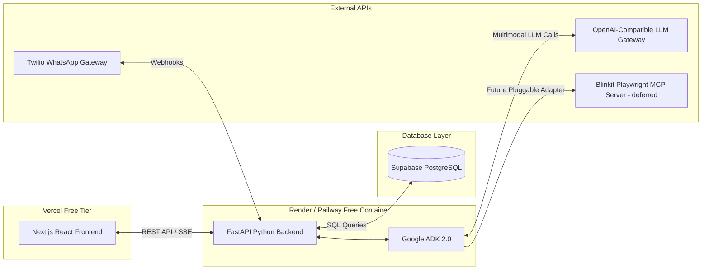

# Production Technology Stack & Deployment Blueprint: Kitch

> [!NOTE]
> This document outlines the **Production Technology Stack** for Kitch. In accordance with project requirements, we prioritize **industry-standard free tiers** for hosting, databases, and APIs. We structure the app using a decoupled frontend/backend framework to support the Python-based Google ADK 2.0 agent runtime.

---

## 1. High-Level Architectural Flow

To ensure high performance while leveraging Vercel's hosting features and the Python ADK runtime, we use a **Split Architecture**:

---

## 2. Component Tech Stack & Service Selection

### 🖥️ 1. Frontend & Client Dashboard
*   **Technology**: **Next.js (React) + TypeScript + Vanilla CSS / Glassmorphic UI**.
*   **Why**: Best-in-class framework for Vercel deployment. Provides fast static rendering, built-in routing, serverless API proxies, and optimized bundle sizes.
*   **Hosting**: **Vercel (Hobby Free Tier)**.
    *   *Includes*: Global CDN, SSL certificates, serverless API functions, and Git-integrated deployments.

### ⚙️ 2. Python Agentic Backend
*   **Technology**: **FastAPI + Python 3.11+ + Google ADK 2.0**.
*   **Why**: Google ADK provides native Python agent orchestration primitives (`LlmAgent`, `Runner`, `App`, session services, memory services). FastAPI is an extremely lightweight, high-performance web framework designed for asynchronous execution, making it the gateway for ADK turns.
*   **Hosting**: **Render (Free Web Services)** or **Railway (Developer Plan)**.
    *   *Why*: Vercel serverless functions have a 10–15s timeout on free plans, which is too short for complex agentic loops or vision scans. A lightweight, hosted container on Render or Railway allows the Python process to remain persistent, handling long-lived chat streams, vision file parsing, and MCP operations.

### 💾 3. Persistent Database & Backend-as-a-Service
*   **Technology**: **Supabase (PostgreSQL)**.
*   **Why**: 
    *   **Generous Free Tier**: Includes 500MB database, 1GB file storage, and up to 50,000 active monthly users.
    *   **Postgres Power**: Perfect for relational structures (joining recipes, calendars, pantry inventory lists, and user profiles).
    *   **Built-in Auth**: Standardizes multi-user profile authentication for the current configured household members and future registered households.

### 🧠 4. Multimodal Generative AI
*   **Technology**: **OpenAI-compatible LLM gateway via ADK `LiteLlm`**.
*   **Why**:
    *   **Gateway Flexibility**: The backend reads `OPENAI_MODEL_NAME`, `OPENAI_API_KEY`, and `OPENAI_API_BASE` from environment variables.
    *   **Multimodal Input**: Image bytes from fridge snaps and plate logs are passed through ADK-compatible content parts to the active agent turn.

### 🛒 5. Grocery Provisioning & Delivery (MCP)
*   **Technology**: **Blinkit Model Context Protocol (MCP) Server** (`hereisSwapnil/blinkit-mcp`) - planned.
*   **Mechanism**:
    *   The current app prepares provider-shaped payloads and applies ADK memory brand preferences.
    *   Real Blinkit MCP cart insertion is deferred until the provider connection is configured.
    *   UPI payment remains manual in the grocery provider app when this adapter is eventually wired.

### 💬 6. Conversational Chat Channels
*   **WhatsApp API Gateway**: **Twilio (Free sandbox/trial)**.
    *   Routes messages from WhatsApp to our FastAPI `/api/webhook/whatsapp` endpoint.
*   **Telegram Gateway**: **Telegram Bot API (100% Free)**.
    *   Simple, lightweight conversational webhook interfacing directly with our python service.

---

## 3. Production Environment Secret Management

All service integrations are connected securely using standard environment variables:

| Variable Name | Provider Source | Role in System |
| :--- | :--- | :--- |
| `OPENAI_MODEL_NAME` | LLM gateway config | Selects the ADK `LiteLlm` model |
| `OPENAI_API_KEY` | LLM gateway config | Authenticates model calls |
| `OPENAI_API_BASE` | LLM gateway config | Points ADK `LiteLlm` to the OpenAI-compatible base URL |
| `SUPABASE_URL` | Supabase Settings | Supabase project URL |
| `SUPABASE_KEY` | Supabase API Keys | Authenticates backend Supabase access |
| `TELEGRAM_BOT_TOKEN` | BotFather (Free) | Auth token for conversational Telegram bot |
| `TWILIO_AUTH_TOKEN` | Twilio Console (Trial) | Validates incoming WhatsApp webhook signatures |

---

## 4. Why This Configuration Works Best

*   **100% Cost-Free Prototyping**: You can develop, host, and test the entire system without inputting a credit card.
*   **Complete Separation of Concerns**: Next.js is focused on rendering interactive visual charts, planners, and lists, while the FastAPI service focuses on running the ADK agentic loops.
*   **Robust Data Integrity**: Relational constraints in PostgreSQL prevent mismatched calendar items or incorrect pantry deductions during concurrent swaps.
