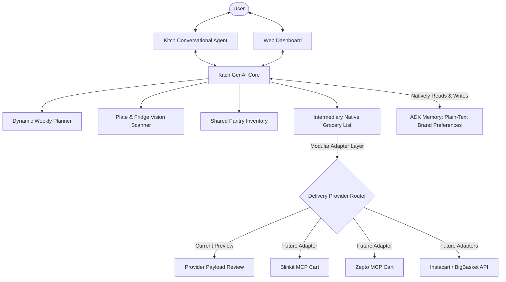
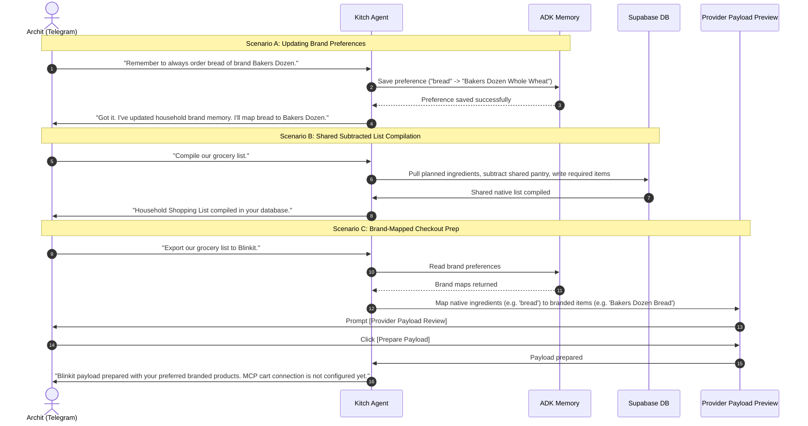

# Kitch: Product Vision & Requirements Document

> [!NOTE]
> **Kitch** is a next-generation, AI-driven culinary assistant, personal chef, and smart household grocery manager. By blending conversational intelligence, multimodal computer vision, and local workspace file memory, it takes the cognitive load out of nourishing yourself, your family, and your household.

---

## 1. Executive Summary & Vision

Modern life demands split-second decisions about what we eat, yet managing nutrition, dietary preferences, household scaling, and grocery shopping remains a highly fragmented and stressful chore. 

**Kitch** bridges this gap. It acts as an empathetic, intelligent agent that:
1. **Understands your household’s unique palate and health targets.**
2. **Generates balanced, dynamic weekly meal plans** that scale perfectly to your household size (optimized for a 3-person home).
3. **Subtracts ingredients you already own** (pantry/fridge stock) from the weekly grocery orders to eliminate redundant buying.
4. **Maintains a platform-agnostic, Intermediary Native Grocery List** in its local database, separating planned needs from delivery logistics.
5. **Logs nutrition with zero friction** on an *individualized* basis using simple photo uploads.
6. **Remembers your precise ingredient brand preferences** using agent-native plain-text memory that can later move to Vertex AI Memory Bank without forcing rigid relational schemas.
7. **Prepares modular grocery delivery payloads (Blinkit/Zepto style)** via a flexible adapter boundary. Live provider MCP cart insertion is intentionally deferred until a provider connection is configured.

---

## 2. Core Pillars & User Experience

### 🥗 Pillar 1: Dynamic Weekly Meal Planning & Pantry Subtraction
*No more redundant buying or "What's for dinner?" arguments.*
*   **Tailored to the Household:** Scales recipes and ingredient counts automatically for a 3-person home.
*   **Pantry Subtraction Logic:** Rather than buying raw recipe volumes every week, the system cross-references your current **Pantry & Fridge Stock**. Required ordering volumes are calculated dynamically:
    $$Shopping = \max(0, Required - Stock)$$
    If you already have enough, the item is labeled as *Stocked* and omitted from the order cart.
*   **Visual Fridge Scanning:** Simply take a photo of your fridge interior shelves. The computer vision engine segments shelves, detects items (e.g. cabbage, eggs, milk), and automatically inserts them into your Pantry Inventory.

### 📊 Pillar 2: Platform-Agnostic Intermediary Grocery List
*Decoupling recipe requirements from delivery providers.*
*   **Intermediary Native List**: The database maintains a native, provider-agnostic shopping list. This list aggregates scaled ingredients, tracks ticked items, and adjusts for pantry stock.
*   **Modular Delivery Adapters**: Delivery integrations are treated as modular plugins (the *Provider Pattern*). 
*   **Blinkit, Zepto, and More**: Users can review their native list on the dashboard, choose their preferred grocery delivery merchant, and export the list. The backend adapter maps native ingredients (e.g. "cabbage 1 piece") to merchant catalog payloads dynamically.

### 📈 Pillar 3: Context-Isolated Household vs. Individual "Minds"
*Shared collaborative assets alongside private personal health tracking.*
*   **The Shared Household Mind (Pantry & Weekly Schedule):** Pantry inventories, weekly recipe calendars, and intermediary grocery lists are collaborative household assets. All housemates see, edit, and subtract from the *same* physical inventory.
*   **The Individual Minds (Macro Diaries & User Preferences):** Calorie progress dials, daily macronutrient logs (Protein, Carbs, Fats, Fiber), and health journals are isolated **independently** per household member. 
*   **Frictionless Personal Logs:** If the active member snaps a photo of their lunch, it logs macros only to that member's target diary. Other members' personal diaries remain separate.

### 📸 Pillar 4: Snap & Log (Computer Vision OCR)
*Say goodbye to tedious manual logging.*
*   **Photo-Based Estimation:** Snap a picture of your plate after eating. The multimodal GenAI identifies ingredients, estimates portion sizes, and logs personal macro/micro values.
*   **Interactive Refinement:** The AI presents its best estimate ("Looks like 150g grilled chicken, 100g quinoa. Correct?") and lets you confirm or adjust with a simple tap.

### 📝 Pillar 5: Agent-Native Brand Preferences
*No redundant relational table overhead. The agent manages its own records.*
*   **Plain-Text Preference Memory:** Rather than storing brand preferences in strict database tables, Kitch records specific brand settings as flexible text in ADK memory.
*   **Active Conversational Updates:** If you casually tell Kitch during a chat: *"Oh, remember to always buy Country Delight milk from now on,"* the agent stores that preference for later grocery preparation.
*   **Checkout Consulting:** When you prepare a provider payload, the agent consults brand memory to translate generic recipe ingredients (e.g. "paneer 200g") into favored branded items (e.g. "Amul Malai Paneer 200g").
*   **Deployment Path:** Local testing currently uses ADK in-memory services. Deployment should replace that with Vertex AI Memory Bank for persistence.

### 💬 Pillar 6: Conversational Chat & Delivery Preparation
*An agent that lives in your ecosystem and prepares delivery-ready grocery payloads.*
*   **Blinkit/Zepto Payload Preparation:** Finalized grocery lists can be mapped into provider-style payloads. Direct MCP cart insertion is a planned integration, not current behavior.
*   **Human-in-the-loop Review:** Before any future provider automation runs, the application presents a clear review prompt displaying the exact list. Current behavior stops at payload preparation.
*   **Conversational Chat (Telegram/WhatsApp):** Interact with Kitch on-the-go:
    *   *“We have chicken and spinach in the fridge, what can we make for the 3 of us tonight?”*
    *   *“Remember that our household prefers strictly organic whole wheat bread.”*
    *   *“Export my shopping list to Blinkit.”*

---

## 3. Product Features & Functional Requirements

### Feature Set 1: User & Household Profiling
| Feature ID | Feature Name | Description | User Impact |
| :--- | :--- | :--- | :--- |
| **REQ-001** | Household Scaling | Configures household size (default: 3 people), dietary profiles (keto, vegan, balanced), and ingredient exclusions (allergies). | Scales all planned recipe grocery lists. |
| **REQ-002** | Multi-User Macro Logs | Isolates macro logs, target calorie dials, and meal journals independently for each household member. | Accurate individual health tracking. |

### Feature Set 2: Pantry & Fridge Inventory Subtracted Planner
| Feature ID | Feature Name | Description | User Impact |
| :--- | :--- | :--- | :--- |
| **REQ-003** | Auto-Planner | Creates a cohesive, balanced 7-day meal schedule scaling all ingredients by household size. | Eliminates decision fatigue. |
| **REQ-004** | Shared Pantry Stock | A living shared inventory representing available ingredients in the home, editable manually or via natural language chats. | Tracks what the household already owns. |
| **REQ-005** | Cart Subtraction Engine | Compares weekly recipe requirements against pantry stock, reducing ordering quantities mathematically. | Prevents food waste and saves money. |

### Feature Set 3: Multimodal Vision Scanners
| Feature ID | Feature Name | Description | User Impact |
| :--- | :--- | :--- | :--- |
| **REQ-006** | Plate Macro OCR | Users upload post-meal plates. GenAI estimates portions and logs values to the *active member's* profile. | Zero-barrier macro tracking. |
| **REQ-007** | Fridge OCR Scan | Users upload fridge shelf layouts. GenAI detects ingredient volumes and appends them to the Shared Pantry Inventory. | Hands-free pantry stock logs. |

### Feature Set 4: Workspace File Memory & MCP Delivery
| Feature ID | Feature Name | Description | User Impact |
| :--- | :--- | :--- | :--- |
| **REQ-008** | Brand Preference Memory | Agent maintains conversational plain-text brand preferences in ADK memory, later migratable to Vertex AI Memory Bank. | Customizes grocery payload preparation without rigid schema rules. |
| **REQ-009** | Native Intermediary List | Maintains a unified, provider-agnostic required shopping list in the database. | Decouples groceries from merchants. |
| **REQ-010** | Modular Exporter Boundary | Exposes pluggable delivery adapter boundaries (Blinkit, Zepto, etc.) to map native items to branded merchant payloads. | Prepares for multi-app expansion. |
| **REQ-011** | Human-in-the-loop Review | Displays an authorization dialog showing provider payload inputs before any future provider execution. | High security and error prevention. |

---

## 4. User Journey Scenarios

---

## 5. Success Metrics & Design Directives

### 💫 Design Directives
*   **Vibrant, Glassmorphic Dashboard**: Dark backgrounds combined with glowing sage greens, warm honey highlights, and multi-user profile quick toggles.
*   **Transparent MCP Terminal Logs**: Clearly formats JSON tool structures on checkouts, giving users confidence in agent actions.
*   **Empathetic Tone**: Proactively supports culinary routines, celebrating nutrient goals and helping coordinate family diets smoothly.
