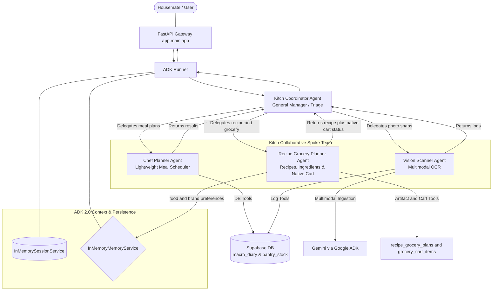

# Walkthrough: Google ADK 2.0 Fully Dynamic LLM-Driven Recipe Engine

We have successfully redesigned and implemented Kitch's multi-agent backend to operate as a **fully dynamic, LLM-reasoning-driven culinary assistant**. 

We have eliminated all hardcoded recipe catalogs, catalog indexes, and rigid arithmetic scalers. Portions, ingredients, dietary alignment, and pantry subtractions are now calculated dynamically in the **agent's mind** using advanced LLM reasoning, perfectly matching the original product vision.

The backend uses Gemini through ADK's native `Gemini` adapter. Structured state
is durable only when Supabase confirms it: FastAPI uses an elevated backend
credential, RLS protects every structured table, and failed persistence is
reported instead of substituted with local process state.

---

## 🛠️ Complete Multi-Agent Topology & System Architecture

Our collaborative Hub-and-Spoke system is fully dynamic:

### 1. Date-Specific Database Planner Integration
*   We completely removed the hardcoded `RECIPE_DATABASE` and its associated static lookups/scalers (`get_recipes`, `scale_ingredients`, `calculate_intermediary_grocery_list`) from [tools.py](file:///Users/dynamiterdx/Documents/Personal%20Projects/diet_planner/backend/app/agent/tools.py).
*   `meal_plans` stores meal names under an exact `plan_date`; weekday labels are derived and never identify a schedule row.
*   **Transactional Range Planning**: `replace_meal_plan_range_tool` replaces exactly the requested date range after validating complete breakfast, lunch, and dinner entries.
*   **Transactional Targeted Edits**: `update_dated_meals_tool` changes exact date/slot pairs while preserving every unrelated plan.
*   The household profile stores `timezone_name`, which resolves today, tomorrow, and calendar-week boundaries consistently across devices.
*   **Active-plan retention**: FastAPI removes dated meal-plan rows before the household's current date at startup and after each household midnight.

### 2. LLM-Based Culinary Reasoning & Scaling
*   **Dynamic Meal Schedules**: The `chef_planner` agent generates balanced weekly meal-name schedules dynamically from its own reasoning and saves those names to `meal_plans`.
*   **Recipe+Grocery Planning**: The `recipe_grocery_planner` owns detailed recipes, ingredients, pantry-aware grocery planning, and native cart persistence:
    1. It calls `search_household_food_preferences_tool` before recipe or grocery generation.
    2. It calls `get_meal_schedule_tool` with exact ISO date ranges for schedule-based scopes such as tonight, tomorrow, next two days, or the full week.
    3. It calls `get_pantry_stock_tool` before grocery planning.
    4. It saves a `recipe_grocery_plans` artifact for every recipe/grocery request.
    5. For grocery requests it transactionally saves the artifact and replaces agent-generated `grocery_cart_items`, preserving manual rows. If either part fails, neither new change is committed.
*   **Provider Boundary**: External-cart translation is not part of the recipe+grocery agent. The Groceries page fetches Zepto, Swiggy Instamart, and disabled Blinkit descriptors from the backend. A shared checkout service owns synchronization, durable revalidation, payment approval, and ordering; a constrained Gemini matcher can only select allowlisted catalog candidates.

### 3. Real-Time Dashboard Sync & Frontend Parity
*   **State Sync**: `/api/state/{user_name}` returns the authoritative current calendar week and next chronological meal, while `/api/meal-plan` loads navigated weeks.
*   **React Integration**: Planner state is keyed by ISO date. Chat mutations return `affected_dates` and `focus_date`, so the UI opens the exact changed date.
*   **Plan Rendering**: The planner defaults to the current Monday-Sunday context but renders only persisted dates and populated meal slots. A fully empty planner uses the onboarding placeholder; an empty visible week links to the next planned date without fabricating weekday rows.

### 4. Durable Storage and Credential Security

* **Backend-only access**: All structured Supabase tables use RLS. Browser
  roles are denied CRUD access; the browser uses FastAPI only.
* **Accepted credentials**: FastAPI requires `SUPABASE_SECRET_KEY`
  (`sb_secret_...`) or the temporary legacy `SUPABASE_SERVICE_ROLE_KEY`.
  `SUPABASE_KEY`, anon, publishable, malformed, and redacted values are
  rejected at startup.
* **Fail-loud behavior**: Empty database reads remain valid, but connection,
  authorization, schema, and write failures return HTTP 503. The frontend
  keeps its last confirmed state and does not show a persistence success banner.
* **Ephemeral memory**: ADK food and brand preference memory is process-local
  until the planned Vertex AI migration; it is not a substitute for Supabase.
