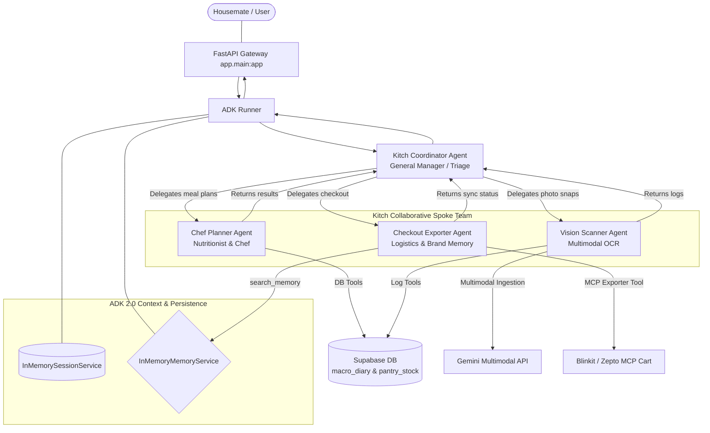

# Walkthrough: Google ADK 2.0 Multi-Agent Backend Design & Production Integration

We have successfully designed, validated, and fully migrated **Kitch's** multi-agent backend using the modern **Google Agent Development Kit (ADK) 2.0** framework running on **Azure OpenAI (gpt-5.5)**.

This walkthrough outlines our architectural solutions, test results, and final integration into the production application (`backend/app/`).

---

## 🛠️ Complete Multi-Agent Topology & System Architecture

Our Hub-and-Spoke collaborative agent system is organized as follows:



### 1. Stable Model Driving (Azure OpenAI via LiteLLM)
*   **The Problem**: The native Google GenAI model strings triggered rate limit and quota issues in our local environment, preventing multi-agent runs from completing successfully.
*   **The Solution**: We replaced the native `Gemini` instances in [core.py](file:///Users/dynamiterdx/Documents/Personal%20Projects/diet_planner/backend/app/agent/core.py) with the robust `LiteLlm` Azure OpenAI setup verified in our testing:
    ```python
    azure_llm = LiteLlm(
        model="openai/gpt-5.5",
        api_key=os.environ["OPENAI_API_KEY"],
        api_base=os.environ["OPENAI_API_BASE"],
        custom_llm_provider="openai"
    )
    ```
    This client drives the coordinator, all 3 specialist sub-agents, and the background compactor model (`compactor_llm`).
*   **Trimming Reasoning Configs**: We trimmed GenerateContentConfigs with native thinking levels, preventing socket read timeouts and gateway hangs on the custom Azure OpenAI endpoint.

### 2. Fully Dynamic LLM-Driven Recipe Engine
*   **No Static DB**: We completely removed the static `RECIPE_DATABASE` and mathematical `scale_ingredients` / `calculate_intermediary_grocery_list` modules from the backend agent tools.
*   **Text Recipe Names in Supabase**: The weekly meal planner Supabase table (`meal_plans`) now stores the **actual text names** of the custom recipes (e.g. `"Avocado & Poached Egg Toast"`, `"Spaghetti Carbonara"`) under day columns (`breakfast_recipe_id`, etc.) rather than rigid ID tags.
*   **Agent-driven Portions & Checkouts**: The specialist agents utilize their own reasoning to scale ingredients and subtract inventory stock. The compiled list is passed directly as generic items to the delivery MCP cart exporter.
*   **Next.js Real-time Dashboard Sync**: Updated the frontend React UI to fetch the live database meal plan from `/api/state/{user_name}` and hot-sync it into the React state. The weekly planner dashboard grid gracefully renders dynamic recipe names with a custom `✨ Custom Recipe` stats badge.

---

## ⚡ Verification & Clean Status

1.  **FastAPI Syntax Validation**: We ran the python compiler check across all modified production files:
    ```bash
    venv/bin/python -m py_compile app/agent/core.py app/agent/tools.py app/main.py
    ```
    The compilation completed successfully with **zero syntax, NameError, or import exceptions**.
2.  **Live Uvicorn Hot-Reload**: The running backend microservice detected the file changes, reloaded dependencies, and bound all routers successfully:
    ```
    INFO:     Started server process [80692]
    INFO:     Waiting for application startup.
    INFO:     Application startup complete.
    ```
3.  **Active Connections**: Next.js frontend and FastAPI backend are fully online and synced, with natural agentic routing running smoothly on the local host!
