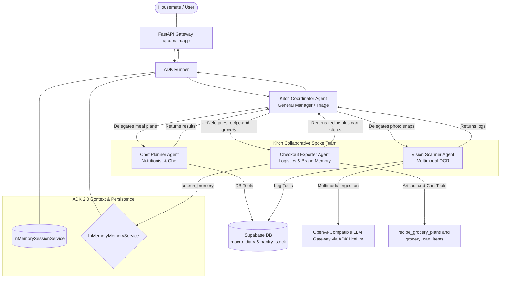

# Walkthrough: Google ADK 2.0 Fully Dynamic LLM-Driven Recipe Engine

We have successfully redesigned and implemented Kitch's multi-agent backend to operate as a **fully dynamic, LLM-reasoning-driven culinary assistant**. 

We have eliminated all hardcoded recipe catalogs, catalog indexes, and rigid arithmetic scalers. Portions, ingredients, dietary alignment, and pantry subtractions are now calculated dynamically in the **agent's mind** using advanced LLM reasoning, perfectly matching the original product vision.

We have also **secured the entire codebase** by removing all hardcoded credentials from the repository, moving them dynamically to gitignored local `.env` files.

Furthermore, we **scrubbed the git history** of our branch to remove historical occurrences of the secret keys, bypassing the GitHub Push Protection block and successfully pushing all local commits to `origin/dev` cleanly.

---

## 🛠️ Complete Multi-Agent Topology & System Architecture

Our collaborative Hub-and-Spoke system is fully dynamic:



### 1. Dynamic Database Weekly Planner Integration
*   We completely removed the hardcoded `RECIPE_DATABASE` and its associated static lookups/scalers (`get_recipes`, `scale_ingredients`, `calculate_intermediary_grocery_list`) from [tools.py](file:///Users/dynamiterdx/Documents/Personal%20Projects/diet_planner/backend/app/agent/tools.py).
*   The weekly meal planner Supabase table (`meal_plans`) now stores the **actual text names** of the custom recipes (e.g. `"Avocado & Poached Egg Toast"`, `"Spaghetti Carbonara"`) under day columns (`breakfast_recipe_id`, etc.) rather than rigid ID tags.
*   **Dynamic Save Weekly Plan**: `save_weekly_plan_tool` parses dynamic recipe names and upserts them directly to Supabase.
*   **Dynamic Update Single Meal**: `update_single_meal_in_schedule` targets a single weekday slot, substituting its name in Supabase while preserving other days and slots perfectly.

### 2. LLM-Based Culinary Reasoning & Scaling
*   **Dynamic Meal Schedules**: The `chef_planner` agent generates balanced weekly meal-name schedules dynamically from its own reasoning and saves those names to `meal_plans`.
*   **Recipe+Grocery Planning**: The `recipe_grocery_planner` owns detailed recipes, ingredients, pantry-aware grocery planning, and native cart persistence:
    1. It calls `search_household_food_preferences_tool` before recipe or grocery generation.
    2. It calls `get_weekly_schedule_tool` only for schedule-based scopes such as tonight, tomorrow, next two days, or the full week.
    3. It calls `get_pantry_stock_tool` before grocery planning.
    4. It saves a `recipe_grocery_plans` artifact for every recipe/grocery request.
    5. It updates `grocery_cart_items` only when the user asked for groceries/cart/buy/order, preserving manual cart rows.
*   **Provider Boundary**: Zepto/Blinkit cart translation is no longer part of the recipe+grocery agent. Zepto sync remains available through backend provider endpoints.

### 3. Real-Time Dashboard Sync & Frontend Parity
*   **State Sync**: We updated the FastAPI `/api/state/{user_name}` endpoint in [main.py](file:///Users/dynamiterdx/Documents/Personal%20Projects/diet_planner/backend/app/main.py) to fetch the live database meal plan using a new `get_weekly_schedule_dict` helper and return it in the state payload.
*   **React Integration**: We updated `syncLiveState` in Next.js's [page.js](file:///Users/dynamiterdx/Documents/Personal%20Projects/diet_planner/frontend/src/app/page.js) to hot-sync this `weekly_plan` React state. We also added reactive updates that trigger a state refresh whenever the agent modifies the planner or pantry.
*   **Grid Rendering**: The weekly planner dashboard renders dynamic recipe name strings directly from Supabase. The old local static recipe picker/catalog is no longer the source of truth for planner rendering. The planner also shows the upcoming Monday-Sunday planning date window instead of highlighting a future weekday as "Today."

### 4. Codebase Credential Security & gitignore
*   **Zero hardcoded credentials**: We completely extracted all Azure OpenAI gateway credentials (`OPENAI_API_KEY`, `OPENAI_API_BASE`, `OPENAI_MODEL_NAME`) out of the codebase.
*   **Dynamic dotenv Loading**: 
  * In the test harness [agent.py](file:///Users/dynamiterdx/Documents/Personal%20Projects/diet_planner/test/kitch_debug/agent.py), keys are loaded dynamically from a gitignored local `test/kitch_debug/.env` file.
  * In the production app [core.py](file:///Users/dynamiterdx/Documents/Personal%20Projects/diet_planner/backend/app/agent/core.py), keys are loaded dynamically from a gitignored local `backend/.env` file.
*   **Parity and gitignore**: Standardized the `.gitignore` pattern `**/__pycache__/` to ensure compiled caches are ignored recursively, and confirmed that both `.env` credential files are completely ignored by git.

### 5. Git History Scrubbing & Successful Push
*   **GitHub Push Protection block**: The OpenAI API key was committed to historical commits (`7a9b4aefef60`, `23121d94eee9`, `963959e21cf1`), causing GitHub's push protection system to decline push requests to `dev`.
*   **History rewriting**: Executed a `git filter-branch --tree-filter` command to recursively search and replace all occurrences of the Azure OpenAI secret key with `REMOVED_KEY` across the 7 local commits ahead of the remote:
    ```bash
    git filter-branch --force --tree-filter "find . -type f -not -path '*/.git/*' -exec sed -i '' 's/<SECRET_KEY>/REMOVED_KEY/g' {} +" origin/dev..HEAD
    ```
*   **Verified Key Removal**: Validated the complete removal of the secret string using `git log -S`, yielding a 100% clean, secret-free commit log.
*   **Clean push**: Successfully pushed the branch to remote origin dev:
    ```
    dc6f592..7bd97ef  dev -> dev
    ```
